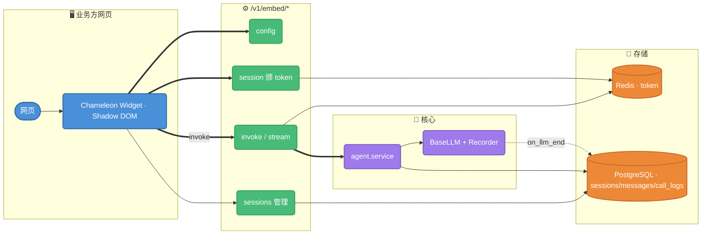
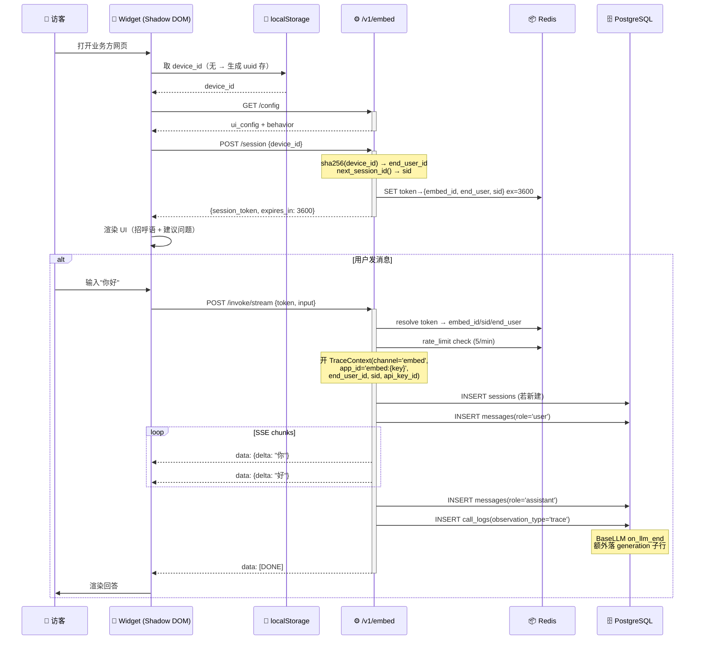
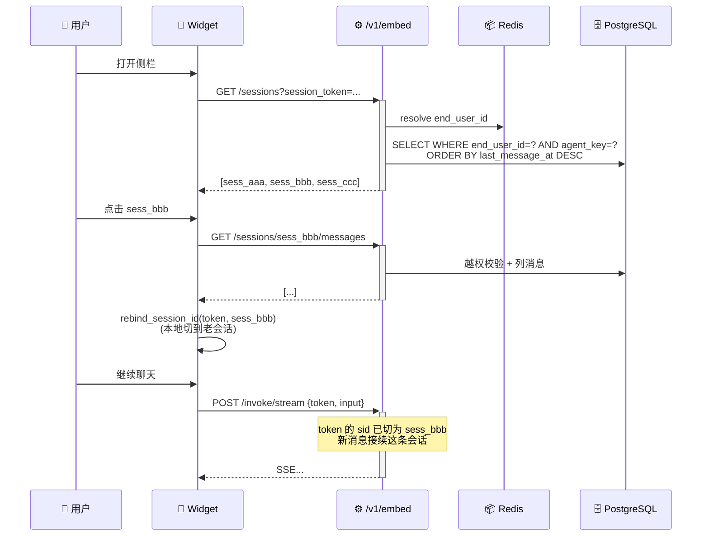
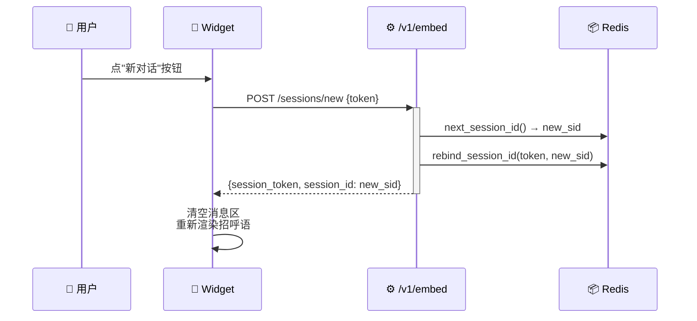

# 嵌入式应用：实现原理与端点使用过程

> 2026-05-28 重构后的全景文档。读者：架构师、想了解内部机制的接入方、维护本模块的开发者。
> 业务方"我只想接入"的最小手册见 [embed-integration-guide.md](./embed-integration-guide.md)。

---

## 0. TL;DR

- **嵌入式应用 = 业务方网页直接弹气泡聊天的场景**，跟 Service API（业务方后端拿 key 调用）走两条完全独立的路径
- 安全核心：**Origin 白名单 + 短期 session_token**（Redis TTL 1h），永久 key 不能暴露在浏览器
- 身份核心：**三种识别模式**（匿名设备 / 外部 user id / 签名 JWT）决定一个浏览器对应哪个 `end_user_id`，所有会话按它隔离
- 10 个端点不是冗余，是 widget 完整生命周期（**启动 → 识别 → 调用 → 历史管理 → 反馈**）所必需的；Dify、FastGPT 都是这套套路
- 流量归属：每次调用 `call_logs` 记 `channel='embed' + app_id='embed:{embed_key}' + end_user_id + session_id`；每次 LLM 调用通过 BaseLLM 回调自动落 `observation_type='generation'` 子行

---

## 1. 它解决什么问题

### 1.1 跟 Service API 的差别

| 维度 | Service API (`/v1/invoke`) | 嵌入式 (`/v1/embed/*`) |
|------|---------------------------|-----------------------|
| 谁调 | 业务方**后端** | 业务方网站**浏览器**直连 |
| 鉴权 | `Authorization: Bearer app-xxx`（永久 key） | **Origin 白名单 + 短期 session_token** |
| 谁是用户 | body.user 自报 | 三选一识别（设备/外部 id/JWT） |
| 走代理 | 走业务方后端代理 | 不需要业务方搭代理 |
| 适用场景 | 后端集成、定制 UI | 一行 `<script>` 接入官网/帮助中心右下角 |

### 1.2 为什么需要短期 token

永久 key（`app-xxxxxxxxxxxxxxxx`）一旦放进浏览器：

1. 任何人 F12 看 Network 就能复制走
2. 接入方网站 XSS / CDN 投毒 / 用户脚本都能偷
3. 滥用 → 业务方账单爆炸 / 限流耗尽

所以嵌入端**必须双层**：
- **业务方后台一次性**配置 `allowed_origins` 白名单
- 浏览器侧用 origin 换**短期 session_token**（1h TTL），再用 token 调业务接口

token 即便被偷也只能滥用 1 小时，且只能从配置的 origin 调（CORS 已 Preflight）。

### 1.3 `embed_key` 是公开 ID，不是密钥

为什么 `/v1/embed/{embed_key}/...` 路径里要带 `embed_key`？因为它跟 api key 完全是两类东西：

| | `embed_key` | api key (`app-xxxxxxxx`) |
|---|---|---|
| 写在哪 | `<script data-embed-key>`，**全世界都看得到** | 业务方后端 env，**绝不能曝** |
| 作用 | "我是哪个嵌入应用" 的**公开标识** | "我是谁、授权调用" 的**密钥** |
| 校验 | Origin 白名单 + 颁短期 session_token | Bearer header 直接校验 |
| 类比 | 像 Google Analytics 的 `UA-XXXXX` tracking id | 像 AWS Access Key |

所以路径里带 `embed_key` 完全合理——它就是个公开 path param。任何人复制走 embed_key 也调不通：

- 没在白名单 origin 上 → CORS preflight 挡
- 强行用 curl 不带 origin → 服务端 `check_origin` 拦
- 拿到 token 也只能 1h、5 msg/min、且锁死在那个 embed 应用上

### 1.4 owner `api_key_id`：流量挂账钩子，不参与鉴权

后台「嵌入应用 → 会话 tab」里可以选一个 owner api key 绑定。**这个 key 不是给调用方用的**（嵌入端点全程不读 Bearer）——纯归属用途：

| 有 owner key | 没绑（NULL） |
|--------------|--------------|
| 嵌入流量挂在该 key 的账单 / 限流配额下 | 流量游离，只能按 `app_id='embed:em_xxx'` 维度统计 |
| 业务方一个 key 同时管 Service API + 嵌入 | 嵌入是"白嫖"通道，跟"开发者 key"没法对账 |

**没绑也不丢统计**——`call_logs` 该有的字段 `channel/app_id/end_user_id/session_id` 都还在，按 embed_key / 按 end_user 维度都能聚合（见 §7）。但有两件事做不了：

1. **per-key 限流**套不上（目前只剩 per-session 5 msg/min 这层兜底）
2. **per-key 配额**套不上（业务方"这个 key 每月 100 万 token"配额不会扣嵌入流量）

所以 owner key 不是必填、但**生产场景建议绑**——多半业务方想让 widget 跟开发者 SDK 共用一份配额。

---

## 2. 整体架构

### 2.1 调用面



### 2.2 安全边界

- **Origin 白名单**：每个端点都验 `Origin` 头，跟 `embed_config.allowed_origins` 比对；`["*"]` 表示公开
- **session_token 绑定**：Redis 里 `token → embed_config_id` + `token → end_user_id` + `token → session_id`；越权（token 对应 embed_id 跟 path 上的 embed_key 不一致）直接 `JwtInvalid`
- **Shadow DOM 隔离**：widget DOM 挂在 Shadow Root 下，业务方 CSS / 选择器**碰不到**，反之亦然
- **跨用户隔离**：所有会话端点都按 token 上绑的 `end_user_id` 过滤，A 用户拿到自己的 token 永远只能看到自己的会话

---

## 3. 数据模型

### 3.1 `embed_configs` 表（关键字段）

| 字段 | 含义 |
|------|------|
| `embed_key` | 公开 ID，业务方 widget 用它（即 `<script>` 里的 `data-key`） |
| `agent_id` | 关联的智能体 |
| `api_key_id` | **owner key**（可选）：嵌入流量按这个 key 限流 / 归属 / 计费；NULL = 不绑定 |
| `allowed_origins` | Origin 白名单数组；`["*"]` 公开 |
| `ui_config` | JSON：颜色 / 头像 / 标题 / 招呼语等 16+ 项外观 |
| `behavior` | JSON：自动展开 / 建议问题 / 反馈按钮 / 引用 / 上传 / 流式 |
| `session_policy` | JSON：见 3.2 |

### 3.2 `session_policy` JSON 子字段

| 字段 | 默认 | 说明 |
|------|------|------|
| `identification_mode` | `anonymous_device` | `anonymous_device` / `external_user_id` / `signed_jwt` 三选一 |
| `jwt_signing_secret_encrypted` | `null` | `signed_jwt` 模式的 HS256 共享密钥（密文落库） |
| `show_history_sidebar` | `true` | widget 是否显示历史会话侧栏 |
| `auto_resume_last` | `true` | widget 加载时自动续接 localStorage 里的上次会话 |
| `allow_user_manage` | `true` | 是否允许用户删除 / 改名自己的会话 |
| `max_history_days` | `90` | 历史列表的时间窗（天） |

### 3.3 关联会话表

```
sessions (chat_session)
  id PK            雪花
  session_id UK    sess_<base32>   ← 端点路径里出现的
  agent_key        关联 agent
  app_id           归属标签 'embed:{embed_key}'
  api_key_id FK    embed_config.api_key_id 透传
  end_user_id      token 上绑的终端用户
  last_message_at  排序键

messages
  session_id FK
  role / content / seq / created_at / end_user_id

call_logs
  parent_id        root trace 自身为 NULL
  channel          'embed'
  app_id / api_key_id / end_user_id / session_id / agent_key
  observation_type 'trace' (root) | 'generation' (BaseLLM 子行)
  prompt/completion/total_tokens / cost_usd ...
```

---

## 4. 核心机制

### 4.1 双层鉴权

每个嵌入端点都跑这两层：

```
1. Origin 验白名单    → check_origin(allowed_origins, request.headers.Origin)
2. session_token 校验 → embed_session.resolve_session(token) == embed_config.id
   (config / session 端点除外：还没颁 token)
```

第 2 层失败一律 `JwtInvalid`（"embed session 已过期或无效" / "session_token 与 embed_key 不匹配"）。

### 4.2 终端用户身份识别（三模式）

`POST /session` 时按 `embed.session_policy.identification_mode` 分流（`chameleon-api/.../embed/service.py:148`）：

```python
def resolve_end_user_from_request(embed, req) -> str | None:
    mode = policy.identification_mode
    if mode == "anonymous_device":
        return "anon_" + sha256(req.device_id)[:24]
    if mode == "external_user_id":
        return req.external_user_id
    if mode == "signed_jwt":
        payload = jwt.decode(req.jwt_token, secret, algorithms=["HS256"])
        return str(payload["sub"])
```

#### 模式 1：`anonymous_device`（默认）

- widget 在 `localStorage` 持久化一个 UUID 作为 `device_id`
- 后端做 `sha256(device_id)[:24]` → `end_user_id`（前缀 `anon_`）
- **特点**：浏览器清缓存 = 变新人；同设备同浏览器 = 同 end_user
- **适用**：官网客服、产品助手等"任何访客都能用"的场景

#### 模式 2：`external_user_id`

- 业务方在自家系统已有用户体系（SaaS 客户编号 / CRM ID），widget 把它直传过来
- 后端原样落 `end_user_id`
- **特点**：跨设备 / 跨浏览器统一；**但前端可篡改**——只适合内部场景
- **适用**：已登录的业务系统嵌入 AI 助手

#### 模式 3：`signed_jwt`（生产推荐）

- 业务方后端用 HS256 签 JWT（密钥在后台配置时加密落库）
- widget 拿 JWT 调 `/session`，后端验签后取 `sub` claim 作 `end_user_id`
- **特点**：用户身份不可伪造 + 可带 `exp` 限时
- **适用**：付费业务系统、需要严格用户隔离的场景

#### 三模式实际场景对比

三种回答的是**同一个问题**——「这个打开 widget 的浏览器，对应你后端的哪个 `end_user_id`？」
差别在**谁说了算、能不能被篡改**。

**场景**：SaaS 公司 Acme 嵌入 Chameleon AI 助手。客户 Alice 登录、跟 AI 聊几条、退出；**同一台电脑** Bob 登录，打开 widget——Bob 应该看到谁的会话历史？

| 模式 | 谁告诉后端 end_user_id | Bob 看到的历史 | Alice 能装成 Bob 吗 | 适合 |
|------|----------------------|---------------|-------------------|------|
| **1. anonymous_device** | widget 自己生成的 localStorage UUID → sha256 | **Alice 的**（device 一样） | 没有身份概念 | 官网游客客服 |
| **2. external_user_id** | Acme 把 Bob 的内部 id 渲到 `data-external-user-id` | **Bob 的** | **能**（F12 改 attr 即可） | 内部工具 / 不严格场景 |
| **3. signed_jwt** | Acme 后端用 HS256 共享密钥签 JWT，sub=bob-id；后端验签取 sub | **Bob 的** | **不能**（密钥在 Acme 后端，Alice 没法签出新 JWT） | 生产付费 SaaS |

身份解析流向图：

```mermaid
graph TB
    classDef anon fill:#A0AEC0,stroke:#718096,stroke-width:1px,color:#fff
    classDef ext fill:#ED8936,stroke:#C66A32,stroke-width:2px,color:#fff
    classDef jwt fill:#48BB78,stroke:#38A169,stroke-width:2px,color:#fff
    classDef api fill:#2B6CB0,stroke:#1E5090,stroke-width:2px,color:#fff
    classDef note fill:#EDF2F7,stroke:#A0AEC0,stroke-width:1px,color:#4A5568,stroke-dasharray:5 5

    subgraph M1["模式 1：匿名设备（业务方零参与）"]
        LS[(localStorage uuid)]:::anon
        W1(widget):::anon
        N1["⚠️ 清缓存 = 新人<br/>跨设备 = 新人"]:::note
        LS --> W1
        W1 -->|"{device_id: uuid}"| API1(POST /session):::api
        API1 -->|sha256| EU1[/"end_user_id = anon_xxxx"/]:::anon
    end

    subgraph M2["模式 2：external_user_id（业务方裸说）"]
        SSR2[Acme 网页 SSR]:::ext
        W2(widget):::ext
        N2["⚠️ F12 改 attr<br/>就能装成别人"]:::note
        SSR2 -->|"data-external-user-id"| W2
        W2 -->|"{external_user_id: bob-id}"| API2(POST /session):::api
        API2 --> EU2[/"end_user_id = bob-id"/]:::ext
    end

    subgraph M3["模式 3：signed_jwt（业务方签名说，不可篡）"]
        BE3[Acme 后端]:::jwt
        SSR3[Acme 网页 SSR]:::jwt
        W3(widget):::jwt
        VS{Chameleon 验签}:::jwt
        N3["✅ Alice 没 SECRET<br/>伪造 = 验签失败 = 401"]:::note
        BE3 -->|"jwt.encode({sub: bob-id}, SECRET)"| SSR3
        SSR3 -->|"data-jwt-token"| W3
        W3 -->|"{jwt_token: ...}"| API3(POST /session):::api
        API3 --> VS
        VS -->|"sub claim"| EU3[/"end_user_id = bob-id"/]:::jwt
    end
```



**取舍**：

- **匿名（模式 1）** = 业务方零成本接入，换跨设备 / 清缓存丢身份
- **裸传（模式 2）** = 业务方 SSR 渲一行就完，但**前端能改的值不该用来鉴权**——只能内部用
- **签名（模式 3）** = 业务方多一步"后端签 JWT"，换不可伪造

Dify、FastGPT 也是这三档（anonymous + 外部 ID + 签名 JWT），我们这套是对齐的。

### 4.3 `session_token` Redis 生命周期

```
chameleon:embed:session:<token>      → embed_config_id    TTL 1h
chameleon:embed:eu:<token>           → end_user_id        TTL 1h
chameleon:embed:sid:<token>          → session_id         TTL 1h
chameleon:embed:ratelimit:<token>    → count              TTL 60s   (5 msg/min)
```

不用 JWT 而用 Redis KV 的原因：
- token 随时能在服务端吊销（Redis DEL）
- TTL 滚动续期更直接（每次活跃续上）
- 不需要把 secret 发到边缘

### 4.4 `session_id` 续接 / rebind

同一个 `session_token` 内：

| 操作 | session_id 怎么变 |
|------|-------------------|
| 第一次 `/invoke` | 用 token 上绑的 sid（colon 创建时签发的） |
| 同 token 继续 `/invoke` | 复用同一个 sid，**多轮历史拼接** |
| `POST /sessions/new` | `rebind_session_id(token, new_sid)`：同 token 切到全新 sid，**对话清零** |
| `GET /sessions/{sid}/messages` 之后继续 invoke | widget 自己 `rebind_session_id(token, old_sid)`：把 token 切到历史 sid，**续接老对话** |

**关键不变量**：一个 session_id 在数据库里永远只属于一个 `(agent_key, end_user_id)` 对——服务端会校验，跨用户访问直接 404。

---

## 5. 端点完整说明

10 个端点按生命周期分四组。所有端点路径前缀 `/v1/embed/{embed_key}/`，所有都要带 `Origin` 头。

### 5.1 启动 / 配置

#### `GET /config`

| 项 | 内容 |
|----|------|
| 何时调 | widget mount 时第一个请求 |
| 鉴权 | 仅 Origin 白名单（还没 token） |
| 入参 | path: `embed_key` |
| 出参 | `{embed_key, name, description, ui_config, behavior}` |
| 内部做啥 | 查 `embed_configs` 行 + 验 origin，原样返公开字段（**不返 agent_id / api_key_id 等内部 ID**） |

#### `POST /session`

| 项 | 内容 |
|----|------|
| 何时调 | 拿到 config 后立刻调，颁 widget 用的 token |
| 鉴权 | 仅 Origin 白名单 |
| 入参 | body 按 `identification_mode` 选一：`{device_id}` / `{external_user_id}` / `{jwt_token}` |
| 出参 | `{session_token, expires_in: 3600}` |
| 内部做啥 | ①验 origin ②按 mode 解析 → `end_user_id` ③`next_session_id()` 签发新 sid ④Redis 写三条 KV（token→embed_id / token→end_user / token→sid） |
| 错误 | mode 跟 body 不匹配 → `ValidationError`；JWT 验签失败 → `JwtInvalid` |

### 5.2 调用

#### `POST /invoke`（非流）

| 项 | 内容 |
|----|------|
| 何时调 | 用户发一条消息，需要一次性拿完整回答（非主流） |
| 鉴权 | Origin + session_token |
| 入参 | `{session_token, input: "你好"}` |
| 出参 | `{answer, session_id, request_id}` |
| 内部做啥 | ①resolve_session(token) 拿 embed_id + sid + end_user_id ②`check_rate_limit` ③开 `TraceContext`（channel='embed'）④调 `agent.service.invoke()` ⑤`agent.service` 落 sessions+messages+call_logs；BaseLLM 回调自动落 generation 子行 |

#### `POST /invoke/stream`（SSE 流式，主流）

同 `/invoke`，但返回 `text/event-stream`：

```
data: {"meta": {"agent": "...", "session_id": "sess_xxx", "request_id": "req_xxx"}}
data: {"delta": "你"}
data: {"delta": "好"}
data: {"citation": {"title": "...", "source": "..."}}    ← show_citations=true 时
data: {"end": true, "answer": "你好", "usage": {...}}
data: [DONE]
```

业务上**永远优先用 stream 端点**——首字延迟低、用户体感好。

### 5.3 会话管理

所有这组端点都先跑 `_resolve_token_context()`：解析 embed + 验 origin + 验 token 归属 + 取 end_user_id。任意一步失败直接 raise。

#### `GET /sessions?session_token=XXX`

| 项 | 内容 |
|----|------|
| 何时调 | widget 打开历史侧栏时（`show_history_sidebar=true`） |
| 出参 | `[{session_id, title, last_message_at, created_at}, ...]` |
| 内部做啥 | `WHERE end_user_id = ? AND agent_key = ? ORDER BY last_message_at DESC` —— **天然按用户隔离** |
| 限制 | `max_history_days` 时间窗（默认 90 天） |

#### `GET /sessions/{session_id}/messages?session_token=XXX`

| 项 | 内容 |
|----|------|
| 何时调 | 用户在侧栏点击某条历史会话 |
| 出参 | `[{role, content, seq, created_at, ...}, ...]`（最多 500，按 seq 正序） |
| 内部做啥 | 先 `get_embed_session(end_user_id=...)` 越权校验 → 列消息 |
| 越权 | session_id 不属于当前 end_user → 404 SessionNotFound |

#### `POST /sessions/new`

| 项 | 内容 |
|----|------|
| 何时调 | 用户在 widget 上点"新对话"按钮 |
| 入参 | `{session_token}` |
| 出参 | `{session_token, session_id: <新>, expires_in}` |
| 内部做啥 | `next_session_id()` + `rebind_session_id(token, new_sid)` —— **同 token 直接切到新 sid，不需要刷新页面** |

#### `POST /sessions/{session_id}/delete`

| 项 | 内容 |
|----|------|
| 何时调 | 用户在侧栏对某历史会话点"删除" |
| 鉴权 | 同上 + 必须 `policy.allow_user_manage=true`（否则 403） |
| 出参 | `{deleted: true}` |
| 内部做啥 | 软删（`is_deleted=true`，不物理删）—— 保留可观测、可恢复 |

#### `POST /sessions/{session_id}/name`

| 项 | 内容 |
|----|------|
| 何时调 | 用户在侧栏改会话名 |
| 鉴权 | 同上 + `allow_user_manage=true` |
| 入参 | `{session_token, title}` |
| 出参 | 同 `EmbedSessionItem` |

### 5.4 反馈

#### `POST /feedback`

| 项 | 内容 |
|----|------|
| 何时调 | 用户点 👍/👎/评分 |
| 入参 | `{request_id, score: 1 \| -1, comment?, ...}` |
| 出参 | 落库的 `ScoreItem` |
| 内部做啥 | 写 `scores` 表，`source='feedback'`，跟人工标注 / eval 区分 |

---

## 6. 时序图

### 6.1 首次访问（匿名设备模式）



### 6.2 续接历史会话



### 6.3 开新会话



---

## 7. 流量归属与可观测

### 7.1 `call_logs` 字段映射

每次 `/invoke` 写**一条** `observation_type='trace'` root 行 + **N 条** `observation_type='generation'` 子行（每个 LLM 调用一条，BaseLLM 的 `GenerationRecorder` 回调自动写）。

| 字段 | embed 调用取值 |
|------|---------------|
| `channel` | `'embed'`（恒定） |
| `app_id` | `'embed:{embed_key}'`（自由标签，方便聚合） |
| `api_key_id` | `embed_config.api_key_id`（绑了 owner key 就有，否则 NULL） |
| `end_user_id` | token 上绑的（三模式产出） |
| `session_id` | 当前会话 sid |
| `agent_key` | embed 关联的 agent |
| `parent_id` | root trace 自身为 NULL；generation 行指向 root |

### 7.2 常见统计 SQL

按用户用量：
```sql
SELECT end_user_id, SUM(total_tokens), SUM(cost_usd), COUNT(*)
FROM call_logs
WHERE channel='embed' AND app_id='embed:em_xxx'
  AND created_at > now() - interval '7 days'
GROUP BY end_user_id ORDER BY 2 DESC;
```

按 embed 应用：
```sql
SELECT app_id, DATE(created_at), COUNT(*), SUM(cost_usd)
FROM call_logs
WHERE channel='embed' AND observation_type='trace'
GROUP BY 1, 2;
```

### 7.3 BaseLLM 自动落 generation

实现位置：`chameleon-core/src/chameleon/core/observe/llm_recorder.py`。

机制：
- `chameleon-core/.../components/llms/factory.py` 构造 BaseLLM 时注入 `GenerationRecorder` callback
- `on_chat_model_start` 缓存 prompt + 时间戳
- `on_llm_end` 提取 usage（streaming 走 `usage_metadata`，非 streaming 走 `llm_output.token_usage`）
- 从 `TraceContext` ContextVar 拿 `app_id/api_key_id/end_user_id/channel/session_id` 写一条 generation 子行

**所以无论调用走哪个入口（embed / service api / 编辑器调试 / 评测 / KB 召回里的 reranker），只要 LLM 真的被调用，generation 一定有 row**——不会因为开发者忘记写切面而漏。

---

## 8. 错误码常见

| 业务码 | 触发 |
|--------|------|
| `40402 SessionNotFound` | session_id 不存在 / 越权（不属于 token 上绑的 end_user） |
| `JwtInvalid` | session_token 过期、不匹配 embed_key、JWT 验签失败 / 过期 / 缺 sub |
| `AppRateLimit` | 单 token 调用 > 5 次/分钟 |
| `40300 PermissionDenied` | origin 不在白名单；或 `allow_user_manage=false` 时调删/改名 |
| `ValidationError` | 三模式入参跟 `identification_mode` 不匹配（如 `mode=signed_jwt` 但传了 `device_id`） |

---

## 9. 完整接入示例（业务方视角）

### 9.1 后台配置嵌入式应用

1. 系统配置 → 嵌入应用 → 新建
2. **基本**：选关联智能体 + 起名
3. **外观**：颜色 / 头像（emoji 或上传图片）/ 标题 / 招呼语
4. **行为**：开 / 关流式、引用、上传、自动展开、建议问题
5. **会话**：选 `identification_mode`，配 `allow_user_manage`/`max_history_days`；signed_jwt 模式还要录入 HS256 密钥
6. **安全**：填 `allowed_origins`（如 `https://your-site.com`，多个换行；`*` 公开）
7. **嵌入**：复制 `<script>` 片段到业务方网页 `<body>` 末尾

### 9.2 接入 widget —— 自动初始化（三种模式都支持）

`data-embed-key` 触发自动 init。`data-api-base` 是可选——缺省自动取 `script src` 的 origin，**所以同源部署的代码片段不需要写它**（后台「嵌入」tab 生成的标签就只有 `data-embed-key`）。跨域才显式写。

**模式 1（默认）：匿名设备**
```html
<script
  src="https://chameleon.example.com/widget.js"
  data-embed-key="em_xxxxxxxxxx"
  defer
></script>
```
widget 自动生成持久化 device_id，无登录场景用。

**模式 2：外部用户 ID**（SSR 把当前登录用户 id 渲到 attr）
```html
<script
  src="https://chameleon.example.com/widget.js"
  data-embed-key="em_xxx"
  data-external-user-id="biz-user-12345"
  defer
></script>
```

**模式 3：签名 JWT**（SSR 把后端签好的 JWT 渲到 attr）
```html
<script
  src="https://chameleon.example.com/widget.js"
  data-embed-key="em_xxx"
  data-jwt-token="eyJhbGciOiJIUzI1NiIs..."
  defer
></script>
```

**跨域部署**（widget 域名 ≠ Chameleon API 域名）时显式给 `data-api-base`：
```html
<script
  src="https://cdn.your-site.com/widget.js"
  data-embed-key="em_xxx"
  data-api-base="https://chameleon.example.com"
  defer
></script>
```

同时填 `data-external-user-id` + `data-jwt-token` 时按 embed 后台配置的 `identification_mode` 选用其一（widget 会把两个都传给 `init()`，后端按 mode 取需要的字段）。

### 9.3 手动初始化（动态场景）

登录态在前端异步拿到 / JWT 时效短需要前端定时签——这些场景下 SSR 没法静态渲，走 `window.ChameleonWidget.init(opts)`：

```html
<script src="https://chameleon.example.com/widget.js" defer></script>

<script>
  window.addEventListener('DOMContentLoaded', async () => {
    const { jwt } = await fetch('/api/embed-jwt').then(r => r.json());
    window.ChameleonWidget.init({
      embedKey: 'em_xxxxxxxxxx',
      apiBase: 'https://chameleon.example.com',
      jwtToken: jwt,
    });
  });
</script>
```

> 注意：不带 `data-embed-key` 的 `<script>` **不会**触发自动 init——必须 `window.ChameleonWidget.init({...})` 显式调一次。

### 9.4 签 JWT 的后端代码示例

业务方后端用配置时录入的同一份 HS256 密钥签：

```python
import jwt, time
token = jwt.encode(
    {"sub": "biz-user-12345", "exp": int(time.time()) + 3600},
    SHARED_SECRET, algorithm="HS256",
)
# 渲到页面 data-jwt-token 属性，或暴露一个签 token 的接口给前端拉
```

### 9.5 错误处理

widget 自带：
- token 过期 → 自动重新颁发
- 限流 → 提示用户稍后再试
- 网络断 → 重试 + fallback 提示

业务方一般不需要管，除了配置时确保 `allowed_origins` 正确。

---

## 10. 关键实现位置

### 后端

| 文件 | 内容 |
|------|------|
| `chameleon-api/src/chameleon/api/embed/api.py` | 10 个端点路由 + 入参校验 + 响应包装 |
| `chameleon-api/src/chameleon/api/embed/service.py` | 业务编排：origin 验证、三模式 end_user 解析、invoke/stream 入口、会话管理 |
| `chameleon-api/src/chameleon/api/embed/session.py` | Redis token + end_user_id + sid + rate limit |
| `chameleon-api/src/chameleon/api/embed/schemas.py` | SessionPolicy / CreateSessionRequest 等 DTO |
| `chameleon-core/src/chameleon/core/models/embed_config.py` | embed_configs ORM |
| `chameleon-core/src/chameleon/core/models/session.py` | ChatSession + Message ORM |
| `chameleon-core/src/chameleon/core/observe/llm_recorder.py` | GenerationRecorder（BaseLLM 回调，generation 行自动落） |
| `chameleon-core/src/chameleon/core/observe/context.py` | TraceContext ContextVar |
| `chameleon-system/src/chameleon/system/embed_configs/` | 后台 CRUD service |

### 前端

| 文件 | 内容 |
|------|------|
| `frontend/embed/src/widget.ts` | 主 widget 实现（Shadow DOM、UI、SSE 消费） |
| `frontend/embed/src/session.ts` | localStorage device_id + 三模式 identity dispatch |
| `frontend/embed/src/api.ts` | embed 端 HTTP 客户端 |
| `frontend/embed/src/styles.ts` | widget CSS |
| `frontend/src/system/embed_configs/components/embed-form-modal.tsx` | 后台配置表单（外观/行为/会话/安全/嵌入 5 tab） |
| `frontend/src/system/embed_configs/components/embed-preview.tsx` | 配置时的实时预览组件 |

### 相关文档

- [embed-integration-guide.md](./embed-integration-guide.md) — 业务方接入最小手册
- [api-reference.md](./api-reference.md) — Service API（`/v1/invoke`、`/v1/sessions` 等）对照
- `docs/plans/2026-05-28-session-and-observability-refactor.md` — 本架构的设计 plan
