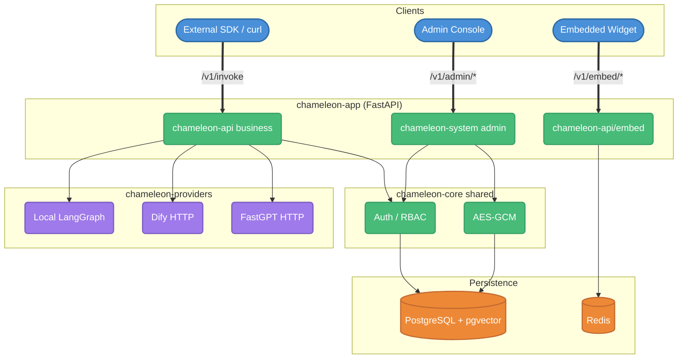
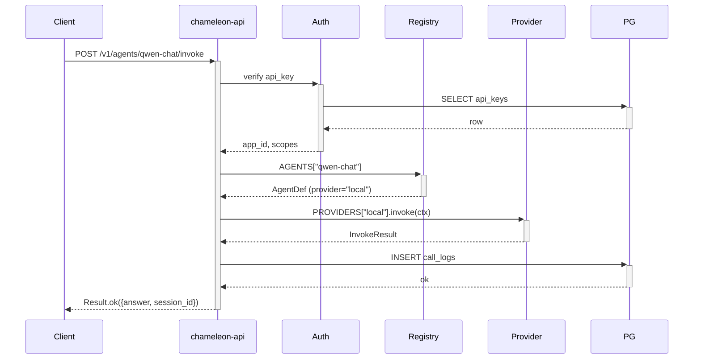

# Architecture

## Overview



## Key decisions

### DB-driven config
JSON files only for first-boot seed; runtime config lives in DB (`providers`, `models`, `agents` tables). Admin UI edits propagate via `reload_agent_registry()` and `reload_llm_cache()`.

### JWT dual-token
- `access_token`: 15 min, in `Authorization: Bearer`
- `refresh_token`: 7 days, in HTTP-only Cookie

axios interceptor catches 401 → auto-refresh → retry once. refresh_token is JS-inaccessible (XSS-safe).

### RBAC three-table
Users ↔ user_roles ↔ roles ↔ role_permissions ↔ permissions, with wildcard support (`*:*`, `users:*`).

### AES-256-GCM provider credentials
Master key in env `CHAMELEON_CRYPTO_KEY` (32 bytes b64). `providers.api_key_encrypted` stores ciphertext; plaintext never logged.

### Snowflake IDs
64-bit: 1 sign + 41 timestamp + 10 instance (`CHAMELEON_INSTANCE_ID`) + 12 seq.

### Provider / Agent Registry
At startup async-loads to in-memory dict. Business hot path reads in O(1). Admin edits trigger `reload_agent_registry()` to refresh.

### Embeddable Widget
Vanilla TS IIFE bundle (13 KB / gzip 4.8 KB). Shadow DOM isolates styles. Origin whitelist + session_token + Redis rate-limit. Messages rendered via `textContent` (XSS-safe).

### Frontend layered (sage style)
```
src/
├── core/                Shared infra (lib / components / stores / i18n / router)
├── system/<module>/     Self-contained business modules
│   ├── pages/           Page components
│   ├── services/        API clients
│   ├── types/           TypeScript types
│   └── routes.ts        Module routes (default-export ModuleRouteConfig)
└── router/index.tsx     import.meta.glob('../system/**/routes.ts')
```

Adding a new business module = creating a new `system/<name>/` directory + a `routes.ts`. No external file edits needed.

## Sequence: one agent call



## Capacity expectations

- Backend single instance: ~ 200 RPS (agent-internal latency dominates)
- pgvector HNSW: million-scale chunks retrieval < 50 ms (m=16, ef_search=40)
- Redis: JWT blacklist + session_token + rate limit, ten-thousands QPS on single instance
- Multi-instance: nginx upstream, stateless backend, no session affinity needed
