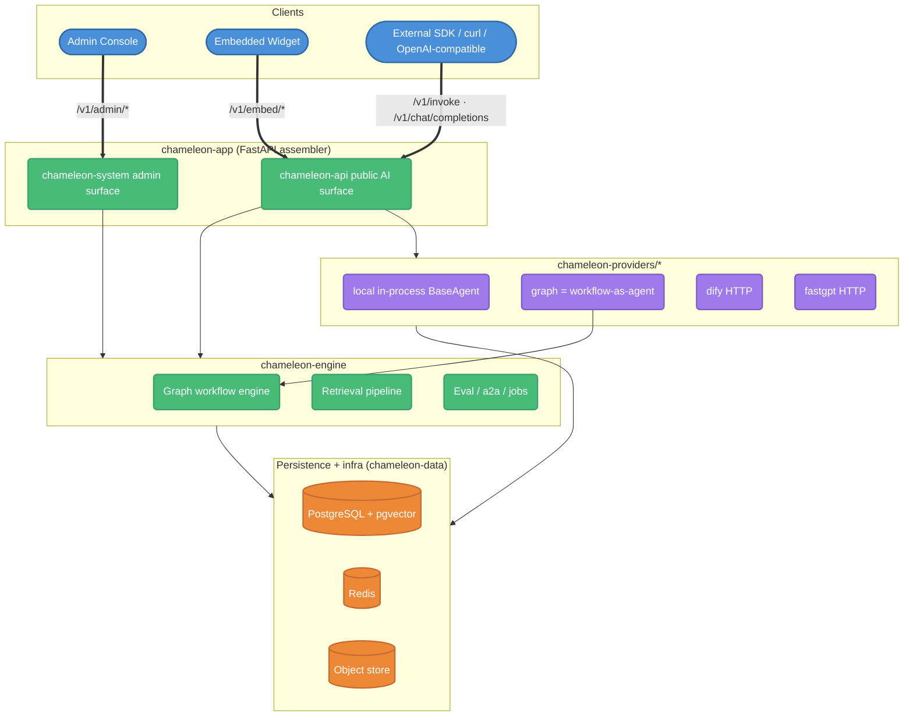
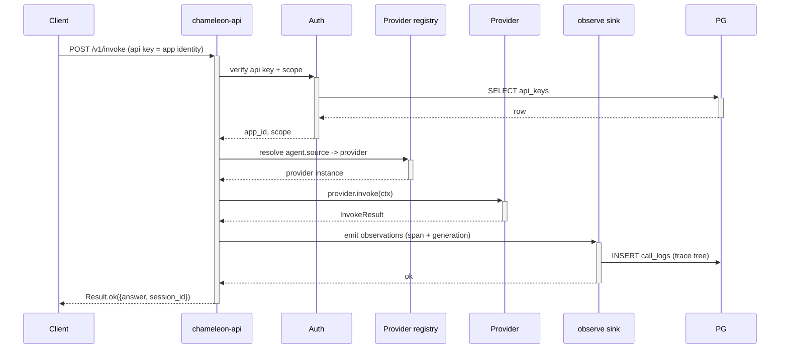

# Architecture

## Overview

Chameleon is an open-source, single-tenant LLMOps platform: multi-source AI aggregation,
workflow orchestration, RAG knowledge bases, Trace/Eval observability, multi-agent
collaboration, and an embeddable SDK.



## Backend layering

The backend is a `uv` workspace of 10 packages. Dependencies are strictly one-directional and
enforced at CI time by `import-linter` (two contracts, both GREEN):

```
core ← data ← integrations ← engine ← (providers / api / system / app / agents / agentkit)
```

| Package | Responsibility | Hard constraint |
|---------|----------------|-----------------|
| **chameleon-core** | Pure protocols + data structures + `observe` ContextVar / sink protocol | pydantic-only; **no sqlalchemy / langchain** (forbidden contract) |
| **chameleon-data** | SQLAlchemy 2.0 async ORM models + infra (`db` / `redis` / `object_store` / `jwt` / `auth` / `crypto` / `logger`) + utils + config loading | — |
| **chameleon-integrations** | Vendor / external implementations: LLM factory, embeddings, pgvector, reranker, sandbox (docker), LangChain bridges, observe → `call_logs` handler, plugin registry | depends down only |
| **chameleon-engine** | Orchestration: graph workflow engine + nodes, retrieval pipeline, eval, a2a, jobs | — |
| **chameleon-providers** | Provider abstraction (`base` protocol / types / registry) + `local` (in-process `BaseAgent`) + `dify` + `fastgpt` + `graph` (workflow-as-agent). Each provider is its own workspace member under `chameleon-providers/*`. | — |
| **chameleon-agents** | Business-level local agents (with `examples/`) | — |
| **chameleon-agentkit** | In-process agent SDK: `@agent` + `ctx` to implicitly pull model / KB / trace, named model slots, config `Schema` → auto-form, entry-points discovery | — |
| **chameleon-api** | Public AI service API (agent invoke / knowledge / session / task / files) + OTLP ingestion | — |
| **chameleon-system** | Internal admin management API | — |
| **chameleon-app** | Thin FastAPI launcher: assembly + lifespan + middleware + DI wiring | — |

### import-linter contracts

```toml
[[tool.importlinter.contracts]]
name = "core stays a pure abstraction: no sqlalchemy / langchain family"
type = "forbidden"
source_modules = ["chameleon.core"]
forbidden_modules = ["sqlalchemy", "langchain", "langchain_core", "langchain_openai", "langgraph"]

[[tool.importlinter.contracts]]
name = "layered base single-direction: core <- data <- integrations <- engine"
type = "layers"
layers = ["chameleon.engine", "chameleon.integrations", "chameleon.data", "chameleon.core"]
```

A handful of IoC-convenience facades (e.g. `base_agent` delegating KB retrieval to
`integrations`) are whitelisted via `ignore_imports`; they are lazy, in-function imports that
never pull heavy deps into `core` at load time.

## Provider model

The `chameleon-providers/base` package defines the provider protocol and an in-memory registry.
Each provider is a separate workspace member:

- **local** — runs a `BaseAgent` (or an `agentkit` agent) in-process.
- **graph** — a published graph workflow exposed as an agent (Dify Chatflow-style); its
  `persist.py` records runs to `graph_runs` (including debug runs).
- **dify** / **fastgpt** — HTTP bridges to external platforms.

An agent's `source` field selects the provider; the public invoke surface is provider-agnostic.

## Workflow engine

`chameleon-engine/graph` is the orchestration core (`engine` + `node_base` + `registry`).
Node types currently shipped:

```
LLM · LLM-messages · LLM-tools · KB · Tool · HTTP · Code (docker sandbox) · Template
· Intent classifier · Aggregator · Answer · If-Else · Iteration · Parallel
· Agent debate · Human input · Assign
```

`Iteration` / `Parallel` run nested subgraphs. `Human input` suspends the run and persists a
`human_input_pending` state for resume.

## Public API surface

Public (`chameleon-api`):

| Prefix | Purpose |
|--------|---------|
| `/v1/sessions` | Chat sessions (`ChatSession` + `end_user_id` identity layer) |
| `/v1/kb` | Knowledge base query / hit-test |
| `/v1/embed` | Embeddable widget (origin whitelist + session token + Redis rate-limit) |
| `/v1/files` | File upload / session files |
| `/v1/tasks` | Async task API |
| `/v1/otel` | OTLP (OpenTelemetry) trace ingestion |
| `/v1/auth` | Login / token refresh |
| `/v1/invoke`, `/v1/info` | Dify-style flat entry (the API key *is* the application identity) |
| `/v1/chat/completions` | OpenAI-compatible endpoint |

Admin (`chameleon-system`, all under `/v1/admin/`):

```
agents · api-keys · app-templates · kbs · graphs · models · providers · datasets
· eval-jobs · eval-templates · plugins · marketplace · tools · schemas · scores
· search · session-files · settings · users · roles · permissions · audit-logs
· dashboard · playground · embed-configs
```

## Key decisions

### DB-driven config
JSON files only seed the first boot; runtime config lives in DB (`providers`, `models`,
`agents`, `graphs` tables). Admin edits propagate via registry reloads and LLM cache
invalidation.

### JWT dual-token
- `access_token`: short-lived, in `Authorization: Bearer`
- `refresh_token`: long-lived, in an HTTP-only Cookie

An axios interceptor catches 401 → auto-refresh → retry once. The refresh token is
JS-inaccessible (XSS-safe). JWT helpers live in `chameleon-data/infra/jwt.py`.

### RBAC three-table
Users ↔ user_roles ↔ roles ↔ role_permissions ↔ permissions, with wildcard support
(`*:*`, `users:*`).

### API-key scopes
There is no app-container concept. A key's scope is one of **app / agent / kb**, distinguished
by prefix (`chm_` / `agent-` / `kbs-`). Scope is enforced at the service layer on every
invoke / knowledge call.

### AES-256-GCM provider credentials
Master key in env `CHAMELEON_CRYPTO_KEY` (32 bytes b64). `providers.api_key_encrypted` stores
ciphertext; plaintext is never logged. Crypto lives in `chameleon-data/utils/crypto.py`.

### Snowflake IDs
64-bit: 1 sign + 41 timestamp + 10 instance (`CHAMELEON_INSTANCE_ID`) + 12 seq.

### Embeddable widget
Vanilla TS IIFE bundle, Shadow-DOM-isolated styles. Origin whitelist + session token +
Redis rate-limit. Messages rendered via `textContent` (XSS-safe).

## Observability (LangSmith-style)

`call_logs` is the **single source of truth** for traces (the ORM model lives in
`chameleon-data/models/api_key.py`, table `call_logs`). A trace is a tree of nested
**observations** (span + generation), linked by `parent_id` and typed by `observation_type`.
Graph nodes emit spans into the same trace tree; the root row carries a rollup of
model / token / cost. Component-level callbacks (LLM, retriever, tool, embedding, reranker)
auto-instrument via the `observe` ContextVar + sink in `chameleon-core`, with the persistence
handler in `chameleon-integrations/observe`.

The frontend splits observability into two tabs: **Trace** and **Session**.

## Knowledge base

- Collection types (generic / FAQ / Wiki / API), each with its own chunker.
- Hybrid retrieval: vector + BM25 + RRF + metadata filter + reranker.
- VLM image captioning; consistency scan; metadata fields with field-scoped filtered recall.
- Session-file ephemeral RAG: small files indexed full-text, large files chunked + vectorized.

## Frontend

React 19 + Vite + TS (strict) + Tailwind v4 + Radix + TanStack Query + Zustand + ReactFlow.
Four navigation domains: **Workbench / Knowledge / Observability / Settings**.

```
src/
├── core/                Shared infra (lib / components / hooks / stores / i18n / services / constants)
├── system/<module>/     Self-contained business modules
│   ├── pages/           Page components
│   ├── services/        API clients
│   ├── types/           TypeScript types
│   └── routes.ts        Module routes (default-export ModuleRouteConfig)
├── api-docs/            Embedded API documentation
└── router/index.tsx     import.meta.glob('../system/**/routes.ts')
```

Adding a business module = creating a `system/<name>/` directory + a `routes.ts`. No external
file edits needed.

## Sequence: one agent invoke



## Toolchain & deployment

- **Backend**: `uv` (workspace) · `ruff` · `pytest` · `import-linter` (layering guard).
- **Frontend**: `yarn` + `vite` · `eslint` · `tsc`.
- **SDKs**: Python (`chameleon-sdk`, httpx sync + async, `@trace` / `patch_openai` / `patch_all`)
  and TypeScript (`@chameleon/sdk`). OTLP over HTTP.
- **Deployment**: Docker + Compose, multi-stage images, `docker/` split into three zones
  (images / containers / scripts). Backend defaults to port 7009; frontend dev server on a
  Vite port (~6006).

## Capacity expectations

- pgvector HNSW: million-scale chunk retrieval < 50 ms (m=16, ef_search=40).
- Redis: JWT blacklist + session token + rate limit, tens-of-thousands QPS on a single instance.
- Multi-instance: nginx upstream, stateless backend, no session affinity needed.
