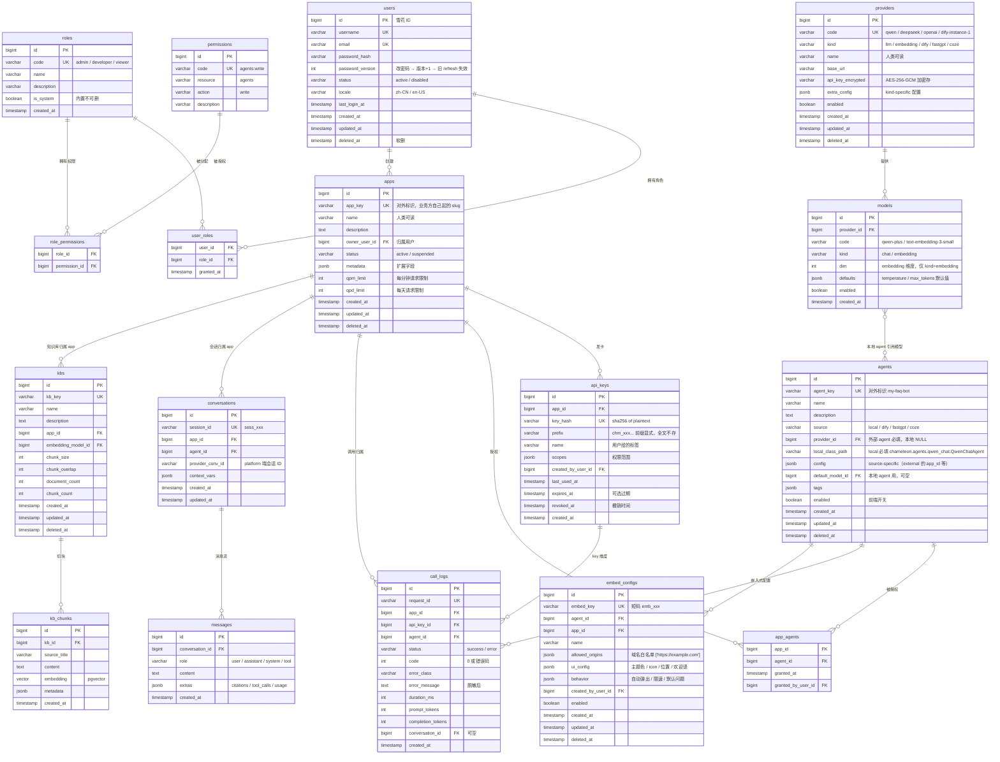
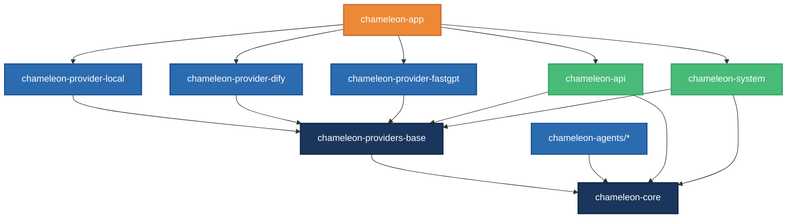

# Chameleon Redesign 架构设计文档

> **性质**：comprehensive redesign（全面重设计）
> **状态**：Draft（待 review）
> **日期**：2026-05-21
> **作者**：Links + Claude（pair design）
>
> 本文档是 Chameleon "DB-driven + 管理面板 + 嵌入式智能体" 全面重设计的设计宪法。所有实施都按本文档落地；任何偏离需先回头改本文档。

---

## 目录

- [一、产品定位](#一产品定位)
- [二、技术选型与论证](#二技术选型与论证)
- [三、领域模型（ER + DDL）](#三领域模型er--ddl)
- [四、API 设计](#四api-设计)
- [五、后端包分层](#五后端包分层)
- [六、JSON ↔ DB 同步策略](#六json--db-同步策略)
- [七、国际化（i18n）](#七国际化i18n)
- [八、质量保证体系](#八质量保证体系)
- [九、嵌入式智能体设计预案](#九嵌入式智能体设计预案v04-ramp-up)
- [十、Docker 化与部署](#十docker-化与部署)
- [十一、演进路线](#十一演进路线)
- [附录 A：参考开源项目映射](#附录-a参考开源项目映射)
- [附录 B：技术选型对比矩阵](#附录-b技术选型对比矩阵)
- [附录 C：术语表](#附录-c术语表)

---

## 一、产品定位

### 1.1 一句话定位

> **Chameleon 是给开源社区使用的"AI 服务统一接入层 + 多平台聚合控制台"。**

- 对**业务方应用**：提供统一的 HTTP API 入口（不管背后接的是 dify / fastgpt / 本地 agent，业务方完全感知不到）。
- 对**管理员**：提供完整的 web 管理面板（应用 / API key / 模型 / agent / 知识库 / 监控全部可视化管理）。
- 对**前端开发者**：提供嵌入式 widget，一行 `<script>` 把 chameleon agent 嵌入业务方网站。

### 1.2 目标用户

| 用户画像 | 场景 |
|---|---|
| **中小团队后端开发者** | 多个内部业务要接 AI 能力，不想每个业务都对接 dify / fastgpt / OpenAI 分别造一遍 |
| **个人开发者 / 独立创业者** | 同时维护多个 side project 需要 AI，想要一个"我的 AI 中枢" |
| **企业内 AI 平台建设者** | 公司里要搭一个内部 AI 服务网关，统一鉴权 / 计量 / 切换底层平台 |

### 1.3 与同类产品差异化

| | dify | fastgpt | litellm | chameleon |
|---|---|---|---|---|
| 主打 | 编排平台（拖拽 workflow） | 编排平台 | LLM 网关（OpenAI 兼容代理） | 多平台聚合 + 嵌入式 |
| 编排能力 | ✅ 强 | ✅ 强 | ❌ | ❌ **故意不做** |
| 接入 dify | — | — | ❌ | ✅ provider |
| 接入 fastgpt | — | — | ❌ | ✅ provider |
| 自己写本地 agent | ✅ | ✅ | ❌ | ✅ BaseAgent + 三种范式 |
| 统一 API 入口 | ✅（自家 agent） | ✅（自家 agent） | ✅（仅 LLM） | ✅ **跨平台** |
| 嵌入式 widget | ✅ | ✅ | ❌ | ✅ |
| 应用 / API key 管理 | ✅ | ✅ | ✅ | ✅ |
| 多模型路由 | 仅平台内 | 仅平台内 | ✅ 强 | ✅ 通过 provider |
| 知识库 / RAG | ✅ | ✅ | ❌ | ✅ |
| 项目体量 | 重 | 重 | 轻 | 中 |

**核心差异化（要在 README 醒目位置写清楚）**：

> **chameleon 不是 dify 的替代品，是 dify 的"上层网关"**：你已经在 dify / fastgpt 编排了 N 个 agent，chameleon 让你用**一个 API key + 一套接口**统一访问它们，而且能混入你的本地 Python agent。

### 1.4 反目标（明确不做什么）

| 反目标 | 为什么不做 |
|---|---|
| 拖拽 workflow 编排 | dify / fastgpt 已经做到极致，正面竞争没胜算 |
| 自研 LLM 服务 | 用商用 / 开源 LLM 即可，造不出比 GPT-4 / Claude 更好的 |
| AI 工程 IDE（如 cursor） | 完全不同的产品形态 |
| 大型 SaaS 多租户隔离 | 本次故意单租户，简化 90% 的复杂度。如真需要 SaaS 化 未来真有 SaaS 化需求再加 tenant 维度 |

### 1.5 中国开源生态适配

- **默认中文 UI**（i18next zh-CN），支持英文切换
- **预装国内 LLM provider 模板**（Qwen / DeepSeek / Moonshot / 智谱 / 百度文心）
- **国内镜像友好**：docker-compose 支持 ghcr.io 与阿里云镜像源切换
- **PG 容器使用 pgvector/pgvector:pg16**（国内可 pull）
- **文档双语**（zh-CN 优先，英文同步）

---

## 二、技术选型与论证

### 2.1 后端核心栈（无变动，仅版本约束）

| 维度 | 选型 | 版本 |
|---|---|---|
| 语言 | Python | ≥ 3.12 |
| Web 框架 | FastAPI | ≥ 0.115 |
| ORM | SQLAlchemy 2.0 async（声明式 + Mapped[]） | ≥ 2.0 |
| 迁移 | Alembic | ≥ 1.13 |
| 校验 | Pydantic v2 | ≥ 2.7 |
| 主数据库 | PostgreSQL + pgvector + pg_trgm | PG 16 + pgvector |
| 包管理 | uv（workspace 多包） | ≥ 0.10 |
| 日志 | loguru | ≥ 0.7 |

### 2.2 新增：Redis

**用途**：

1. **JWT 黑名单**：用户主动登出 / 修改密码后吊销 access_token，存 token JTI 到 Redis 直到 TTL 过期
2. **登录速率限制**：单 IP / 单账号 5 次失败 → 锁定 15 分钟
3. **配置热重载缓存**：DB 里 models / providers / agents 表的内容缓存到 Redis，30 秒 TTL；改动后失效
4. **嵌入式 token 短期存储**：embed_token 直接存 Redis，TTL 1 小时

**连接配置**（沿用 `component.json` 风格）：

```json
{
  "redis": {
    "host": "127.0.0.1",
    "port": 6379,
    "password": "${env:REDIS_PASSWORD}",
    "db": 0
  }
}
```

**客户端**：`redis-py` 异步版（`redis.asyncio`），不引入 aioredis（已废弃）。

**为什么是 Redis 而不是 pg LISTEN/NOTIFY**：

- Redis SET + TTL 是 JWT 黑名单标准做法，pg 实现要自己写定时清理
- 限流用 Redis INCR + EXPIRE 一条命令搞定，pg 要写 lua 等价物
- 配置热重载用 pg LISTEN/NOTIFY 也能实现，但跨连接订阅模型在 asyncpg 里复杂
- Redis 是 backend 标配，开源社区普及度极高

**对部署的影响**：docker-compose 加 1 个 Redis 容器（256MB 内存够用）。

### 2.3 认证机制：JWT 双 token

```
登录 → 颁发 access_token (15min) + refresh_token (7d HTTP-only cookie)
        ↓
  存到客户端：
    - access_token：localStorage / memory（前端代码可见）
    - refresh_token：HTTP-only cookie（前端代码不可见，仅浏览器自动带）

请求 → Authorization: Bearer <access_token>
     → 过期 → 前端拦截器自动 POST /v1/auth/refresh（cookie 自动带）
     → 拿新 access_token

登出 → 把当前 access_token 的 JTI 加 Redis 黑名单（剩余 TTL）
     → 清掉 refresh_token cookie
     → 前端清 localStorage
```

**JWT payload**：

```json
{
  "sub": "user_id",
  "username": "alice",
  "roles": ["admin"],
  "iat": 1234567890,
  "exp": 1234568790,
  "jti": "uuid-v7"
}
```

**为什么 access 15min + refresh 7d**：

- access 短 = 即使被偷，损失窗口可控
- refresh 长 = 用户体验好，一周不用反复登录
- 修改密码 → refresh 全部失效（DB 标记 user.password_version_inc）

**库选型**：`python-jose[cryptography]` 或 `PyJWT`，倾向 PyJWT（更轻，依赖少）。算法 HS256（单实例够用）；如需多实例签名共享，未来切 RS256。

### 2.4 权限模型：RBAC 经典三表

```
users ───────┐                              ┌─────── permissions
             │                              │           ↑
             ↓                              ↓           │
        user_roles (M:N) ─────→ roles ────→ role_permissions (M:N)
```

**5 张表**：

| 表 | 角色 |
|---|---|
| `users` | 用户基础信息（username / password_hash / email / status / locale） |
| `roles` | 角色定义（admin / developer / viewer + 用户自建） |
| `permissions` | 权限点定义（如 `models:write` / `agents:read` / `apps:delete`） |
| `user_roles` | 用户 ↔ 角色多对多 |
| `role_permissions` | 角色 ↔ 权限多对多 |

**内置默认角色（seed）**：

| 角色 | 权限 |
|---|---|
| `admin` | 全部权限 `*:*` |
| `developer` | 业务资源 CRUD（agents / models / providers / apps / api_keys），不能管 users / roles |
| `viewer` | 只读所有 + 看 dashboard，不能改任何东西 |

**权限点命名规约**：`<resource>:<action>`，action ∈ `{read, write, delete, manage}`。

**FastAPI 集成**：dependency 风格

```python
@router.post("/agents", dependencies=[Depends(require_permission("agents:write"))])
async def create_agent(...): ...
```

**为什么不用 Casbin**：

- Casbin 强大但学习曲线高，debug 难
- 三表 RBAC 99% 的场景够用，剩余 1% (条件权限) 再加自定义判断函数
- 开源社区用户读代码门槛低（三个表都看得懂）
- 参考：dify / langflow / open-webui 都自实现 RBAC，未用 Casbin

### 2.5 多租户隔离：单实例多用户共享资源

**本次选择**：所有用户共享资源池——一个 chameleon 实例里所有 models / agents / kbs 全部共享，由权限控制谁能改。

**未来 SaaS 化升级路径（不在本次范围）**：

- 加 `workspaces` 表（轻量级 tenant）
- 资源表加 `workspace_id` 字段
- 全部 SQL 加 workspace_id 过滤
- 不破坏本次 schema：本次视所有资源 `workspace_id = NULL`，迁移时全归到 default workspace

参考：langflow 走的这条路，先单租户，后加 workspace。

### 2.6 前端栈

| 维度 | 选型 |
|---|---|
| 构建 | Vite 5 |
| 框架 | React 19 |
| 语言 | TypeScript（strict） |
| 路由 | React Router v6 |
| 样式 | Tailwind CSS v3 |
| 组件 | **shadcn/ui**（基于 Radix + Tailwind，可定制度高，不锁死品牌） |
| 数据请求 | TanStack Query v5（替代 SWR） |
| 状态管理 | Zustand（轻状态） + React Context（主题 / 用户） |
| 表单 | React Hook Form + zod |
| 图表 | Recharts（dashboard 用） |
| 国际化 | i18next + react-i18next |
| HTTP | 自封装 axios |
| 测试 | Vitest + React Testing Library + Playwright（E2E） |
| Lint | ESLint + Prettier |

**为什么 shadcn 不是 Antd**：

| | Antd | shadcn/ui |
|---|---|---|
| 上手速度 | 快（开箱全套组件） | 中（要复制粘贴组件） |
| 视觉锁定 | 重（一眼看出 Antd） | 轻（每个组件你能改） |
| 包大小 | 大（≈1.5MB） | 小（按需引入） |
| 国际化 | 内置 | 自己接 i18next |
| 主题切换 | locale.theme 一行 | CSS variables，更灵活 |

**chameleon 是开源项目**——要让用户能自由定制 UI，shadcn 更合适。

参考：cal.com / linear-clone / inboxbase 都用 shadcn。

### 2.7 监控：起步从简，预留扩展

**本次实施**：

- `loguru` 结构化日志（已有）
- 启动后 `GET /metrics` 返回 Prometheus 格式纯文本（用 `prometheus_client` 库），但 本次不强制接 Prometheus 服务端，预留扩展点
- 启动后 `GET /health` + `GET /ready`（已有）
- 调用日志已经入 `call_logs` 表，dashboard 自己 SQL 查

**未来扩展（不在本次范围）**：

- 接 Prometheus + Grafana docker-compose 一键起
- 接 Sentry（可选，自部署或 cloud）

**为什么暴露 /metrics 但不强制接**：让开源用户能自己接 Prometheus，不强制依赖。

### 2.8 异步任务：保持简单

**当前**：`asyncio.create_task` 跑 KB ingest worker（够用）。

**本次不引入** Celery / arq / RQ。

**原因**：

- chameleon 是接入层，本身不做重计算
- KB ingest 是唯一长任务，规模可控
- 引入队列 = 多一个服务（Redis 已经在，但 worker 进程要单独管）
- 真要重队列未来接 arq（同 asyncio 生态最近）

### 2.9 密码哈希

| 维度 | 选型 |
|---|---|
| 算法 | `argon2id`（OWASP 推荐） |
| 库 | `argon2-cffi` |
| 参数 | time_cost=2, memory_cost=64MB, parallelism=1 |

**为什么不是 bcrypt**：bcrypt 已被 argon2 超越，OWASP 2023+ 推荐 argon2id。

---

## 三、领域模型（ER + DDL）

### 3.1 完整 ER 图



### 3.2 关键索引（性能与查询模式驱动）

```sql
-- 鉴权热路径
CREATE INDEX idx_api_keys_hash ON api_keys(key_hash) WHERE revoked_at IS NULL;
CREATE INDEX idx_users_username ON users(username) WHERE deleted_at IS NULL;
CREATE INDEX idx_users_email ON users(email) WHERE deleted_at IS NULL;

-- 调用日志查询（dashboard 主力）
CREATE INDEX idx_call_logs_app_created ON call_logs(app_id, created_at DESC);
CREATE INDEX idx_call_logs_agent_created ON call_logs(agent_id, created_at DESC);
CREATE INDEX idx_call_logs_created ON call_logs(created_at DESC);
CREATE INDEX idx_call_logs_status ON call_logs(status) WHERE status = 'error';

-- 会话
CREATE INDEX idx_conversations_app_updated ON conversations(app_id, updated_at DESC) WHERE deleted_at IS NULL;
CREATE INDEX idx_messages_conv ON messages(conversation_id, created_at);

-- 知识库 / 向量
CREATE INDEX idx_kb_chunks_kb ON kb_chunks(kb_id);
CREATE INDEX idx_kb_chunks_embedding ON kb_chunks USING hnsw (embedding vector_cosine_ops);

-- 嵌入
CREATE INDEX idx_embed_configs_key ON embed_configs(embed_key) WHERE deleted_at IS NULL;
```

### 3.3 软删除约定

- 所有业务表都加 `deleted_at TIMESTAMPTZ DEFAULT NULL`
- 查询默认 `WHERE deleted_at IS NULL`（ORM 层 `@declared_attr` 加 default filter）
- 物理删仅用于：
  - call_logs 数据 retention（90 天前的物理删 + 归档 S3）
  - 测试数据 cleanup
- 唯一约束都改为部分唯一：`UNIQUE (xxx) WHERE deleted_at IS NULL`

### 3.4 主键策略

- 业务表：**bigint 雪花 ID**（沿用 v0.1 的 `core/utils/snowflake.py`）
- 连接表（user_roles / role_permissions / app_agents）：复合主键 `(user_id, role_id)` 等

### 3.5 加密字段

| 字段 | 加密方式 |
|---|---|
| `users.password_hash` | argon2id（不可逆 hash） |
| `api_keys.key_hash` | sha256（不可逆 hash） |
| `providers.api_key_encrypted` | AES-256-GCM（可逆，启动用 master key 解） |

**Master key 来源**：环境变量 `CHAMELEON_MASTER_KEY`（32 字节 base64）。未设置时启动 fail-fast 不允许跑生产。dev 环境给默认 key + warn。

---

## 四、API 设计

### 4.1 三类接口分层

| 层 | 前缀 | 鉴权方式 | 用途 |
|---|---|---|---|
| **业务接口** | `/v1/agents` `/v1/knowledge` `/v1/conversations` `/v1/tasks` | API key (Bearer) | 业务方应用调（chameleon-api 包） |
| **管理接口** | `/v1/admin/*` | JWT (Bearer) | 前端管理面板调（chameleon-system 包） |
| **嵌入接口** | `/v1/embed/*` | embed_token (短期，URL 参数) | 嵌入 widget 调 |
| **认证接口** | `/v1/auth/*` | 部分 JWT，部分无 | 登录 / 刷新 / 登出 |
| **元接口** | `/health` `/ready` `/metrics` | 无 | 健康 / 监控 |

### 4.2 认证接口

```
POST   /v1/auth/login            { username, password } → access_token + set-cookie refresh_token
POST   /v1/auth/refresh          (refresh_token cookie 自动带) → new access_token
POST   /v1/auth/logout           → 黑名单 + 清 cookie
GET    /v1/auth/me               (admin) → 当前用户信息 + 角色 + 权限点
POST   /v1/auth/change-password  { old_password, new_password }
```

### 4.3 管理接口（`/v1/admin/*`）

```
# 用户与权限
GET    /v1/admin/users
POST   /v1/admin/users
POST   /v1/admin/users/{id}/update
POST   /v1/admin/users/{id}/delete
POST   /v1/admin/users/{id}/roles/grant       { role_id }
POST   /v1/admin/users/{id}/roles/revoke      { role_id }

GET    /v1/admin/roles
POST   /v1/admin/roles
POST   /v1/admin/roles/{id}/update
POST   /v1/admin/roles/{id}/delete            # 仅非 is_system
POST   /v1/admin/roles/{id}/permissions/sync  { permission_ids: [...] }

GET    /v1/admin/permissions                  # 仅读，permission 表是 seed

# 应用与 key
GET    /v1/admin/apps
POST   /v1/admin/apps
POST   /v1/admin/apps/{id}/update
POST   /v1/admin/apps/{id}/delete
GET    /v1/admin/apps/{id}/api-keys
POST   /v1/admin/apps/{id}/api-keys           → 返回 plaintext key（仅一次）
POST   /v1/admin/api-keys/{id}/revoke
POST   /v1/admin/apps/{id}/agents/grant       { agent_id }
POST   /v1/admin/apps/{id}/agents/revoke      { agent_id }

# 模型与 provider
GET    /v1/admin/providers
POST   /v1/admin/providers
POST   /v1/admin/providers/{id}/update
POST   /v1/admin/providers/{id}/delete
POST   /v1/admin/providers/{id}/test          # 测试连通性

GET    /v1/admin/models
POST   /v1/admin/models
POST   /v1/admin/models/{id}/update
POST   /v1/admin/models/{id}/delete

# Agent 管理
GET    /v1/admin/agents
POST   /v1/admin/agents                       # 仅 source=external 可建
POST   /v1/admin/agents/{id}/update
POST   /v1/admin/agents/{id}/delete           # 本地 agent 仅能 disable，不能删
POST   /v1/admin/agents/{id}/enable
POST   /v1/admin/agents/{id}/disable
POST   /v1/admin/agents/{id}/test             { input: "test" } → 调用一次返回结果

# 知识库
GET    /v1/admin/kbs                          # 总览（含统计）
POST   /v1/admin/kbs/{id}/update
POST   /v1/admin/kbs/{id}/delete
GET    /v1/admin/kbs/{id}/chunks              # 看切块

# 调用日志
GET    /v1/admin/call-logs                    # 分页 + 过滤（app / agent / status / 时间范围）
GET    /v1/admin/call-logs/{id}               # 详情

# Dashboard
GET    /v1/admin/dashboard/overview           # 综合统计
GET    /v1/admin/dashboard/timeseries         # 时序数据 { metric, granularity, from, to }
GET    /v1/admin/dashboard/top-agents
GET    /v1/admin/dashboard/top-apps

# 系统配置
GET    /v1/admin/settings                     # 全部配置项
POST   /v1/admin/settings/update              # 单项更新
POST   /v1/admin/settings/export-json         # 导出 JSON 备份
POST   /v1/admin/settings/import-json         # 导入 JSON

# 审计日志
GET    /v1/admin/audit-logs
```

### 4.4 业务接口（`/v1/*` 不变）

继承 v0.1，签名不变；内部实现改为查 DB 而不是 JSON。

### 4.5 嵌入接口

```
POST   /v1/embed/{embed_key}/session    # 业务方前端 widget 起会话，返回 embed_session_token
POST   /v1/embed/{embed_key}/invoke     # 用 embed_session_token 调 agent
GET    /v1/embed/{embed_key}/config     # widget 拉取 UI 配置
```

### 4.6 统一响应封装（沿用 v0.1 Result[T]）

```json
{
  "code": 0,
  "message": "ok",
  "success": true,
  "data": { ... }
}
```

错误响应：

```json
{
  "code": 4011,
  "message": "JWT 已过期",
  "success": false,
  "data": null
}
```

错误码段位（扩展 v0.1）：

| 段位 | 含义 |
|---|---|
| 0 | 成功 |
| 4000-4099 | 通用请求错误 |
| 4100-4199 | 鉴权 / 权限（**新加**：4101 token 过期，4102 token 无效，4103 权限不足） |
| 4200-4299 | 资源不存在 |
| 5000-5099 | 服务内部错误 |
| 5100-5199 | Provider 错误（沿用） |

### 4.7 分页 / 排序 / 过滤规约

**请求**：

```
GET /v1/admin/apps?page=1&page_size=20&sort=-created_at&filter[status]=active
```

**响应**：

```json
{
  "code": 0,
  "data": {
    "items": [...],
    "total": 123,
    "page": 1,
    "page_size": 20
  }
}
```

`PageResult[T]` 类已在 `chameleon-core/api/response.py`，沿用。

### 4.8 OpenAPI 文档

- FastAPI 自动生成 `/docs`（Swagger UI）+ `/redoc`
- 生产环境关闭 docs（环境变量 `OPENAPI_PUBLIC=false`）
- 中文 description 必填，title 英文（OpenAPI 客户端生成友好）

---

## 五、后端包分层

### 5.1 v0.1 现有包（不动）

```
backend/
├── chameleon-core/        基础设施 + AI infra + 共享 ORM
├── chameleon-providers/*  Provider 适配层
├── chameleon-agents/*     本地 agent 资产
├── chameleon-api/         对外业务 API
├── chameleon-system/      内部管理 API（本次大幅扩张）
├── chameleon-app/         FastAPI 启动器（薄）
```

### 5.2 本次扩张方向

**`chameleon-system/` 子模块大幅增加**：

```
chameleon-system/src/chameleon/system/
├── auth/             ★ 新：登录 / JWT / 黑名单 / 中间件（依赖 Redis）
├── users/            ★ 新：用户 CRUD
├── roles/            ★ 新：角色 CRUD
├── permissions/      ★ 新：权限查询
├── apps/             ★ 新：应用 CRUD
├── api_key/          已有，重构入新规约
├── models/           ★ 新：模型 CRUD
├── providers/        ★ 新：provider CRUD
├── agents/           ★ 新：agent 管理（本地启用态 + 外部 yaml 入表）
├── kbs/              ★ 新：知识库管理（移过来自 chameleon-api/knowledge 的 admin 部分）
├── call_logs/        ★ 新：调用日志查询（沿用 admin 模块）
├── dashboard/        ★ 新：dashboard 时序数据 + 聚合
├── settings/         ★ 新：系统配置 / 导入导出 JSON
├── audit_logs/       ★ 新：审计日志
└── admin/            重构入：仅留 providers 健康检查（监控）
```

**`chameleon-core/` 加新子模块**：

```
chameleon-core/src/chameleon/core/
├── infra/
│   ├── db.py             已有
│   ├── logger.py         已有
│   ├── auth.py           已有（API key 路径）
│   ├── redis.py          ★ 新：Redis 客户端工厂
│   └── jwt.py            ★ 新：JWT encode / decode / 黑名单
├── api/
│   ├── response.py       已有
│   └── exceptions.py     已有（扩展 JwtExpired / PermissionDenied 等）
├── models/               扩展：加 user/role/permission/app/provider/model/agent/... 等 ORM
├── components/
├── base/
├── config/
└── utils/
```

**`chameleon-api/`（不变，但内部业务改）**：

```
chameleon-api/src/chameleon/api/
├── agent/        业务接口（不变）
├── knowledge/    业务接口（CRUD 部分挪到 chameleon-system，仅留 ingest / search）
├── conversation/ 业务接口（不变）
└── task/         业务接口（不变）
```

### 5.3 是否单独抽 chameleon-auth 包？

**讨论**：

- 选项 A：auth 放 chameleon-system/auth/
- 选项 B：auth 抽成独立包 chameleon-auth

**结论**：**选项 A**。auth 是 system 的一部分，独立成包带来的好处（理论上其他项目复用）不显著，反而加包数量。如未来真要复用，未来真要复用再抽。

### 5.4 包依赖图



**铁律不变**：

- agent 子包仅依赖 chameleon-core
- providers/* 仅依赖 chameleon-providers-base + chameleon-core
- chameleon-api / chameleon-system 不互相依赖

---

## 六、JSON ↔ DB 同步策略

### 6.1 启动流程

```
chameleon-app 启动
  ↓
init_db_connections()         (PG + Redis)
  ↓
alembic upgrade head           (schema 同步)
  ↓
init_registry_from_db()        (read-only：扫 DB 加载 providers/models/agents 到内存)
  ↓
  └── DB 为空？
        ├── 是 → seed_from_json_if_present()
        │           ↓ 读 backend/config/*.json
        │           ↓ 插入 DB（idempotent，看 PK / unique 冲突跳过）
        │           ↓ 重新 init_registry_from_db()
        │
        └── 否 → 直接用 DB 现状
  ↓
FastAPI app ready
```

### 6.2 seed 逻辑详解

**入口**：`chameleon.system.settings.seed.run_seed_if_empty()`

**5 个 seed 步骤**：

```python
async def run_seed_if_empty():
    """启动时如果 DB 关键表为空，从 JSON 导入"""
    if await _users_count() > 0:
        return  # 已有数据，不 seed

    logger.info("DB empty, seeding from JSON...")
    await seed_default_admin()           # 1. 建 admin / developer / viewer 角色 + 全部 permission + 默认 admin 用户
    await seed_providers_from_model_json()  # 2. config/model.json → providers + models 表
    await seed_apps_and_keys()            # 3. 如果存在 admin key，迁移到 apps + api_keys
    await seed_agents_from_yaml()          # 4. config/agents.yaml → agents 表（external 部分）+ 扫 local agent 入表
    await seed_settings_defaults()        # 5. chameleon.json → settings 表
    logger.info("seed done")
```

**默认 admin 账号**：

- username: 由环境变量 `CHAMELEON_ADMIN_USERNAME` 指定（默认 `admin`）
- password: 随机生成强密码，打印到终端 + 写 `backend/logs/initial-admin-credentials.txt`（chmod 600）
- 强制首次登录改密

### 6.3 JSON 导出能力

`POST /v1/admin/settings/export-json` → 返回完整 zip:

```
chameleon-backup-2026-05-21.zip
├── model.json
├── agents.yaml
├── chameleon.json
├── apps.json          ★ 含 app + api_key（key_hash，不可还原 plaintext）
├── users.json         ★ 含 user + roles 关系
└── README.md          ← 还原方法说明
```

**意义**：

- 个人项目灾备：DB 挂了 → import-json 还原
- 多机部署：导出 → 新机 import
- git 追踪：把 zip 解压版本控制（除 api_keys / users 含密码 hash 部分）

### 6.4 运行时配置更新

**两种更新路径**：

1. **前端改 → API → 落 DB → 失效 Redis 缓存**（首选）
   - `POST /v1/admin/models/{id}/update` → SQL UPDATE → `DEL chameleon:cache:models:*`
   - 下次读取 → cache miss → 从 DB 加载 → 新值 → cache set
   - 缓存 TTL 30s（兜底机制）

2. **重启服务**（保底）
   - 启动期一次性把 providers / models / agents 全 load 到内存（registry）
   - 不依赖 Redis，简单可靠

**不做的**：

- ❌ 不做 pg LISTEN/NOTIFY 实时推送（复杂度大于收益）
- ❌ 不做配置文件 watch（DB 已是 SoT，watch 文件没意义）

### 6.5 模型 / Provider 配置加密

`providers.api_key_encrypted` 用 AES-256-GCM：

```python
# 写入
encrypted = aes_gcm_encrypt(plaintext, master_key)

# 读取（每次启动 + 每次 cache miss）
plaintext = aes_gcm_decrypt(encrypted, master_key)
```

Master key：env `CHAMELEON_MASTER_KEY`（强制 32 字节 base64，dev 给 demo key）。

---

## 七、国际化（i18n）

### 7.1 后端

- **错误消息**：抽 `i18n/zh-CN/errors.json` + `i18n/en-US/errors.json`
- **API 响应**根据 `Accept-Language` header 或 `users.locale` 字段返对应语言
- **结构化错误**：`Result.fail(code=4101, message_id="auth.token.expired")` → 前端可选拿 code 或 message

```python
class Result:
    def __init__(self, code: int, message_id: str | None = None, data=...):
        message = i18n.translate(message_id, locale=get_request_locale())
        ...
```

### 7.2 前端

- `i18next` + `react-i18next`
- 默认 `zh-CN`，切换 `en-US`
- 文案文件按 namespace 切（auth / agents / models / dashboard / common）

### 7.3 文档

- README zh + en 同步
- docs/getting-started.md → docs/zh/getting-started.md + docs/en/getting-started.md（双语同步实施）

---

## 八、质量保证体系

### 8.1 测试金字塔

```
                    ┌───────────────────┐
                    │   E2E (Playwright) │  ← 前端关键路径
                    │   E2E (httpx ASGI)  │  ← 后端跨模块
                    └───────────────────┘
                  ┌───────────────────────┐
                  │  Integration (pytest)  │  ← 真 PG + Redis (testcontainers)
                  └───────────────────────┘
              ┌─────────────────────────────┐
              │      Unit Tests (pytest)     │  ← 函数 / 类级
              └─────────────────────────────┘
```

| 层 | 目标覆盖率 | 实现 |
|---|---|---|
| Unit | 80%+ | 各包 tests/ 下 |
| Integration | 关键路径全覆盖 | tests/integration/，用 testcontainers 起真 PG/Redis |
| E2E 后端 | 主要 API 走通 | tests/ 已有 |
| E2E 前端 | 登录 / 主要 CRUD / dashboard 渲染 | frontend/tests/e2e/ Playwright |

### 8.2 CI/CD（GitHub Actions）

```yaml
.github/workflows/
├── backend-ci.yml    push / PR：lint + test + 构建 wheel
├── frontend-ci.yml   push / PR：lint + test + build dist
├── e2e.yml           手工触发：完整起 docker-compose 跑 Playwright
├── release.yml       tag：构建 Docker image + push 到 ghcr.io
└── docs.yml          push docs/：构建并部署到 GitHub Pages（用 docsify）
```

### 8.3 代码规范

| 维度 | 工具 |
|---|---|
| 后端 lint | ruff（已有） |
| 后端类型检查 | mypy（本次加入，逐步 strict） |
| 前端 lint | ESLint + typescript-eslint |
| 前端 format | Prettier |
| Commit 规范 | commitlint（Angular 规范，已用） |
| Pre-commit | husky + lint-staged（前端）/ pre-commit（后端可选） |

### 8.4 ADR（Architecture Decision Records）

新建 `docs/adr/` 目录，记录重大决策。命名 `NNNN-title.md`：

```
docs/adr/
├── 0001-jwt-double-token.md
├── 0002-rbac-classic-three-tables.md
├── 0003-json-seed-db-runtime.md
├── 0004-shadcn-over-antd.md
├── 0005-redis-for-jwt-blacklist.md
└── ...
```

**模板**：

```markdown
# NNNN. 标题

## 状态
Proposed / Accepted / Deprecated / Superseded by NNNN

## 上下文
什么背景下要做这个决策

## 决策
我们决定 ...

## 后果
正面 / 负面 / 风险

## 替代方案考虑
方案 B / 方案 C / 为啥没选
```

### 8.5 监控

**本次实施**：

- loguru 结构化日志（含 request_id / user_id / app_id）
- `/health` + `/ready`（已有）
- `/metrics` Prometheus 格式（暴露 QPS / latency p95 / 错误率）
- call_logs 表存所有调用（已有），dashboard 直接 SQL 查

**未来扩展（不在本次范围）**：

- docker-compose 加 Prometheus + Grafana + 预制 dashboard
- Sentry 可选接入

### 8.6 性能基准

`scripts/benchmark/` 下放 locust 脚本：

- `bench_login.py` 登录 QPS
- `bench_invoke_local.py` 本地 agent invoke QPS
- `bench_invoke_dify.py` 远程 dify QPS（mock dify）
- `bench_dashboard.py` dashboard 接口响应

本次至少跑通基础场景；性能 SLO 后续完善。

### 8.7 文档

| 目录 | 内容 |
|---|---|
| `README.md` | 项目门面（zh + en 链接） |
| `docs/getting-started.md` | 入门指南（agent 开发者视角，已有） |
| `docs/providers.md` | Provider 适配层原理（已有） |
| `docs/extension-guide.md` | 扩展指南（已有） |
| `docs/admin-guide.md` | ★ 新：管理员视角操作手册 |
| `docs/api-reference.md` | ★ 新：完整 API 参考（除 OpenAPI 之外人类可读版） |
| `docs/architecture.md` | ★ 新：架构总览 |
| `docs/deployment.md` | ★ 新：部署指南（Docker / K8s / 国内镜像） |
| `docs/adr/*.md` | ★ 新：决策记录 |
| `docs/plans/*.md` | 历史设计稿 |
| `docs/zh/` `docs/en/` | 双语同步实施 |

---

## 九、嵌入式智能体设计

> **状态**：完整实现（含表 schema + token 流程 + widget UMD bundle + iframe 模式）。

### 9.1 形态

```html
<!-- 业务方网站只需嵌入这一行 -->
<script
  src="https://chameleon.example.com/widget.js"
  data-embed-key="emb_abc123"
  defer
></script>
```

加载后右下角自动出现对话气泡按钮，点击展开 chat UI。

### 9.2 token 流程

```
1. 业务方网站加载 widget.js
   ↓
2. widget.js GET /v1/embed/emb_abc123/config
   → 返回 ui_config + behavior
   → 检查 origin 在 allowed_origins 内
   ↓
3. 用户点开 → widget POST /v1/embed/emb_abc123/session
   → 后端生成短期 embed_session_token (Redis 存 1h TTL)
   → 返回 token
   ↓
4. 用户发消息 → widget POST /v1/embed/emb_abc123/invoke
   Authorization: Bearer <embed_session_token>
   → 调对应 agent
```

### 9.3 chameleon-embed-sdk 包规划

```
backend/chameleon-embed-sdk/   ← Python 包（用于业务方后端二次集成）
frontend/embed/                 ← 独立 Vite 子工程
  ├── src/widget.ts             ← UMD bundle
  ├── src/iframe.html           ← iframe 模式入口
  └── dist/                     ← 构建产物（widget.js / iframe.html）
```

### 9.4 安全考虑

- `allowed_origins` 严格校验（CORS + Referer 双重）
- embed_session_token 短期 + 限流（5 msg/min/token）
- agent 输出过滤（防 prompt injection 输出代码注入业务方网页）—— 实现 markdown safe 渲染
- 不允许嵌入 widget 自动转账 / 表单提交（仅文本对话）

---

## 十、Docker 化与部署

### 10.1 docker-compose（本次完整提供）

```yaml
# docker-compose.yml
services:
  postgres:
    image: pgvector/pgvector:pg16
    ...

  redis:
    image: redis:7-alpine
    ...

  backend:
    build: ./backend
    depends_on: [postgres, redis]
    ports: ["8000:8000"]
    ...

  frontend:
    build: ./frontend
    depends_on: [backend]
    ports: ["3000:3000"]    # or nginx 反代到 80
    ...
```

### 10.2 Dockerfile

```
backend/Dockerfile           multi-stage：uv build → slim runtime
frontend/Dockerfile          multi-stage：node build → nginx static
```

### 10.3 镜像源 / 国内友好

`docker-compose.cn.yml`（overlay）：

```yaml
services:
  postgres:
    image: registry.cn-hangzhou.aliyuncs.com/library/pgvector:pg16
```

### 10.4 K8s（未来规划，不在本次范围）

- 提供 helm chart `deploy/helm/chameleon/`
- 默认 1 backend + 1 frontend + StatefulSet PG + StatefulSet Redis
- HPA 基于 CPU / QPS

---

## 十一、实施范围与 Phase 拆分

### 11.1 本次完整实施范围（一次性发布）

本次重设计**不分版本迭代发布**——所有能力一次性规划、一次性实施、一次性发版。Phase 仅作为**执行顺序**（因为模块间有依赖），不是发版边界。

详细任务清单见独立文档 `docs/plans/2026-05-21-chameleon-impl-plan.md`。

### 11.2 本次实施全部能力清单

**后端基础设施**：
- Redis 接入（JWT 黑名单 / 限流 / 配置缓存）
- AES-256-GCM 加密 provider api_key
- JSON seed + DB 运行时同步机制
- 配置导出 / 导入 zip 备份能力

**鉴权与权限**：
- JWT 双 token（access 15min + refresh 7d HTTP-only cookie）
- RBAC 三表（users / roles / permissions + 多对多）
- 内置 admin / developer / viewer 默认角色
- 首次启动自动创建 admin 账户（强制改密）
- 修改密码 → 全部 refresh_token 失效

**数据建模**：
- 14 张新增 / 重构表（详见 §三 ER 图）
- 软删除约定 + 雪花 ID 主键

**后端 API**：
- 完整 `/v1/auth/*` 鉴权 API
- 完整 `/v1/admin/*` 管理 API（users / roles / apps / api_keys / providers / models / agents / kbs / call_logs / dashboard / settings / audit_logs）
- 原业务 API（`/v1/agents/*` `/v1/knowledge/*` `/v1/conversations/*` `/v1/tasks/*`）改造为 DB 驱动
- `/v1/embed/*` 嵌入式 API

**业务核心改造**：
- LLMFactory 从 model.json → DB
- Provider registry 从 yaml → DB
- 本地 agent 启用态 / 默认参数从 DB 读
- agents.yaml 入表（外部 agent 注册）
- apps 表独立于 api_keys（应用概念升级）

**前端管理面板**（12 类页面）：
- 登录页 + 首次改密页
- Dashboard（QPS / 调用量 / 错误率 / token 消耗 / top agents / top apps）
- Users 管理（CRUD + 角色分配）
- Roles 管理（CRUD + 权限分配）
- Apps + API Keys 管理（CRUD + 授权 agent）
- Providers + Models 管理(CRUD + 连通性测试)
- Agents 管理（本地启用态 + 外部 CRUD + 测试调用抽屉）
- Knowledge Bases 管理（CRUD + 文档上传 + 切块查看）
- Call Logs 查询（分页 + 过滤 + 详情）
- Embed Configs 管理（CRUD + 嵌入代码生成器）
- Settings（系统配置 + 导入 / 导出 JSON）
- Audit Logs 查询

**嵌入式智能体**：
- `embed_configs` 表完整 CRUD
- `frontend/embed/` 子工程（widget UMD bundle ≤200KB）
- iframe 模式
- `/v1/embed/*` 后端 API
- CORS + 域名白名单 + 限流

**国际化**：
- 后端 message_id 抽离（zh-CN + en-US）
- 前端 i18next（默认 zh-CN，可切 en-US）
- 文档双语（zh + en 主目录同步）

**质量保证**：
- 后端测试覆盖率 ≥ 80%
- 前端测试（组件 + 关键 E2E Playwright）
- ADR 文档（≥ 10 篇覆盖关键决策）
- GitHub Actions CI/CD（lint + test + build + docker push）
- docker-compose 一键起（含 PG + Redis + backend + frontend）

**监控起步**：
- loguru 结构化日志
- `/metrics` Prometheus 格式（不强制接 Prometheus 服务端）
- `/health` + `/ready` 探针

### 11.3 Phase 拆分（执行顺序，非发布顺序）

按依赖关系拆 **10 个 Phase**，前序 Phase 完成才能解锁后序。每个 Phase 内可并行，Phase 之间串行。

| Phase | 名称 | 依赖 | 主要 deliverable |
|---|---|---|---|
| **P1** | 基础设施扩展 | — | Redis 客户端 / AES 加密 / argon2id 哈希 / JWT 工具 |
| **P2** | 数据建模 | P1 | 14 张表 ORM + Alembic 迁移 + 雪花 ID 整合 |
| **P3** | 鉴权与权限核心 | P1 + P2 | JWT 双 token + RBAC + FastAPI dependency + 黑名单 |
| **P4** | JSON ↔ DB seed 与同步 | P2 + P3 | 启动 seed 流程 + 导入导出 + 配置加密 |
| **P5** | 业务核心改造 | P4 | LLMFactory / Provider registry / agent registry 全部从 DB 读 |
| **P6** | 管理 API 实现 | P3 + P5 | 完整 `/v1/admin/*` 所有 endpoint + 全局异常映射扩展 |
| **P7** | 嵌入式后端 | P5 + P6 | `embed_configs` CRUD + `/v1/embed/*` API + 限流 + 白名单 |
| **P8** | 前端脚手架 + 核心页面 | P3 完成后即可启动 | Vite + React + shadcn 脚手架 + login + 12 类页面 |
| **P9** | 前端嵌入式 widget | P7 + P8 | `frontend/embed/` UMD bundle + iframe 模式 |
| **P10** | 收尾：国际化 / 测试 / 文档 / Docker | 全部 | i18n 完整 + 测试覆盖 + ADR + docker-compose + 文档双语 |

### 11.4 不在本次实施范围（明确推迟）

- 多租户 / workspaces（未来 SaaS 化需求再加）
- 官方 Python / TS SDK
- OpenAI 兼容接口 `POST /v1/chat/completions`
- Prometheus + Grafana 服务端完整接入（仅暴露 `/metrics` endpoint）
- Sentry 服务端接入
- locust 性能基准与 SLO
- 配额 / 计费 / Stripe
- 自定义插件机制
- WebSocket 流式（仅 SSE）
- K8s helm chart

---

## 附录 A：参考开源项目映射

每个设计决策的灵感来源 / 反例：

| 决策 | 参考项目 | 取舍 |
|---|---|---|
| JWT 双 token | langflow / supabase / next-auth | 主流模式 |
| RBAC 三表 | dify / open-webui | 经典够用 |
| shadcn over Antd | cal.com / linear-clone | 开源项目主流 |
| TanStack Query | 几乎所有现代 React 项目 | 事实标准 |
| Pydantic + SQLAlchemy 2 | langflow | 同栈 |
| pgvector + hnsw | dify / open-webui | 自托管首选 |
| 不做拖拽编排 | 反 dify / fastgpt | 差异化 |
| 嵌入式 widget | dify chatbot embed / intercom | 借鉴形态 |
| Provider 适配层 | litellm (provider 思路) + chameleon 独创 (agent 级) | 独有 |
| 导出 JSON 备份 | posthog (export) + chameleon 独创 | 个人友好 |
| Vite + React SPA | 大量现代项目 | 不需要 SSR |

---

## 附录 B：技术选型对比矩阵

### B.1 认证方式对比

| | JWT 双 token | Session + cookie | OAuth2 only |
|---|---|---|---|
| 前后分离友好 | ✅ | ❌ | ✅ |
| 单实例需 Redis | ⭕ (黑名单可选) | ✅ | ❌ |
| 多实例横向扩展 | ✅ | 需共享 session 存储 | ✅ |
| 学习成本 | 中 | 低 | 高 |
| **chameleon 选** | ✅ | | |

### B.2 ORM 对比

| | SQLAlchemy 2 async | SQLModel | Tortoise ORM |
|---|---|---|---|
| 成熟度 | ✅ 极高 | 中（依赖 SA） | 中 |
| 文档 | ✅ 完整 | 较少 | 较少 |
| 性能 | ✅ | ✅（同 SA） | 中 |
| Alembic 迁移 | ✅ | ✅ | 自带 aerich |
| **chameleon 选** | ✅（已用） | | |

### B.3 前端组件库对比

| | Antd | shadcn/ui | MUI | Chakra |
|---|---|---|---|---|
| 包大小 | 大 | 小（按需复制） | 大 | 中 |
| 视觉锁定 | 重 | 轻 | 中 | 中 |
| 定制度 | 中（ConfigProvider） | 高（你能改任意组件源码） | 中 | 中 |
| 中文文档 | ✅ 优秀 | 一般 | 一般 | 弱 |
| 上手速度 | 快 | 中 | 快 | 中 |
| **chameleon 选** | | ✅ | | |

---

## 附录 C：术语表

| 术语 | 解释 |
|---|---|
| **Agent** | 一个智能体单元：本地 BaseAgent 子类 / dify 上的 chatflow / fastgpt 上的应用 |
| **Provider** | "agent 执行方式"的适配器（参见 docs/providers.md） |
| **App** | 业务方应用：一组 api_key 的归属容器，含 quota / metadata |
| **API key** | 业务方调 chameleon API 用的凭证 |
| **JWT** | JSON Web Token，管理员登录用 |
| **embed_key** | 嵌入式 widget 的固定标识—— 业务方网页 HTML 里写死 |
| **embed_session_token** | 嵌入式 widget 用户会话短期 token（Redis 1h TTL） |
| **Workspace** | 多租户隔离单元（未来规划，本次不实现） |
| **SoT** | Source of Truth，运行时数据的权威来源（DB） |
| **Seed** | 启动期把 JSON 配置导入空 DB 的过程 |

---

## 附录 D：决策矩阵速查

| 决策 | 本次选择 | 备选 | 见章节 |
|---|---|---|---|
| 认证 | JWT 双 token | Session | 2.3 |
| 权限 | RBAC 三表 | Casbin / scope-only | 2.4 |
| 多租户 | 单实例多用户 | 多租户行级 / 多实例 | 2.5 |
| Redis | 接入 | PG-only | 2.2 |
| 监控 | loguru + /metrics | Prometheus 完整接入 | 2.7 |
| 异步任务 | asyncio.create_task | Celery / arq | 2.8 |
| 密码哈希 | argon2id | bcrypt | 2.9 |
| 前端栈 | Vite + React + shadcn | Next.js + Antd | 2.6 |
| 源头管理 | JSON seed + DB | 纯 DB / 纯 JSON | 六 |
| SDK | 不在本次范围 | 未来扩展 | 十一 |
| OpenAI 兼容 | 不在本次范围 | 未来扩展 | 十一 |

---

## 下一步

1. **你 review 这份文档** → 标注同意 / 反对 / 待讨论
2. 我根据 review **拆 ADR**（每个重大决策单独 docs/adr/NNNN-xxx.md）
3. 写 **实施计划文档** `docs/plans/2026-05-21-chameleon-impl-plan.md`（按 10 个 Phase 拆任务，参考 v0.1 impl-plan 风格）
4. 实施 phase 1 → ...
