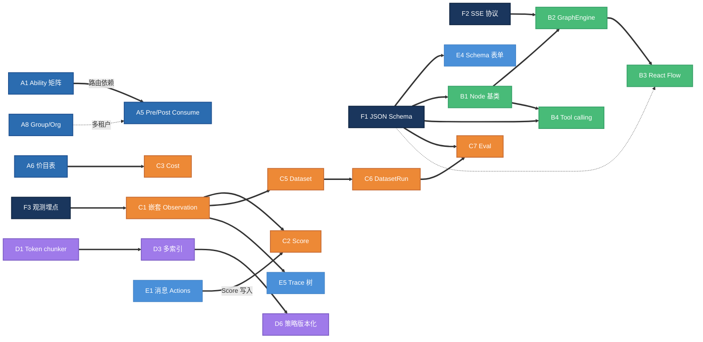
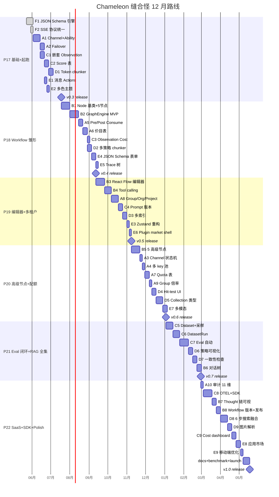

# Chameleon Master Plan · 12 个月缝合怪计划

**作者**：Links + Claude
**日期**：2026-05-23
**周期**：2026-05 → 2027-05（48 周 / 12 个月）
**目标**：成为 **Dify (Workflow) + LangFuse (Trace/Eval) + One-API (Gateway) + FastGPT (RAG) + LobeChat (UI)** 五合一的开源 AI Agent 平台，定位顶级 OSS 项目（GitHub 10k+ star 目标）
**对标分析**：`docs/competitive/`
**前置文档**：`docs/plans/2026-05-23-p17-p18-competitive-roadmap.md`（本文档为完整版替代）

---

## 0. TL;DR

| 项 | 内容 |
|---|---|
| **总周期** | 48 周（12 个月） |
| **阶段** | 6 个，每阶段 8 周 |
| **阶段产出** | 每阶段 1 次 v-release（v0.3 → v0.8），第 6 阶段冲 v1.0 |
| **功能轨道** | 5 条（Gateway / Workflow / Trace+Eval / RAG / UI）+ 3 项跨轨基础设施 |
| **功能总数** | 45 项 feature（不含 polish / bugfix） |
| **节奏** | 全面均衡 —— 每阶段 5 轨道都推进 1-2 个 milestone，避免单点突破其他塌方 |
| **资源** | 1 人主开发 + AI 助手；不依赖额外人手 |

**6 个 v-release**：

| 版本 | 周次 | 主题 | 对外宣传词 |
|---|---|---|---|
| **v0.3** | Week 8 | 基础设施 + 5 维度起跑 | "可观测 Agent 网关 + 智能路由 + 多色主题" |
| **v0.4** | Week 16 | Workflow 雏形 + Cost 落地 | "可视化编排 + 精准成本拆分" |
| **v0.5** | Week 24 | Workflow 编辑器 + 多租户骨架 + Prompt 版本 | "团队级 Workflow 平台" |
| **v0.6** | Week 32 | 高级节点 + 配额体系 + 多模态 | "企业级 Quota + 多模态对话" |
| **v0.7** | Week 40 | Eval 闭环 + RAG 全集 + 对话树 | "自动评估 + 知识库全栈" |
| **v1.0** | Week 48 | SaaS 化 + SDK + OTEL + Polish | "顶级 LLMops 一站式平台" |

---

## 1. 定位 (Vision)

### 1.1 一句话定位
> **Chameleon = "Dify Workflow + LangFuse 观测 + One-API 路由 + FastGPT KB + LobeChat UI" 的 Python 原生一站式平台，主打 Provider 协议抽象 + 不锁定生态。**

### 1.2 三大独有差异化（不要被对标吞掉）
1. **Provider 协议抽象 > 单一适配**
   `chameleon-providers/{local,dify,fastgpt,future...}` 子包让"挂一个 Dify 应用 / 一个 FastGPT 知识库 / 一个 LangGraph agent / 一个 Claude SDK"是同一套接口。我们是"聚合层的聚合层"，这是 5 个对标对象都没有的。

2. **Python 后端 + uv workspace + 严格 MVC**
   Dify 是 Python 但层混杂；LobeChat 是 TS 全栈；只有我们是 Python 严格分层，对 Python 数据团队最友好。

3. **0 框架原生 vanilla shadow DOM widget（27KB / 9KB gz）**
   LobeChat 没真 embed；Dify webapp 是重 React。我们的 widget 是真正的 drop-in，ToB 决定性优势。

### 1.3 反向定位（不要做的事）
- ❌ 不重做 LangChain / LlamaIndex —— 我们是上层平台，底层用现成的
- ❌ 不自己写 vector DB —— pgvector + 未来可选 Milvus/Qdrant 适配器
- ❌ 不强依赖 ClickHouse / Kafka —— Chameleon 单 PG 就跑得起来（LangFuse 反模式）
- ❌ 不做 Prompt Engineering IDE 级 —— Prompt 版本管理够用，复杂 IDE 留给 Langfuse / Helicone

---

## 2. 全功能清单（48 项 = 3 基础 + 5×9 轨道）

### 2.0 Foundation · 跨轨道基础设施（3 项）

| ID | Feature | 输出 | 阻塞下游 |
|---|---|---|---|
| F1 | **JSON Schema 引擎**（FE + BE） | Pydantic dump schema / 前端 schema-driven form | B Tool / B Node / C EvalTemplate / E Plugin |
| F2 | **统一事件流协议**（SSE + chunk types） | sse.py + sse.ts 已起步，补 typed event registry | B GraphEngine / 所有流式接口 |
| F3 | **统一观测埋点**（call_log writer 接口） | record_call → 任意层调；后端 contextvar 透传 trace_id | C 全部 / B GraphEngine |

### 2.A Gateway · 网关 / 路由（10 项，灵感 One-API）

| ID | Feature | 关键表 / API |
|---|---|---|
| A1 | **Channel + Ability 矩阵路由** | `channels`, `abilities(group×model×channel,priority)`；agent 解绑 provider |
| A2 | **自动 failover + 重试** | 错误码分类；retry decorator；`lastFailedChannelId` 避免回路 |
| A3 | **Channel 状态机** | enabled / auto_disabled / manual_disabled；失败自动降级；后台健康检测 |
| A4 | **多 key 池**（每 channel 多 key 轮询） | `channels.keys JSONB[]`；round-robin / 失败移除 |
| A5 | **Pre-consume + Post-consume 计费** | Redis 预扣 → 实际 token 出后结算；信任阈值优化 |
| A6 | **Model + PricingTier + Price** | 版本化价目表；价目从 litellm 同步 |
| A7 | **Quota 表** | `user_quotas(limit, used, remaining, reset_cycle)` |
| A8 | **Group / Organization / Project 三级隔离** | `organizations`/`groups`/`projects`；users.group_id；ability 第一维 |
| A9 | **Group 倍率 + cost 差异化** | VIP / standard 分组系数；cost = base × group_ratio |
| A10 | **审计日志 11 维**（user/channel/model/tokens/cost/stream/elapsed/...） | 优化现有 call_logs 索引；新增 consumption_logs 聚合视图 |

### 2.B Workflow · 编排（8 项，灵感 Dify）

| ID | Feature | 关键文件 / 表 |
|---|---|---|
| B1 | **Node[NodeDataT] 泛型基类 + 5 核心节点** | LLM / Tool / KB-Search / If-Else / End；Pydantic schema 自动 dump |
| B2 | **GraphEngine MVP** | Worker pool + Ready queue + Event manager；事件类型 enum |
| B3 | **React Flow 前端编辑器** | 节点 drag/drop / 连线 / config panel（走 F1 schema form） |
| B4 | **Tool calling 系统 + 5 内置 tool** | HTTP / SQL / Code Sandbox / Web Search / File Read |
| B5 | **5 高级节点** | Iteration / Parallel / HumanInLoop / VariableSet / Code |
| B6 | **Conversation tree + branching + regenerate** | `messages.parent_message_id`；前端树状视图 |
| B7 | **Agent thought chain 可视化** | `agent_thoughts(step,tool,input,output)`；trace tree 集成 |
| B8 | **Workflow versioning + publish/draft** | `workflows`/`workflow_versions`；草稿态 vs 已发布 |

### 2.C Trace + Eval · 观测评估（9 项，灵感 LangFuse）

| ID | Feature | 关键表 |
|---|---|---|
| C1 | **嵌套 Observation + type enum** | call_logs 加 parent_id + observation_type(span/generation/agent/tool/retriever/evaluator/embedding/guardrail) |
| C2 | **独立 Score 表 + Feedback API** | `scores(call_id, name, value, data_type, source)`；widget 点赞写入 |
| C3 | **Observation 上 cost（计算 + 用户提供）** | input_cost/output_cost/total_cost + calculated_*；递归求和到父 |
| C4 | **Prompt versioning + dependency** | `prompts(name,version,labels[],tags[])`+`prompt_dependencies` |
| C5 | **Dataset + DatasetItem + 从日志采样** | `datasets`/`dataset_items`；POST /datasets/sample-from-logs |
| C6 | **DatasetRun + DatasetRunItem** | 跑新 prompt/model 对账；指标聚合（avg score / p95 latency） |
| C7 | **EvalTemplate + JobConfiguration + JobExecution** | 自动评估配置；采样率 + 异步执行；RAGAS 内置 |
| C8 | **OTEL 摄入 + Python/TS SDK** | `POST /api/public/otel/v1/traces`；@chameleon/sdk 链式 API |
| C9 | **Cost dashboard + breakdown** | 按 user/agent/model/channel 多维聚合；时间序列图 |

### 2.D RAG · 知识库（9 项，灵感 FastGPT + RagFlow）

| ID | Feature | 关键表 / 改动 |
|---|---|---|
| D1 | **Token-based chunker** | tiktoken / model-aware；按 embedding model 切 |
| D2 | **多策略 chunker** | paragraph / size / char / qa / ai-mode；可视化预览 |
| D3 | **chunks.indexes[] 多索引** | type: chunk/qa/summary/custom；GIN 索引 JSONB |
| D4 | **Hit-test rich UI** | 原文左 + chunks 中 + 参数右；score_breakdown (embedding/full_text/rerank) |
| D5 | **Collection 类型扩展** | file / link（爬虫）/ api / image / folder / virtual |
| D6 | **Chunking strategy 版本化 + 可视化编辑器** | `chunking_strategies` 表；策略快照绑定 chunks |
| D7 | **KB 一致性检查 + 自修复** | 扫描 chunks vs pgvector vs tsvector；orphan / version mismatch；自动 repair job |
| D8 | **6 步搜索融合** | caption → multi-query expand → multi-recall → semantic fusion → rerank → multi-source merge → token-limit |
| D9 | **图片解析（VLM caption + image vector）** | image collection；caption embedding + 可选 image embedding |

### 2.E UI / Frontend（9 项，灵感 LobeChat）

| ID | Feature | 关键文件 |
|---|---|---|
| E1 | **消息 hover Actions** | copy / edit / regenerate / delete / 反馈；Provider Pattern 注入 |
| E2 | **多色主题**（primary × neutral × animation） | userStore 加偏好；CSS variables + tailwind extend |
| E3 | **Zustand slice + flatten 重构** | store/{chat,trace,kb,workflow}/{state,actions,selectors}；flattenActions util |
| E4 | **JSON Schema 动态表单**（基于 F1） | core/components/form/json-schema-form.tsx |
| E5 | **Trace tree gantt 可视化** | /call-logs/:id 改造；嵌套缩进 + 时间轴 + cost 标注 |
| E6 | **Plugin market shell UI** | Modal + 搜索 / 分类 / 安装；本地导入 + GitHub URL |
| E7 | **多模态上传** | image / file / audio（语音转写）；widget + admin 双边 |
| E8 | **Application / Agent 市场** | 公共模板 + 一键克隆；分享链接 |
| E9 | **移动端响应式优化** | widget 在 < 480px 下走 fullscreen 模式；admin 折叠侧栏 |

---

## 3. 依赖图（哪些项目阻塞哪些）

---

## 4. 时间轴（Gantt）

---

## 5. 阶段详细规划

### 🚀 P17 · 基础设施 + 5 维度起跑（Week 1-8）

**主题**：搭好"缝合架构"地基，5 个维度同步动起来。

**Slots**：32 (= 8 周 × 4 productive slots/week)

| 周次 | Feature | Slots | 验收 |
|---|---|---|---|
| W1 | F1 JSON Schema 引擎（后端 Pydantic→Schema + 前端表单组件骨架） | 4 | agent 配置页改用 schema 渲染，删旧硬编码 |
| W2 | F1 续 + F2 SSE 协议统一（typed event registry） | 4 | tests 验证所有流式接口走同一协议 |
| W3 | A1 Channel 表 + CRUD | 4 | admin 可建 channel；provider 解绑 key（key 进 channel） |
| W4 | A1 Ability 矩阵 + 路由器替换 | 4 | agent 调用走 ability 查询；保留 fallback 到旧逻辑 |
| W5 | A2 Failover + 重试 + lastFailedChannelId | 4 | mock channel 失败可自动重路由；测试覆盖 |
| W6 | C1 嵌套 Observation（parent_id + observation_type enum） | 4 | call_logs schema 迁移；老数据视为 trace root |
| W7 | C2 Score 表 + Feedback API + widget 反馈联通 | 3 | widget 👍/👎 写入 scores 表 |
| W7 | D1 Token chunker（model-aware） | 1 | 新建 KB 时可选 token 切；老 char 切保留 |
| W8 | E1 消息 hover Actions + E2 多色主题 | 4 | playground + widget 都有 copy/regen/反馈；setting 加 8 色 |
| W8 | v0.3 release 准备（changelog / migration guide / demo gif） | 4 | 发版 |

**关键产出**：
- `chameleon-core/schema/` 新模块，集中放共享 schema
- `migrations/` 新增 4 张表（channels / abilities / scores / 修改 call_logs）
- 前端 `core/components/form/json-schema-form.tsx`
- v0.3 release notes：**"Chameleon 现在能用 1 个 model code 路由到多个上游、记录嵌套调用链、widget 收用户反馈、admin 支持 8 种主题色"**

### 🛠️ P18 · Workflow 雏形 + Cost 落地（Week 9-16）

**主题**：Workflow 第一次能跑通；Cost 计算闭环。

| 周次 | Feature | Slots | 验收 |
|---|---|---|---|
| W9-10 | B1 Node[NodeDataT] 基类 + 5 核心节点（LLM/Tool/KB/IfElse/End） | 8 | CLI `chameleon workflow run sample.yaml` 可跑通 |
| W11-12 | B2 GraphEngine MVP（Worker pool + Ready queue + Event） | 8 | 流式输出节点级 event；并发节点并行执行 |
| W13 | A5 Pre/Post-consume 计费 | 4 | invoke 前预扣，结束后实扣；超额拒绝 |
| W14 | A6 Model + PricingTier + Price（从 litellm 同步种子） | 4 | model 价目可在 admin 改；版本号回滚 |
| W15 | C3 Observation cost + D2 多策略 chunker | 4 | call_logs 实时算 cost；KB chunking 三种模式可切 |
| W16 | E4 JSON Schema 表单上线全站 + E5 Trace 树视图 | 4 | trace 详情页改成嵌套树；node config 走 schema form |
| W16 | v0.4 release | 4 | 发版 |

**v0.4 release notes**："Chameleon 现支持 YAML 定义 workflow，5 个节点类型；trace 树状可视化；cost 按 input/output 精确拆分。"

### 🎨 P19 · Workflow 编辑器 + 多租户骨架 + Prompt 版本（Week 17-24）

**主题**：Workflow 有可视化编辑；引入 Group/Organization；Prompt 版本管理。

| 周次 | Feature | Slots | 验收 |
|---|---|---|---|
| W17-18 | B3 React Flow 前端编辑器 | 8 | 拖拽 5 种节点 / 连线 / 节点配置 / 保存运行 |
| W19-20 | B4 Tool calling + HTTP/SQL/Code Sandbox（3 内置） | 7 | LLM 节点开启 function calling 后能调内置 tool |
| W21-22 | A8 Group / Organization / Project | 6 | admin 可建组织；用户归属；ability/channel 走 group |
| W23 | C4 Prompt 版本 + 依赖 | 4 | prompts 表；LLM 节点引用 prompt + version/label |
| W23 | D3 chunks.indexes[] 多索引 | 3 | chunk 可挂 chunk/qa/summary 多 index；GIN 索引 |
| W24 | E3 Zustand slice 重构 + E6 Plugin market 壳 | 3 | 状态层规整；plugin modal 占位（实际安装 P22） |
| W24 | v0.5 release | 4 | 发版 |

**v0.5 release notes**："Chameleon 上线 workflow 可视化编辑器，5 节点 + 3 工具；Group 多租户隔离；Prompt 版本/label/tag 全套。"

### ⚙️ P20 · 高级节点 + 配额体系 + 多模态（Week 25-32）

**主题**：Workflow 节点扩到 10 种；用户配额 + 限流；UI 上多模态。

| 周次 | Feature | Slots | 验收 |
|---|---|---|---|
| W25-26 | B5 5 高级节点（Iteration / Parallel / HumanInLoop / VariableSet / Code） | 8 | Iteration 节点能跑 for-each；HumanInLoop 能暂停等审批 |
| W27 | A3 Channel 状态机 + A4 多 key 池 | 4 | 失败自动 disable；多 key 轮询 + 自动剔除 |
| W28 | A7 Quota + A9 Group 倍率 | 5 | user 有月配额；VIP 组 cost ratio 优惠 |
| W29 | D4 Hit-test rich UI | 4 | /kbs/:id/test 三栏布局；score breakdown |
| W30-31 | D5 Collection 类型（file/link/api/image） | 7 | 可加 URL 链接 / API 数据源 / 图片集 |
| W32 | E7 多模态上传 | 3 | widget + admin 都能上传图 / 文件 / 录音 |
| W32 | v0.6 release | 4 | 发版 |

**v0.6 release notes**："Chameleon 完整 Workflow（10 节点）；Quota + Group 倍率；KB 支持 link/api/image；widget/admin 多模态。"

### 🔬 P21 · Eval 完整闭环 + RAG 全集 + 对话树（Week 33-40）

**主题**：Eval 系统闭环；RAG 高级功能；对话支持分支。

| 周次 | Feature | Slots | 验收 |
|---|---|---|---|
| W33-34 | C5 Dataset + DatasetItem + 从 call_log 采样 | 6 | 一键采样 N 条；手工 import；input/expected schema |
| W35 | C6 DatasetRun + DatasetRunItem | 5 | 跑新 prompt/model；指标对比卡片 |
| W36-37 | C7 EvalTemplate + JobConfiguration + JobExecution（含 RAGAS 内置） | 8 | 自动按采样率评分；分布图 |
| W38 | D6 Chunking 策略可视化编辑 | 4 | 原文 + chunks + 参数三栏实时预览 |
| W39 | D7 KB 一致性检查 + 自修复 | 4 | 扫描孤立 chunk；一键修复 |
| W40 | B6 对话树 + branching + regenerate | 4 | regenerate 创建分支；前端树视图 |
| W40 | v0.7 release | 1 | 发版 |

**v0.7 release notes**："Chameleon 上线 Dataset / Eval 闭环（RAGAS）；KB 一致性自修复；对话分支与回溯。"

### 🚢 P22 · SaaS + SDK + Polish → v1.0（Week 41-48）

**主题**：对外 SDK；OTEL 兼容；应用市场；为 v1.0 launch 做准备。

| 周次 | Feature | Slots | 验收 |
|---|---|---|---|
| W41 | A10 审计日志 11 维 + Cost dashboard | 4 | dashboard 按 user/model/channel 聚合曲线 |
| W42-43 | C8 OTEL 摄入 + Python/TS SDK | 8 | `pip install chameleon-sdk` 链式 API；OTLP 端点 |
| W44 | B7 Agent thought chain 可视化 + B8 Workflow 版本/发布 | 4 | workflow 有 draft / published；thought 树嵌入 trace |
| W45-46 | D8 6 步搜索融合 + D9 图片解析 | 7 | hybrid + VLM caption + image vector 全跑通 |
| W47 | E8 应用市场 + E9 移动端优化 | 4 | 公共模板 / 一键克隆；widget 移动端 fullscreen |
| W48 | v1.0 release：docs / benchmark / launch | 8 | 发版 + 上 HN/Reddit/小红书 |

**v1.0 release notes**："Chameleon 1.0 发布 —— 完整的 LLMops 一站式平台，对标 Dify+LangFuse+One-API。提供 Python/TS SDK，OTEL 兼容，企业级多租户。"

---

## 6. 跨阶段关切

### 6.1 测试策略
- **每个 feature 进入 main 前必须有**：
  - 后端：service 层单元测试（mock DB / mock provider）+ 集成测试（真 PG + 真 Redis via testcontainers）
  - 前端：vitest 组件测试 + Playwright 关键路径 e2e
- **migration 测试**：每条 alembic 改动跑 `upgrade head → downgrade -1 → upgrade head` 确保可逆
- **Provider 测试**：每个新 provider 子包必须有 `tests/test_provider_stream.py` + `tests/test_provider_invoke.py` 双跑

### 6.2 文档策略（与代码同步）
- 每个 P stage 发版 → 更新 `docs/zh/` + `docs/en/` + CHANGELOG
- 每个新表 → 写 `docs/adr/00XX-{decision}.md` 记录决策
- 每 release 出一个 **demo gif** + 短视频，放 README

### 6.3 迁移与兼容性
- **Stage P17-P18**：DB schema 大改 → 每条 migration 都 mandatorily 提供 downgrade
- **API 兼容**：v0.x 阶段允许 break，v1.0 后所有 public API 走 deprecation policy（保留 1 个 minor 版本）
- **配置兼容**：seed 文件 / model.json / chameleon.json 改动走 `chameleon migrate config` 半自动升级
- **Widget 兼容**：embed widget bundle 版本独立，老业务方页面不强制升级（widget.js 走 CDN URL）

### 6.4 DX（开发体验）
- 每周更新 `MEMORY.md`（你的全局规约）+ 项目 CLAUDE.md
- 跨阶段保持：**每个 PR < 800 lines diff**；超出强制拆
- 严格走已有规约：MVC 分层 / GET+POST / 统一响应 / Tailwind+主题 / Liquibase SQL-only

### 6.5 性能基准
- **Stage P18 起**：每发版跑 `benchmarks/` 测试套件
  - p50 / p95 / p99 SSE 首字节延迟
  - 1000 concurrent stream 内存占用
  - 10w 条 chunks 检索延迟
  - workflow 100 节点编译耗时
- 历史数据存 `benchmarks/results/`，README 贴最新数据 vs Dify/LangFuse

---

## 7. 风险管理

| 风险 | 影响 | 概率 | 对冲 |
|---|---|---|---|
| 12 月节奏跑不动（feature creep） | 高 | 高 | 每阶段砍 1-2 项进 backlog；不延期发版 |
| GraphEngine 复杂度爆炸（P18） | 高 | 中 | 严格只做 5 节点；事件协议先抄 Dify JSON-L |
| Cost 计算与 LangFuse 不一致 | 中 | 中 | Cost 价目直接同步 litellm 项目（MIT），不自造 |
| Eval 框架太抽象用户用不来 | 高 | 中 | P21 必须 ship 至少 3 个 ready-to-use 模板（RAGAS faithfulness / answer correctness / context relevance） |
| 多租户改动破坏现有单租户用户 | 高 | 低 | 引入 `default` org/group；老数据归属默认 |
| 一致性检查（D7）让数据更乱 | 中 | 低 | repair job 默认 dry-run；改动需用户二次确认 |
| 对标项目持续演进抢风头 | 中 | 高 | 不抄具体实现，抄"概念 + 表结构"；保留 Python 原生优势 |
| 自己累垮 | 高 | 中 | **每阶段间留 1 周 buffer**；周末不写代码；卡壳就开 issue 让 AI 顶上 |

---

## 8. 决策框架（当事情超预算）

每个 feature 进入实施前先问 3 问：
1. **能砍吗？** → 砍到下一 stage 的 backlog（>50% 都可以推迟）
2. **能 hack 吗？** → 先 MVP，feature flag 控制可见性，下 stage 再补
3. **能买吗？** → 用第三方 lib（如 RAGAS / litellm / react-flow），不自造

**红线**：
- ⛔ 不为了"看起来全"塞半成品进 main —— 宁可砍
- ⛔ 不在阶段最后一周追加新 feature
- ⛔ 不修改已发布的 alembic migration（永远 forward-only）
- ⛔ 不延后发版（哪怕只剩 70% 完成）—— release 节奏比内容重要

---

## 9. v1.0 launch 准备（P22 W48 前）

- [ ] **网站**：chameleon.dev（Astro / Nextra）
- [ ] **demo 视频**：3 分钟产品 tour + 5 个场景案例
- [ ] **benchmark report**：对标 Dify 同等场景的性能 / cost / DX 数据
- [ ] **case studies**：找 3 个 alpha 用户写使用案例
- [ ] **文档**：getting-started / architecture / deployment / API / SDK / FAQ 中英双语
- [ ] **Discord / Slack 社区**：建好等用户进
- [ ] **HN / Reddit / 小红书**：launch post 提前写好排期
- [ ] **Docker compose 一键部署**：`docker compose up` 起完整栈
- [ ] **价目数据每周同步 litellm**：保证 cost 计算长期准确

---

## 10. Backlog（不在 12 月主线，但有价值）

按重要性排序，等 v1.0 后纳入 v1.x：

1. **Vector DB 适配器**（Milvus / Qdrant / Weaviate）
2. **多 embedding 模型混搭**（不同 KB 用不同模型，retrieval 自动 reroute）
3. **Workflow MCP Server / Client**（让 Chameleon workflow 暴露成 MCP）
4. **Helm chart / k8s operator**
5. **细粒度 RBAC**（Role × Resource × Action）
6. **Audit trail GUI**（合规审计）
7. **SSO / OIDC / SAML**
8. **Webhook 系统**（事件外推到 Slack / 钉钉 / Lark）
9. **AB testing 框架**（同一 query 跑两个 workflow 对比 score）
10. **Workflow runtime 持久化**（执行中重启不丢状态）

---

## 11. 关键产出文件清单（最终态）

**docs/**：
- `docs/plans/2026-05-23-chameleon-master-plan.md`（本文）
- `docs/plans/2026-05-23-p17-{1..6}-detail.md`（每阶段开始前出详细 sub-plan）
- `docs/adr/` 持续新增（每新表 / 大决策一个 ADR）
- `docs/competitive/`（已有，5 份对标分析，作为永久参考）

**架构最终态（v1.0）**：
- `backend/chameleon-core/` —— 21 张表 → ~38 张表
- `backend/chameleon-api/` —— 现有 + workflow / dataset / eval / sdk endpoints
- `backend/chameleon-system/` —— 现有 + organizations / quotas / billing / channels / abilities
- `backend/chameleon-providers/` —— +1-2 个新 provider（如 openai 原生 / anthropic 原生）
- `backend/chameleon-eval/` —— 新增子包：内置 evaluator + RAGAS 集成
- `backend/chameleon-workflow/` —— 新增子包：GraphEngine + Node 全集
- `backend/chameleon-sdk/` —— 新增子包：Python SDK
- `frontend/src/system/` —— 现有 + workflow / dataset / eval / organizations / billing 模块
- `sdk/typescript/` —— TS SDK

---

## 12. 下一步（W1 启动）

1. **本周读完本文档**，把以下 3 项确认/调整：
   - 每阶段砍/加/换的 feature
   - v0.X 命名是否合心意（也可以用 hero 命名：v0.3 = "Aurora"，v0.4 = "Pulse"，...）
   - 是否接受"每阶段中间不加 feature"的红线

2. **创建 P17 详细 sub-plan**（我帮写）：
   `docs/plans/2026-05-23-p17-detail.md` —— 把 W1-W8 拆成每天粒度的 issues

3. **开 GitHub project board**：每个 feature 一张卡，按 swim lane = 5 轨道

4. **W1 启动 spike**：F1 JSON Schema 引擎（你确认这个先做，我开干）

---

**Chameleon 1.0 = 五合一的 Python 原生 LLMops 平台。**
**12 月后见。**
