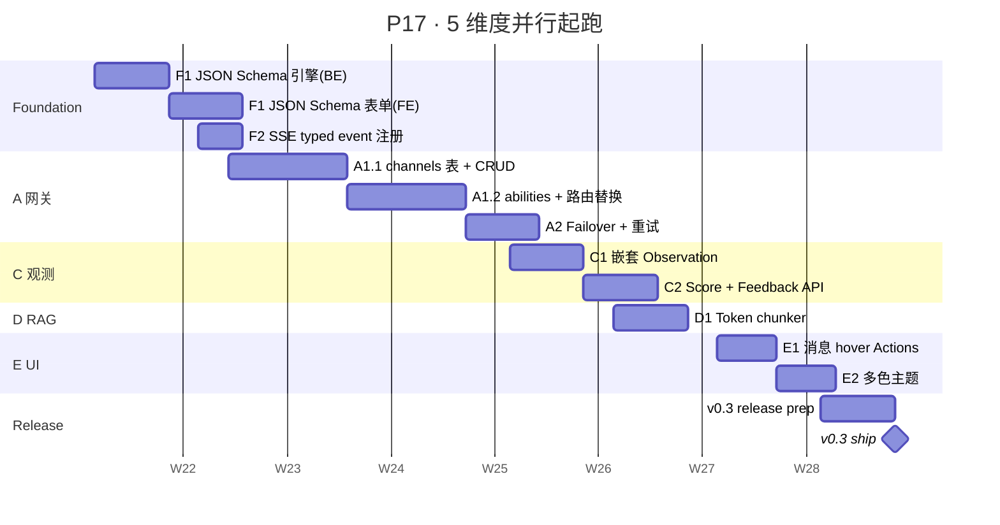

# P17 详细 Sub-Plan · 基础设施 + 5 维度起跑

**周期**：2026-05-23 → 2026-07-18（8 周）
**目标版本**：v0.3
**总 slots**：32 (8 周 × 4 productive slots/week，1 slot ≈ 1.25 day)
**主计划**：[docs/plans/2026-05-23-chameleon-master-plan.md](./2026-05-23-chameleon-master-plan.md)
**前置阅读**：5 份对标分析 in `docs/competitive/`

---

## 0. P17 全景



---

## 1. 进度跟踪表

| ID | Feature | 目标周 | PR 数 | 状态 | 验收负责人 |
|---|---|---|---|---|---|
| F1 | JSON Schema 引擎（BE + FE） | W1-W2 | 3 | ⏳ pending | Links |
| F2 | SSE typed event registry | W2 | 1 | ⏳ pending | Links |
| A1.1 | channels 表 + CRUD + 迁移 | W3 | 2 | ⏳ pending | Links |
| A1.2 | abilities 矩阵 + 路由替换 | W4 | 2 | ⏳ pending | Links |
| A2 | Failover + 重试 | W5 | 1 | ⏳ pending | Links |
| C1 | 嵌套 Observation + parent_id | W6 | 2 | ⏳ pending | Links |
| C2 | Score 表 + Feedback API + widget 联通 | W7 | 2 | ⏳ pending | Links |
| D1 | Token chunker（model-aware） | W7 | 1 | ⏳ pending | Links |
| E1 | 消息 hover Actions（playground + widget） | W8 | 1 | ⏳ pending | Links |
| E2 | 多色主题（primary × neutral × animation） | W8 | 1 | ⏳ pending | Links |
| 🚢 | v0.3 release | W8 | 1 | ⏳ pending | Links |

**总 PR 数**：17 个；按红线 < 800 LOC/PR 控制。

---

## 2. 红线 + 验收门槛（每个 PR 都要过）

### 2.1 红线（违反必须打回）
- ⛔ **不修改已发布 alembic migration** —— 永远 forward-only，要改就新增 migration
- ⛔ **不延迟发版** —— 哪怕 W8 周末只完成 70%，v0.3 照发，剩余移 P18
- ⛔ **不在阶段最后一周追加新 feature** —— W8 只有 E1/E2 + release prep，不引入新 backlog
- ⛔ **不绕过统一响应封装** —— 所有 API 返 `Result[T]`
- ⛔ **不绕过统一 SSE 协议** —— 所有流式接口走 `sse_response`
- ⛔ **service 不返 ORM Model 给 API**、**API 不调 Mapper** —— MVC 红线

### 2.2 每 PR 验收 checklist
- [ ] `yarn tsc --noEmit` clean（前端）
- [ ] `uv run pytest` clean（后端涉及部分）
- [ ] `yarn lint` 不引入新 error（warning 可接受）
- [ ] migration 跑过 `upgrade head → downgrade -1 → upgrade head` 三次
- [ ] 关键路径 e2e 用 Chrome MCP 跑一遍（截图附 PR）
- [ ] 改动 > 3 张表 → 同步更新 `docs/zh/architecture.md` mermaid 图
- [ ] 改动牵涉 public API → 同步 `docs/zh/api-reference.md`
- [ ] CHANGELOG.md 加一行（feat/fix/break）

### 2.3 PR / branch 命名
- 分支：`p17/<ID>-<short-desc>`，例 `p17/a1.1-channels-table`
- PR 标题：`feat(<scope>): <subject>`，例 `feat(gateway): 引入 channels 表 + CRUD（A1.1）`
- commit：按 `~/.claude/rules/git.md` —— type 英文 / scope 小写 / subject 中文 / 不超 72 字

---

## 3. W1 · F1 JSON Schema 引擎（后端）

### 3.1 目标
后端任意 Pydantic 模型可以 dump 出标准 JSON Schema；admin 前端能拉 schema 用于动态渲染。

### 3.2 入场状态
- 现有 Pydantic v2 模型分布在各业务模块（`schemas/` 或 `api.py` 内）
- 前端表单全部硬编码

### 3.3 PR 拆分

#### **PR #1**: `feat(schema): 引入 JSON Schema 生成 service`
**LOC 预估**：~400

**新增文件**：
- `backend/chameleon-core/src/chameleon/core/schema/__init__.py`
- `backend/chameleon-core/src/chameleon/core/schema/registry.py` —— 全局 schema 注册表
- `backend/chameleon-core/src/chameleon/core/schema/service.py` —— `dump_schema(model_cls)` / `dump_schema_by_name(name)` 公开 API
- `backend/chameleon-system/src/chameleon/system/schemas/__init__.py`
- `backend/chameleon-system/src/chameleon/system/schemas/api.py` —— `GET /v1/admin/schemas/{name}` 路由

**关键设计**：
```python
# core/schema/registry.py
from pydantic import BaseModel

_REGISTRY: dict[str, type[BaseModel]] = {}

def register(name: str):
    def decorator(cls: type[BaseModel]):
        if name in _REGISTRY:
            raise ValueError(f"schema {name} already registered")
        _REGISTRY[name] = cls
        return cls
    return decorator

def get(name: str) -> type[BaseModel] | None:
    return _REGISTRY.get(name)

def list_all() -> dict[str, type[BaseModel]]:
    return dict(_REGISTRY)
```

```python
# system/schemas/api.py
@router.get("/{name}", response_model=Result[dict])
async def get_schema(name: str, _=Depends(require_permission("schemas:read"))):
    cls = registry.get(name)
    if cls is None:
        raise BusinessError(ResultCode.AgentNotFound, f"schema 不存在: {name}")
    return Result.ok(cls.model_json_schema(mode="serialization"))
```

**首批注册**：
- `provider.config` —— 各 provider kind 的 extra_config schema
- `agent.input` —— agent 入参 schema（先 echo agent 示例）
- `kb.chunking_strategy` —— 占位，P17 暂为空（D1 周再填）

**测试**：`backend/tests/test_schema_dump.py`
- 注册一个 BaseModel，确认 dump 出 type/required/properties
- 重复注册抛 ValueError
- 自定义类型（datetime / enum / Optional）正确处理

#### **PR #2**: `feat(schema): 把现有 provider/agent config 接入 schema registry`
**LOC 预估**：~250

**改动文件**：
- `backend/chameleon-providers/dify/src/chameleon/providers/dify/__init__.py` —— `DifyProviderConfig(BaseModel)` 加 `@register("provider.dify")`
- `backend/chameleon-providers/fastgpt/src/...` 同
- `backend/chameleon-providers/local/src/...` 同
- `backend/chameleon-agents/...echo/__init__.py` —— `EchoAgentInput(BaseModel)` 加 `@register("agent.echo.input")`
- `backend/chameleon-system/src/chameleon/system/providers/api.py` —— providers 列表接口加 `config_schema_name` 字段
- 前端 `frontend/src/system/providers/services/provider.ts` —— `getSchema(name)`

**验证**：在 `/providers` 详情页拿到 schema 但不渲染（W2 才做表单）。

### 3.4 W1 日历

| 日 | 任务 | slot |
|---|---|---|
| Mon | PR #1 设计 + registry 骨架 + 测试 | 1 |
| Tue | PR #1 service + API + 单测 → 合并 | 1 |
| Wed | PR #2 4 个 provider config 注册 + agent.echo.input | 1 |
| Thu | PR #2 前端拉 schema 显示 raw JSON（debug 用） + 合并 | 1 |
| Fri | buffer + W2 准备（设计前端 form 渲染） | - |

### 3.5 风险
| 风险 | 缓解 |
|---|---|
| Pydantic v2 schema 含 `$ref` 难处理 | 先做 ref-flatten util（`schema/utils.py:flatten_refs`），后续表单需要时再启用 |
| Provider 子包 import 顺序导致 registry 未填充 | 在 `chameleon.app.main:lifespan` 启动时强制 import 所有 provider 子包 |

---

## 4. W2 · F1 续（前端表单） + F2 SSE typed event

### 4.1 目标
- 前端有可用的 `<JSONSchemaForm>` 组件覆盖 string/number/boolean/enum/object/array
- SSE 协议出 typed event registry，所有现有流式接口走统一类型

### 4.2 PR 拆分

#### **PR #3**: `feat(ui): JSONSchemaForm 表单引擎`
**LOC 预估**：~600

**新增**：
- `frontend/src/core/components/form/json-schema-form.tsx` —— 主组件
- `frontend/src/core/components/form/widgets/{string,number,boolean,enum,object,array}-widget.tsx` —— 6 个基础控件
- `frontend/src/core/components/form/types.ts`
- `frontend/src/core/components/form/use-form-state.ts` —— 状态 hook
- `frontend/src/core/components/form/__tests__/json-schema-form.test.tsx`

**支持 schema 子集**（标 ✓ 必做，✗ 留 P18+）：
- ✓ `type: string` + `format: textarea/password/url/email`
- ✓ `type: number` / `integer` + `minimum`/`maximum`/`step`
- ✓ `type: boolean`
- ✓ `enum: [...]` + `enumNames` 扩展
- ✓ `type: object` + `properties`/`required`/`title`/`description`
- ✓ `type: array` + `items`（单类型，不支持 oneOf）
- ✗ `oneOf`/`anyOf`/`allOf`（P18 加）
- ✗ `pattern` 正则（P18 加 validate hook）
- ✗ `format: date/time/datetime`（P18 用 DatePicker）

**接入演示**：在 `/providers/:id/edit` 用 schema-form 替换硬编码 extra_config 字段。

#### **PR #4**: `feat(sse): 引入 typed event registry + 统一 chunk schema`
**LOC 预估**：~300

**新增**：
- `backend/chameleon-core/src/chameleon/core/api/sse_events.py` —— event 类型枚举 + Pydantic 模型
- `frontend/src/core/lib/sse-events.ts` —— TS 镜像类型

**事件类型**（统一全平台）：
```python
class SSEEventType(StrEnum):
    META = "meta"           # {kind, model, provider, ...}
    DELTA = "delta"         # {text: str}
    CITATION = "citation"   # {source, title, snippet, ...}
    THOUGHT = "thought"     # {step, tool, input, output}
    USAGE = "usage"         # {input_tokens, output_tokens, total_tokens}
    NODE_START = "node_start"     # workflow 用，P18 启用
    NODE_END = "node_end"
    END = "end"             # {latency_ms, ...}
    ERROR = "error"         # {type, message}
```

**改动**：
- `backend/chameleon-api/src/chameleon/api/embed/service.py` —— 现在的 dict chunks 改用 typed model dump
- `backend/chameleon-system/src/chameleon/system/models/test_service.py` —— 同
- `backend/chameleon-system/src/chameleon/system/playground/service.py` —— 同
- 前端 `widget.ts` / `model.ts` / `playground.ts` 替换 type definition

**约束**：sse.py 的 `_encode` 保持不变；只是上层产 dict 的代码改成产 typed model 然后 `.model_dump()`。

### 4.3 W2 日历

| 日 | 任务 | slot |
|---|---|---|
| Mon | PR #3 form 主组件 + string/number/boolean widget | 1 |
| Tue | PR #3 object/array/enum widget + 测试 | 1 |
| Wed | PR #3 接入 /providers/:id/edit + 合并 | 1 |
| Thu | PR #4 sse_events 定义 + provider service 改造 | 1 |
| Fri | PR #4 前端 type 替换 + 合并 + buffer | - |

### 4.4 验收
- /providers/:id/edit 表单完全由 schema 驱动渲染
- widget / model-test / playground 三处流式都用同一套 typed event；console 看到 `meta` / `delta` / `end` 标准化
- 现有功能完全不退步（关键路径 e2e 全过）

---

## 5. W3 · A1.1 channels 表 + CRUD

### 5.1 目标
引入 `channels` 表（一个 channel = 一个上游 key），admin 可创建 / 编辑 / 启用 / 禁用 / 监控。
**关键变化**：provider.api_key 逻辑迁移到 channel.api_key，provider 退化为"分类"。

### 5.2 PR 拆分

#### **PR #5**: `feat(gateway): channels 表 + ORM + 迁移 + 数据 backfill`
**LOC 预估**：~500

**Migration**: `p17_w3_channels.py`
```sql
CREATE TABLE channels (
    id BIGINT PRIMARY KEY,
    provider_id BIGINT NOT NULL REFERENCES providers(id) ON DELETE RESTRICT,
    name VARCHAR(64) NOT NULL,
    api_key_encrypted TEXT,
    base_url VARCHAR(512),
    status VARCHAR(16) NOT NULL DEFAULT 'enabled',  -- enabled/auto_disabled/manual_disabled
    weight INT NOT NULL DEFAULT 0,
    priority INT NOT NULL DEFAULT 0,
    response_time_ms INT,
    used_quota BIGINT NOT NULL DEFAULT 0,
    last_failed_at TIMESTAMPTZ,
    last_success_at TIMESTAMPTZ,
    fail_count INT NOT NULL DEFAULT 0,
    deleted_at TIMESTAMPTZ,
    created_at TIMESTAMPTZ NOT NULL DEFAULT NOW(),
    updated_at TIMESTAMPTZ NOT NULL DEFAULT NOW()
);
CREATE INDEX ix_channels_provider ON channels(provider_id) WHERE deleted_at IS NULL;
CREATE INDEX ix_channels_status ON channels(status) WHERE deleted_at IS NULL;

-- BACKFILL：每个有 api_key 的 provider → 默认 1 个 channel
INSERT INTO channels (id, provider_id, name, api_key_encrypted, base_url, status, created_at)
SELECT
    -- 用 provider.id 派生 channel.id（保证幂等）
    -(p.id::bigint),
    p.id,
    'default',
    p.api_key_encrypted,
    p.base_url,
    CASE WHEN p.enabled THEN 'enabled' ELSE 'manual_disabled' END,
    p.created_at
FROM providers p
WHERE p.deleted_at IS NULL;

-- providers.api_key_encrypted 不删（兼容期，P18 再 deprecate）
```

**新增文件**：
- `backend/chameleon-core/src/chameleon/core/models/channel.py`
- `backend/chameleon-system/src/chameleon/system/channels/{__init__.py,api.py,service.py,schemas.py}`
- migration

#### **PR #6**: `feat(gateway): channels admin UI（列表 + 编辑 + 测试）`
**LOC 预估**：~700

**新增**：
- `frontend/src/system/channels/routes.ts`
- `frontend/src/system/channels/pages/channels-page.tsx` —— 列表 + Create modal + Edit modal
- `frontend/src/system/channels/services/channel.ts`
- `frontend/src/system/channels/types/channel.ts`
- `frontend/src/system/channels/components/channel-form-modal.tsx`
- Sidebar 新增"渠道管理"入口

**功能**：
- 列表显示：name / provider / status / weight / priority / 健康度（成功率 / p95 延迟）
- 创建：选 provider → 填 name / key / base_url（可继承 provider 的）/ weight / priority
- 编辑：同上 + 状态切换（enabled / manual_disabled）
- 测试：复用 P16 的 model 测试逻辑，按 channel 调用
- 删除：软删

### 5.3 W3 日历

| 日 | 任务 | slot |
|---|---|---|
| Mon | PR #5 migration 设计 + backfill SQL + 跑过三次 up/down | 1 |
| Tue | PR #5 ORM + service + API + tests + 合并 | 1 |
| Wed | PR #6 列表页 + Create modal | 1 |
| Thu | PR #6 Edit + 状态切换 + 测试按钮 + 合并 | 1 |
| Fri | buffer + W4 设计：abilities 路由替换详细方案 | - |

### 5.4 风险
| 风险 | 缓解 |
|---|---|
| Backfill 给已存在 provider 派生 id 冲突 | 用 `-p.id` 作为 channel.id（snowflake 全正数，负数空间安全） |
| 现有 models 已经走 provider.api_key 直读 | provider service 加 `get_key_for_provider()` 抽象，逐步迁到 channel |
| 加密密钥跟 provider 一样还是各自有？ | 沿用 provider 已加密的密文，channel 字段直接拷贝（同一 master key） |

---

## 6. W4 · A1.2 abilities 矩阵 + 路由替换

### 6.1 目标
新建 `abilities(group_id, model_code, channel_id, priority, enabled)` 联合主键；路由层从"agent → provider 直绑"切换为"agent → model_code → ability 查 → channel"。

### 6.2 PR 拆分

#### **PR #7**: `feat(gateway): abilities 表 + 路由 service`
**LOC 预估**：~600

**Migration**: `p17_w4_abilities.py`
```sql
CREATE TABLE abilities (
    group_id BIGINT,                            -- NULL = 全局
    model_code VARCHAR(64) NOT NULL,
    channel_id BIGINT NOT NULL REFERENCES channels(id) ON DELETE CASCADE,
    priority INT NOT NULL DEFAULT 0,
    weight INT NOT NULL DEFAULT 0,
    enabled BOOLEAN NOT NULL DEFAULT TRUE,
    created_at TIMESTAMPTZ NOT NULL DEFAULT NOW(),
    PRIMARY KEY (COALESCE(group_id, -1), model_code, channel_id)  -- 用 -1 占位 NULL
);
CREATE INDEX ix_abilities_route ON abilities(model_code, enabled, priority DESC) WHERE enabled = TRUE;

-- BACKFILL：每个现有 (provider, llm_model) → 1 个 ability（NULL group_id = 全局）
INSERT INTO abilities (group_id, model_code, channel_id, priority, enabled)
SELECT NULL, m.code, -(p.id::bigint), 0, m.enabled AND p.enabled
FROM llm_models m
JOIN providers p ON m.provider_id = p.id
WHERE m.deleted_at IS NULL AND p.deleted_at IS NULL;
```

**新增**：
- `backend/chameleon-core/src/chameleon/core/models/ability.py`
- `backend/chameleon-system/src/chameleon/system/abilities/{api.py,service.py,schemas.py}` —— CRUD
- `backend/chameleon-core/src/chameleon/core/routing/__init__.py`
- `backend/chameleon-core/src/chameleon/core/routing/router.py`：

```python
async def resolve_channel(
    session: AsyncSession,
    *,
    model_code: str,
    group_id: int | None = None,
    exclude_channels: set[int] | None = None,
) -> Channel:
    """按 model_code 解析到 channel
    优先级：1. 精确 group_id 匹配  2. NULL group_id 兜底
    同优先级内按 priority desc → weight 加权随机
    """
    ...

async def mark_failed(session, channel_id: int) -> None:
    """失败后调用，自动 inc fail_count；超阈值 → status=auto_disabled"""
    ...
```

#### **PR #8**: `feat(gateway): 调用链路接入 router（feature flag 控）`
**LOC 预估**：~500

**改动**：
- `backend/chameleon-api/src/chameleon/api/agent/service.py` —— invoke 前先调 router.resolve_channel
- `backend/chameleon-system/src/chameleon/system/admin/settings/schema.py` —— 加 `gateway.routing_enabled` flag（默认 false）
- `backend/chameleon-providers/dify/` `fastgpt/` —— provider init 接受 channel 而非 provider 直绑
- 前端 `/abilities` 页面（简版矩阵 grid）

**Feature flag 策略**：
- 默认 `gateway.routing_enabled = false` → 走老逻辑（agent.provider_id 直绑）
- 设 `true` → 走 router；agent 表加 `preferred_model_code`（W4 内补一个 mini migration）
- v0.3 release 时默认 false；v0.4 默认 true；v0.5 删旧路径

### 6.3 W4 日历

| 日 | 任务 | slot |
|---|---|---|
| Mon | PR #7 migration + ORM + 单测 | 1 |
| Tue | PR #7 router service + 加权随机算法 + 测试 + 合并 | 1 |
| Wed | PR #8 agent invoke 接入 router + feature flag | 1 |
| Thu | PR #8 abilities 矩阵 admin UI + 合并 | 1 |
| Fri | buffer + 端到端测试（开 flag 跑全链路） | - |

### 6.4 验收
- 开 flag 后，调 echo agent 流式正常
- abilities 表里临时 disable 某条，调用走另一条 ability
- 关 flag → 退到老路径，行为完全不变

---

## 7. W5 · A2 Failover + 重试

### 7.1 目标
路由失败时自动选另一条 ability 重试；channel 连续失败自动 disable；前端可见 channel 健康曲线。

### 7.2 PR 拆分

#### **PR #9**: `feat(gateway): failover middleware + 健康监控`
**LOC 预估**：~700

**新增**：
- `backend/chameleon-core/src/chameleon/core/routing/failover.py`
  ```python
  async def invoke_with_failover(
      session: AsyncSession,
      *,
      model_code: str,
      group_id: int | None,
      invoke_fn: Callable[[Channel], Awaitable[T]],
      max_retries: int = 3,
      retry_status_codes: set[int] = {429, 500, 502, 503, 504},
  ) -> T:
      """包装 invoke_fn，自动重试"""
  ```
- `backend/chameleon-core/src/chameleon/core/routing/health.py` —— 单 channel 健康统计（成功/失败计数、p95 延迟滑动窗口）
- `backend/chameleon-core/src/chameleon/core/utils/error_classify.py` —— provider 错误码 → 是否可重试

**改动**：
- `chameleon-api/agent/service.py` 调 `invoke_with_failover` 替代直 invoke
- `chameleon-system/channels/api.py` 加 `GET /v1/admin/channels/{id}/health` —— 返最近 1h 健康统计
- 前端 `/channels` 列表加"健康"列（彩色 dot + tooltip 显示数据）

**算法核心**：
1. 第一次：`resolve_channel()` 选 channel
2. 调用失败 + 错误码可重试 → 加入 `exclude_channels` 集合
3. 再 resolve 新 channel（排除已失败的）
4. 重试 max_retries 次还失败 → 把最后错误抛给上层
5. 每次失败：`channel.fail_count += 1`，连续 5 次失败 → status=auto_disabled
6. 成功 → `fail_count = 0`，更新 last_success_at + response_time_ms 滑动平均

### 7.3 W5 日历

| 日 | 任务 | slot |
|---|---|---|
| Mon | PR #9 failover service + 单测（mock provider 模拟失败） | 1 |
| Tue | PR #9 health 滑动窗口 + 状态自动迁移 | 1 |
| Wed | PR #9 agent 接入 + 端到端 e2e | 1 |
| Thu | PR #9 channels 健康 UI + 合并 | 1 |
| Fri | buffer + 手动模拟 chaos 测试（disable 1/2/3 个 channel） | - |

### 7.4 风险
| 风险 | 缓解 |
|---|---|
| 流式接口重试需要重新建立 SSE 连接 | 第一个 chunk 之前可重试；首 token 之后不重试 |
| 失败计数和健康统计要不要持久化 | response_time_ms / fail_count 入 DB；窗口数据放 Redis 1h TTL |
| 误判可重试（4xx Quota exceeded） | error_classify 显式列白名单，4xx 默认不重 |

---

## 8. W6 · C1 嵌套 Observation + parent_id

### 8.1 目标
`call_logs` 加 `parent_id` + `observation_type` enum；service 层 with-span context manager；前端 trace tree 视图。

### 8.2 PR 拆分

#### **PR #10**: `feat(trace): call_logs 扩展为嵌套 Observation`
**LOC 预估**：~500

**Migration**: `p17_w6_observation.py`
```sql
ALTER TABLE call_logs ADD COLUMN parent_id VARCHAR(64);
ALTER TABLE call_logs ADD COLUMN observation_type VARCHAR(32) NOT NULL DEFAULT 'generation';
-- enum 值：trace, span, generation, agent, tool, retriever, evaluator, embedding, guardrail
ALTER TABLE call_logs ADD COLUMN completion_start_ms INT;  -- 首 token 延迟
CREATE INDEX ix_call_logs_parent ON call_logs(parent_id);
CREATE INDEX ix_call_logs_type ON call_logs(observation_type);
```

**新增**：
- `backend/chameleon-system/src/chameleon/system/api_key/observation.py` —— context manager
  ```python
  @asynccontextmanager
  async def observe(
      session: AsyncSession,
      *,
      observation_type: str = "generation",
      name: str | None = None,
      parent_id: str | None = None,
      ...
  ) -> AsyncIterator[ObservationContext]:
      """嵌套观测的 context manager
      with observe(observation_type='agent') as o:
          with observe(observation_type='generation', parent_id=o.id) as g: ...
      """
  ```
- contextvar `current_observation_id` 自动传递 parent_id（业务方不必手传）

**改动**：
- `chameleon-system/api_key/service.py:record_call` —— 接受 parent_id / observation_type
- `chameleon-api/embed/service.py` + 各 provider stream —— 用 contextvar 自动嵌套

#### **PR #11**: `feat(trace): /call-logs/:id trace tree 可视化`
**LOC 预估**：~500

**改动**：
- `backend/chameleon-system/src/chameleon/system/admin/call_logs/api.py` —— `GET /v1/admin/call-logs/{trace_id}/tree` 返嵌套结构
- `frontend/src/system/admin/call_logs/pages/call-log-detail-page.tsx` —— 树状缩进 + Gantt 时间轴
- 新组件 `frontend/src/system/admin/call_logs/components/observation-tree.tsx`

**UI 规格**：
- 左：嵌套树（图标按 observation_type 不同）
- 右：选中 observation 详情（input/output/duration/usage/error）
- 顶部：trace 总览（total duration / total cost / status）

### 8.3 W6 日历

| 日 | 任务 | slot |
|---|---|---|
| Mon | PR #10 migration + 老数据 backfill（默认 type=generation, parent_id=NULL） | 1 |
| Tue | PR #10 observe context manager + contextvar | 1 |
| Wed | PR #10 各 service 接入 + 端到端 | 1 |
| Thu | PR #11 树形 API + 前端组件 | 1 |
| Fri | PR #11 联调 + 合并 + buffer | - |

### 8.4 验收
- 跑一次 widget 对话：trace 树展示 trace > generation > （未来会有 tool/retriever）层级
- 老 call_log 全部默认 type=generation，列表行为不变

---

## 9. W7 · C2 Score + Feedback API + D1 Token chunker

### 9.1 目标
- 独立 `scores` 表 + Feedback API（widget 点赞写入）
- TokenChunker（model-aware）作为 KB 第二可选 chunker

### 9.2 PR 拆分

#### **PR #12**: `feat(trace): scores 表 + Feedback API + widget 联通`
**LOC 预估**：~500

**Migration**: `p17_w7_scores.py`
```sql
CREATE TABLE scores (
    id VARCHAR(64) PRIMARY KEY,
    call_log_id VARCHAR(64) NOT NULL,           -- 关联 call_logs.request_id（trace 根 id 或子 observation id）
    trace_id VARCHAR(64),                       -- 冗余存 trace 根 id 用于聚合
    name VARCHAR(64) NOT NULL,                  -- "thumbs_up", "user_rating", "ragas_faithfulness"
    value FLOAT,                                -- 数值评分
    string_value TEXT,                          -- 文本/类别评分
    data_type VARCHAR(16) NOT NULL,             -- numeric/categorical/boolean/text
    source VARCHAR(16) NOT NULL DEFAULT 'api',  -- annotation/api/eval/feedback
    comment TEXT,                               -- 用户附言
    created_at TIMESTAMPTZ NOT NULL DEFAULT NOW()
);
CREATE INDEX ix_scores_call ON scores(call_log_id);
CREATE INDEX ix_scores_trace_name ON scores(trace_id, name);
```

**新增**：
- `backend/chameleon-core/src/chameleon/core/models/score.py`
- `backend/chameleon-system/src/chameleon/system/scores/{api.py,service.py,schemas.py}`
- `backend/chameleon-api/src/chameleon/api/embed/api.py` 加 `POST /v1/embed/{key}/feedback`
  ```json
  // 入参
  { "trace_id": "...", "name": "thumbs", "value": 1, "comment": "" }
  ```

**前端改动**：
- `frontend/embed/src/widget.ts` —— feedback 按钮回调改成调 `embedApi.feedback(traceId, name, value)`
- `frontend/embed/src/api.ts` —— 加 `feedback()` 方法
- `frontend/src/system/playground/components/chat-column.tsx` —— playground 也加反馈按钮（admin 自用）
- `frontend/src/system/admin/call_logs/components/observation-tree.tsx` —— 显示该 observation 上的 scores

**关键**：widget 需要知道 trace_id —— SSE 的 meta event 已经包含，widget 缓存到 message 对象

#### **PR #13**: `feat(rag): TokenChunker（model-aware）`
**LOC 预估**：~400

**新增**：
- `backend/chameleon-api/src/chameleon/api/knowledge/chunkers/__init__.py` —— Chunker 协议
- `backend/chameleon-api/src/chameleon/api/knowledge/chunkers/token.py` —— TokenChunker（tiktoken / model registry）
- `backend/chameleon-api/src/chameleon/api/knowledge/chunkers/char.py` —— 把现有字符切移过来

```python
class Chunker(Protocol):
    def split(self, text: str) -> list[ChunkResult]: ...

class TokenChunker(Chunker):
    def __init__(self, *, model: str, chunk_token_size: int = 512, overlap: int = 50):
        self.encoder = tiktoken.encoding_for_model(model) if "gpt" in model \
                       else tiktoken.get_encoding("cl100k_base")  # qwen 也用 cl100k
        ...
```

**改动**：
- `chameleon-api/knowledge/document_service.py:ingest` —— 按 KB 配置选 chunker
- `chameleon-core/models/knowledge_base.py` 加 `chunker_type` 字段（默认 'char' 兼容）
- 前端 `/kbs/create` + `/kbs/:id/settings` 加选项（"按字符切"/"按 token 切"）

**注意**：D1 只做 token chunker 落地。多策略选择器 UI / 段落感知 / 实时预览全部留 P18.D2/D6。

### 9.3 W7 日历

| 日 | 任务 | slot |
|---|---|---|
| Mon | PR #12 migration + scores service + tests | 1 |
| Tue | PR #12 widget feedback API + 端到端 + 合并 | 1 |
| Wed | PR #13 chunker protocol + TokenChunker | 1 |
| Thu | PR #13 KB 接入 + 前端选项 + 合并 | 0.75 |
| Fri | buffer + W8 准备（消息 Actions 设计稿） | 0.25 |

### 9.4 验收
- widget 点 👍 → /v1/admin/scores 列表新增一条 source=feedback
- 创建 KB 选 "token" → 上传文档后 chunks 数与字符切不同；hit-test 召回正常

---

## 10. W8 · E1 消息 Actions + E2 多色主题 + v0.3 release

### 10.1 目标
- playground + widget 双边都有消息 hover Actions（copy / regenerate / 反馈 / 删除）
- userStore + CSS variable 实现 8 色主题 × 4 灰度 × 3 动画模式
- v0.3 ship

### 10.2 PR 拆分

#### **PR #14**: `feat(ui): 消息 hover Actions（playground + widget）`
**LOC 预估**：~600

**前端 (admin playground)**：
- 新建 `frontend/src/system/playground/components/message-actions.tsx`
- 改 `frontend/src/system/playground/components/chat-column.tsx` —— hover 显 Actions
- 动作：
  - Copy（navigator.clipboard.writeText）
  - Regenerate（重新调用 invoke / streamInvoke，绑定到原 user message）
  - Edit（user 消息）—— 改后重发，老 assistant 标记 stale
  - Delete（删除本地，不调后端）
  - 👍 / 👎 反馈（用 W7 的 scores API）

**Widget**（同步加）：
- `frontend/embed/src/widget.ts:buildFeedbackTools` 扩展为完整 Actions
- 长按移动端等价 hover

#### **PR #15**: `feat(ui): 多色主题（primary × neutral × animation）`
**LOC 预估**：~500

**新增**：
- `frontend/src/core/stores/preferences.ts` —— Zustand store（持久化 localStorage）
  ```ts
  interface UserPreferences {
    themeMode: 'light' | 'dark' | 'auto';
    primaryColor: 'blue' | 'purple' | 'green' | 'orange' | 'rose' | 'cyan' | 'amber' | 'teal';
    neutralColor: 'slate' | 'stone' | 'zinc' | 'gray' | 'neutral';
    animationMode: 'disabled' | 'smooth' | 'agile';
  }
  ```
- `frontend/src/assets/styles/theme.css` —— `:root[data-primary="purple"]` 等切换 CSS variables
- `frontend/tailwind.config.ts` —— 把硬编码颜色替换成 CSS variable 引用
- `/settings/外观` tab：色卡选择器 + 动画 toggle + 预览组件

**关键**：保持向后兼容 —— preferences 没有时用现有 default（blue + stone + smooth）

#### **PR #16**: `chore(release): v0.3 准备`
**LOC 预估**：~200（无新代码，主要是 docs / changelog / migration guide）

**产出**：
- `CHANGELOG.md` 加 v0.3 section（按 feat/fix/break/docs 分组）
- `docs/release/v0.3-migration.md` —— 给老用户的迁移指南（channels backfill / abilities flag / new feedback API）
- `docs/zh/architecture.md` 更新 mermaid 图（加 channels / abilities / scores）
- README.md 顶部加 v0.3 demo gif（手工录制 60s 流程）
- `package.json` / `pyproject.toml` 改 version
- git tag `v0.3.0` + GitHub Release notes

### 10.3 W8 日历

| 日 | 任务 | slot |
|---|---|---|
| Mon | PR #14 admin playground message-actions 主结构 | 1 |
| Tue | PR #14 widget actions + 端到端 + 合并 | 1 |
| Wed | PR #15 preferences store + theme css 切换 | 1 |
| Thu | PR #15 设置页 UI + 全站验证 + 合并 | 1 |
| Fri | PR #16 changelog + migration guide + demo gif + tag → 🎉 v0.3 ship | - |

### 10.4 验收 = v0.3 release
- [ ] 6 个 v-release 维度全部有可演示功能（Gateway / Trace / RAG / UI / Foundation）
- [ ] 老用户从 v0.2 升级，按 `docs/release/v0.3-migration.md` 跑通
- [ ] CHANGELOG 完整、demo gif 在 README
- [ ] tag 推到 GitHub，Release notes 发布
- [ ] 朋友圈 / 小红书 / 论坛短公告（不用爆发宣传，v1.0 才正式 launch）

---

## 11. 跨周共用约束

### 11.1 测试要求
- 每 PR：service 层单测（mock DB / mock provider）+ 涉及 API 的集成测试
- W5 末 + W8 末：全量 e2e 跑一遍（Chrome MCP 录屏存档）
- Migration 三跑：`upgrade head → downgrade -1 → upgrade head`，不通过禁止合并

### 11.2 文档同步
- 每个 PR 改了 public API → 同步 `docs/zh/api-reference.md`
- 每加表 → `docs/adr/00XX-<topic>.md`（schema rationale）
- W4 末：架构图加 channels / abilities
- W6 末：架构图加 observation 层级
- W8 末：架构图整体重绘

### 11.3 与 AI 助手分工
| 工作 | 我做 | AI 做 |
|---|---|---|
| 设计决策、需求拆解 | ✓ | - |
| 代码骨架 | - | ✓ |
| 单测填充 | - | ✓ |
| 文档草稿 | - | ✓ |
| Migration SQL | 我 review | AI 起稿 |
| Chrome MCP e2e | 我跑 | AI 协助看截图 |
| 风险评估 | ✓ | ✓ |

### 11.4 周节奏
- 周一：design + 最难 PR 启动
- 周二：上一 PR 收尾合并 + 下一 PR 推进
- 周三：本周第二 PR 收尾
- 周四：联调 / e2e / 合并
- 周五：buffer / 文档 / 下周准备；不写主线代码

---

## 12. 风险全表（P17 范围）

| 风险 | 周次 | 概率 | 缓解 |
|---|---|---|---|
| F1 schema dump 复杂类型卡壳 | W1 | 低 | 先支持基础类型，复杂的 P18 加 |
| F2 改 SSE 协议导致 widget 老版不兼容 | W2 | 中 | event 类型字段新增 vs 改名 → 用新增；老字段保留 1 个 minor 版本 |
| channels backfill 在线数据出 PG 唯一约束冲突 | W3 | 低 | 用 ON CONFLICT DO NOTHING；事先 dry-run |
| Ability 路由替换打破现有 agent 行为 | W4 | 高 | 用 feature flag，老路径保留到 v0.5 |
| Failover 流式接口重试体验差 | W5 | 中 | 首 token 前可重试，之后只透传错误 |
| Observation 嵌套递归把 dashboard 查询拖慢 | W6 | 中 | trace 树查询限制深度 ≤ 10；trace 列表用 trace 根 id 索引 |
| Scores 表写 QPS 高（widget feedback） | W7 | 低 | INSERT-only，无需事务；后续可改异步 batch |
| Token chunker tiktoken 加载慢 | W7 | 低 | 全局 lazy + cache encoder 实例 |
| 主题切换 CSS variable 在 Antd 组件上失效 | W8 | 中 | 提前测 Antd token，必要时 ConfigProvider override |
| v0.3 ship 前发现 P0 bug | W8 | 中 | 红线：照 ship，next-day patch release v0.3.1 |

---

## 13. 退出标准（v0.3 ship 必须全 ✓）

- [ ] 17 个 PR 全部合并到 main
- [ ] 11 项 feature 全部完成（允许 1 项 ≤ 70% 完成度，剩余进 P18 backlog）
- [ ] `yarn tsc --noEmit` & `uv run pytest` & `yarn lint` 全 clean
- [ ] `alembic upgrade head` 在空库 / 老 v0.2 数据上都跑通
- [ ] 关键路径 e2e 全过：login / agent invoke / KB 上传+查询 / widget 对话+反馈 / channel 切换
- [ ] CHANGELOG 完整
- [ ] Migration guide 完整
- [ ] git tag `v0.3.0` 推送
- [ ] README demo gif 更新

---

## 14. P18 启动准备（W8 周五做）

提前列：
1. P18 详细 sub-plan 文档 `docs/plans/2026-07-19-p18-detail.md`（W8 周五起草）
2. P18 backlog（W1-W8 没做完的迁进来 + 主计划 P18 全量）
3. P18.B1 GraphEngine 技术 spike 设计稿（架构 / 节点抽象 / 事件协议）

---

## 15. Quick Reference · 17 个 PR 总览

| # | Week | Feature | Branch | LOC |
|---|---|---|---|---|
| 1 | W1 | F1 schema service | `p17/f1.1-schema-service` | ~400 |
| 2 | W1 | F1 provider config 接入 | `p17/f1.2-provider-config` | ~250 |
| 3 | W2 | JSONSchemaForm | `p17/f1.3-json-schema-form` | ~600 |
| 4 | W2 | F2 typed SSE events | `p17/f2-sse-events` | ~300 |
| 5 | W3 | channels 表 + backfill | `p17/a1.1-channels-table` | ~500 |
| 6 | W3 | channels admin UI | `p17/a1.1-channels-ui` | ~700 |
| 7 | W4 | abilities 表 + router | `p17/a1.2-abilities-router` | ~600 |
| 8 | W4 | router 接入 + flag | `p17/a1.2-router-integration` | ~500 |
| 9 | W5 | failover + health | `p17/a2-failover-health` | ~700 |
| 10 | W6 | observation 嵌套 | `p17/c1-observation-nested` | ~500 |
| 11 | W6 | trace tree UI | `p17/c1-trace-tree-ui` | ~500 |
| 12 | W7 | scores + feedback | `p17/c2-scores-feedback` | ~500 |
| 13 | W7 | token chunker | `p17/d1-token-chunker` | ~400 |
| 14 | W8 | 消息 hover Actions | `p17/e1-message-actions` | ~600 |
| 15 | W8 | 多色主题 | `p17/e2-multi-color-theme` | ~500 |
| 16 | W8 | v0.3 release | `p17/release-v0.3` | ~200 |

**总 LOC**：~7,750（合理范围；按 8 周分散 ≈ 970/week）

---

**P17 结束 = v0.3 ship。**
**5 维度起跑姿势就位，P18 进入 Workflow 雏形 + Cost 落地。**
