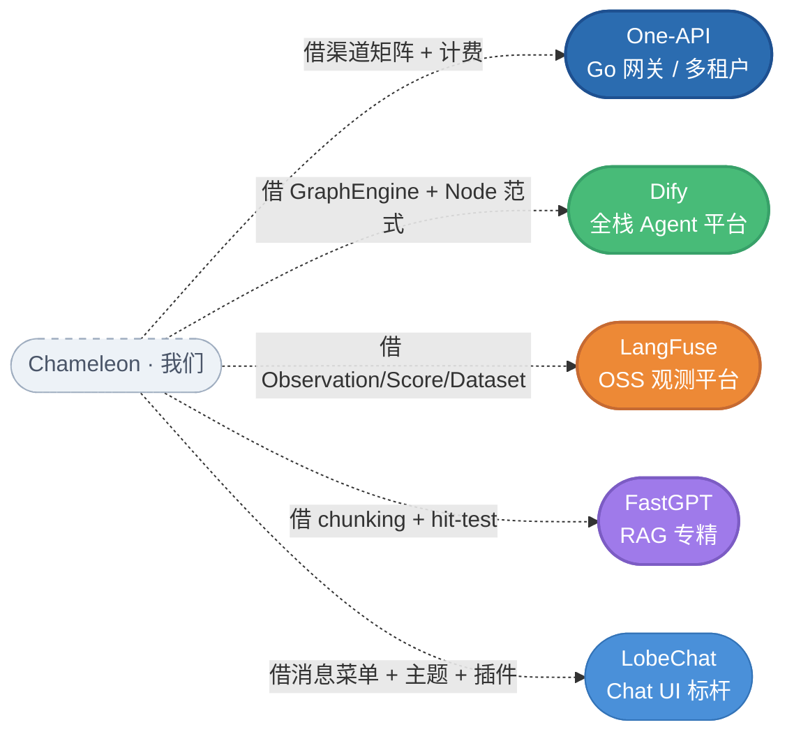
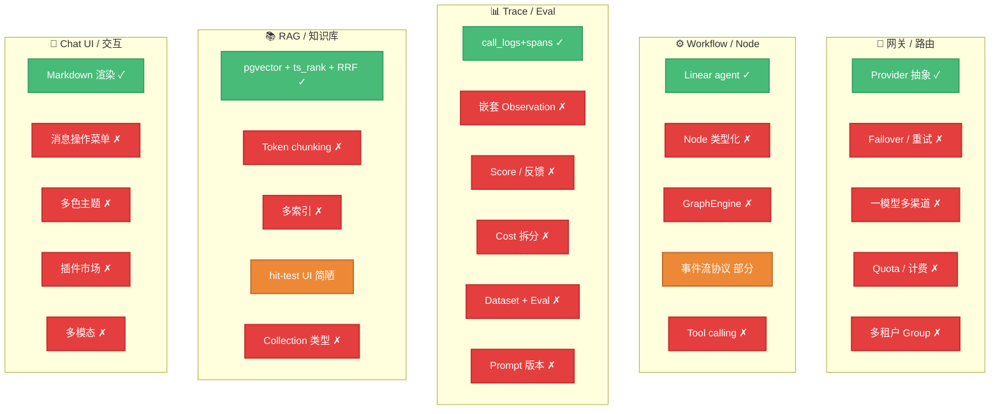

# Chameleon 进阶路线图 · 5 项目对标分析

**作者**：Links + Claude
**日期**：2026-05-23
**对标项目**：Dify · LobeChat · LangFuse · FastGPT · One-API
**目标**：把 Chameleon 从"中规中矩的 Agent 网关 + Admin"推到**顶级开源项目梯队**（GitHub 1w+ star 候选）
**文档原始分析**：`docs/competitive/{dify,lobechat,langfuse,fastgpt,one-api}-analysis.md`

---

## 0. TL;DR

我们的核心瓶颈不是某个功能，是**五个维度同时不够"垂直深"**：

| 维度 | 当前 Chameleon | 顶级标杆 | 差距 |
|---|---|---|---|
| **网关 / 路由** | agent → 单 provider 死绑 | One-API：(group × model × channel) 矩阵 + failover + 权重 | P0 |
| **Workflow / 节点编排** | 无，只 linear agent | Dify：GraphEngine + 31+ 节点 + 事件流 | P0 |
| **Trace / Eval / Cost** | 平坦 call_logs + spans JSON | LangFuse：嵌套 Observation + Score + Dataset + Eval | P1 |
| **RAG 深度** | 字符切 + RRF 混合检索 | FastGPT：token chunking + 多索引 + hit-test + Collection 类型 | P1 |
| **Chat UI / 交互** | 基础渲染 + 单 toggle theme | LobeChat：消息操作菜单 + 多色主题 + 插件市场 | P1 |

P17（4-6 周）落地 5 项 P0+P1 闪电战 → 产生**用户可感知的质变**；P18（6-8 周）补深度；P19+ 拓宽边界。

---

## 1. 5 个项目的 1 分钟速览



### 1.1 One-API — Go + Gin，最值得抄的"网关味"
- **核心**：`abilities (group, model, channel_id, priority)` 联合主键 → 一个 model_code 路由到多个上游
- **杀手锏**：pre-consume + post-consume 两阶段计费、status 状态机自动禁用失效 channel、`(model_ratio × group_ratio × completion_ratio)` 三维倍率
- **对 Chameleon 启发**：我们 agent ↔ provider 死绑，无 failover、无 quota、无多租户

### 1.2 Dify — FastAPI + Next.js，全栈"瑞士军刀"
- **核心**：Queue 驱动的 `GraphEngine`（Worker 池 + Ready Queue）+ 31+ 强类型 Node + 事件流式协议
- **杀手锏**：`Node[NodeDataT]` 泛型范式（Pydantic schema 自动给前端生成表单）、`Message.parent_message_id` 对话分支、Paragraph/QA/Parent-Child 三种 RAG 索引
- **对 Chameleon 启发**：我们没有 Workflow 概念，对话也不支持分支与回溯

### 1.3 LangFuse — Next.js + tRPC + ClickHouse，观测层 OSS 头部
- **核心**：嵌套 `Observation`（SPAN / GENERATION / AGENT / TOOL / EVALUATOR / GUARDRAIL 等）+ 独立 `Score` 表 + Model/PricingTier/Price 三层价目
- **杀手锏**：Dataset → DatasetRun → DatasetRunItem → Score 完整闭环、Prompt 版本管理 + 依赖、OTEL 协议摄入
- **对 Chameleon 启发**：我们 `call_logs.spans` 只是 JSON 数组，没有跨调用链路、没有 score、没有 dataset、没有 cost 拆分

### 1.4 FastGPT — Next.js + Mongoose + pgvector，RAG 专精
- **核心**：`Dataset → Collection → DatasetData` 三层 + 每 chunk 的 `indexes[]` 多索引（原文 / 摘要 / QA）
- **杀手锏**：token-based chunking、6 种 Collection 类型（file / link / api / image / folder / virtual）、6 步搜索融合（caption → multi-query → semantic fusion → rerank → multi-source merge → token limit）、hit-test UI 显示得分明细
- **对 Chameleon 启发**：我们的 chunk 单一字符切、单一 index、检索测试 UI 几乎没有

### 1.5 LobeChat — Next.js + Zustand + Antd，颜值/交互天花板
- **核心**：Zustand 分片 + flatten + 消息操作菜单（Provider Pattern）+ 双层主题（primaryColor × neutralColor）+ animationMode
- **杀手锏**：消息 hover Actions（copy/edit/regenerate/delete/反馈）、JSON Schema 驱动的插件配置表单、Dexie + localStorage 增量同步
- **对 Chameleon 启发**：我们的 chat 消息只渲染气泡，无菜单、无 regenerate；主题只有 dark/light，无品牌色

---

## 2. Chameleon 差距矩阵（5 维度细化）



---

## 3. 跨项目主题归纳（不是简单堆功能，是抽出 5 个"质变"）

把 5 份分析里反复出现的主题汇总，得到 Chameleon 真正应该补的**5 个根本性升级**：

### 主题 A · 把"agent → provider 死绑"升级为"(group, model, channel) 矩阵路由"
**来源**：One-API（abilities 表）、Dify（model 路由配置）
**为什么是质变**：当前一个 agent 写死一个 provider，导致用户必须自己分流；引入矩阵路由后，同一 `model_code: gpt-4` 可分布到多个 provider，用 priority+weight+failover 智能选。
**关键表**：新增 `channel`（绑定 provider + key + 状态）+ `ability(group_id, model_code, channel_id, priority, weight)` 联合键

### 主题 B · 把"linear agent"升级为"GraphEngine + 强类型 Node"
**来源**：Dify（`api/core/workflow/`）、FastGPT（datasetSearchNode）
**为什么是质变**：当前只有"绑 agent_key → invoke → 出 answer"，没有把多步、条件、并行表达成图；workflow 化是 Dify 之所以是 LLMops 头部的原因。
**关键概念**：每种 Node 定义 `NodeData(BaseModel)` Pydantic 子类 → 后端自动 dump JSON Schema → 前端 React Flow + 自动表单。
**最小可行**：先支持 5 类节点（LLM / Tool / KB Search / Conditional / End），不追 Dify 31 个全集。

### 主题 C · 把"平坦 call_logs"升级为"Observation 树 + Score + Dataset + Eval"
**来源**：LangFuse（全部 Prisma schema）、Dify（MessageAgentThought）
**为什么是质变**：现在 `spans` 是 JSON 数组，看不到跨请求的关系；引入 `parent_observation_id` 后能展示完整调用链，配合 Score 表能做用户满意度 + 自动评估对账。
**关键表增量**：`call_logs` 加 `parent_id` + `observation_type` enum；新增 `scores` / `datasets` / `dataset_items` / `dataset_runs` / `prompts(版本化)` / `eval_templates`。

### 主题 D · 把"字符切 + 单 index"升级为"token chunking + 多索引 + 多 Collection 类型 + 富 hit-test"
**来源**：FastGPT（DataChunkSplitModeEnum、indexes[]）、Dify（HIGH_QUALITY / ECONOMY）、RagFlow（title_chunker）
**为什么是质变**：现在 chunking 一刀切；RAG 质量上限被卡在切分这一步。token-based + 段落感知 + QA 对索引能立刻把召回率拉一档。
**关键改造**：chunker 模块解耦 + chunks 加 `indexes JSONB[]` + 引入 `chunking_strategy` 表版本化。

### 主题 E · 把"基础 chat 渲染"升级为"消息操作 + 多色主题 + JSON Schema 表单 + 插件骨架"
**来源**：LobeChat（Conversation/ChatItem、SkillStore、PluginSettings）
**为什么是质变**：消息没 regenerate / edit / 反馈 → 用户体验断层；没主题色 / 动画 → 没品牌力；没 JSON Schema 表单 → 未来插件市场没基础。这是"看起来像顶级产品"的关键。
**关键改造**：ChatMessage 加 hover Actions slot + Zustand userStore 加 primaryColor/neutralColor/animationMode + 新建 `JSONSchemaForm` 组件。

---

## 4. 阶段化路线图

### P17（4-6 周）· "可感知的质变"

**目标**：跑通 6 个 P0 项，发布 v0.3，对外宣传"对标 LangFuse + One-API 的开源 Agent 网关"。

| # | 主题 | 维度 | 工作量 | 关键产出 |
|---|---|---|---|---|
| P17.1 | 网关 Ability 矩阵 | Gateway | 1.5 周 | `channels` + `abilities` 表；agent 解绑 provider；failover / priority / weight；CRUD UI |
| P17.2 | 嵌套 Observation + Score | Trace | 1.5 周 | `call_logs.parent_id` + `observation_type`；新增 `scores` 表；trace tree 可视化 |
| P17.3 | Cost 拆分 + 模型价目表 | Trace | 1 周 | `model_pricings(provider_id, model_code, version)`；call_log 实时算 cost；dashboard 按 model 聚合 |
| P17.4 | Token chunking + hit-test UI | RAG | 1.5 周 | `TokenChunker`（tiktoken / model-aware）；`chunks.indexes JSONB[]`；前端搜索测试页显示 score breakdown |
| P17.5 | 消息操作菜单 + 多色主题 | UI | 1 周 | ChatMessage hover Actions（copy / regen / 反馈）；userStore 加 primaryColor / neutralColor / animationMode |
| P17.6 | Prompt 版本管理 + 反馈打分 | Trace | 1 周 | `prompts(name, version, labels[], tags[])`；agent 引用版本；widget 反馈按钮写入 scores 表 |

**总工时**：~7.5 周（按 1 人计；2 人并行 ≈ 4 周）

### P18（6-8 周）· "深度补齐"

**目标**：Workflow MVP + Eval 框架 + 分块策略可视化，对外宣传"可视化编排 + 自动评估"。

| # | 主题 | 工作量 | 关键产出 |
|---|---|---|---|
| P18.1 | GraphEngine MVP | 3 周 | `Node[NodeDataT]` 泛型基类；事件队列；5 种 node（LLM / Tool / KB / If-Else / End）；React Flow 前端编排 |
| P18.2 | Tool calling 系统 | 1.5 周 | `Tool` 抽象 + 内置工具（HTTP / SQL / Code Sandbox）；OpenAI function calling 对齐；MCP 兼容预留接口 |
| P18.3 | Dataset 采样 + DatasetRun | 1.5 周 | `datasets` + `dataset_items`（从 call_log 一键采样）；`dataset_runs` 跑新 prompt/model 对比 |
| P18.4 | 分块策略可视化编辑器 | 1 周 | `/kbs/:id/chunking-preview`：原文左 + chunks 中 + 参数右 + 实时预览；`chunking_strategy` 表版本化 |
| P18.5 | 对话分支 + Agent thought 链 | 1 周 | `messages.parent_message_id`；regenerate 创建新分支；Agent 中间步骤显示在 trace tree |
| P18.6 | JSON Schema 表单引擎 | 1 周 | `JSONSchemaForm` 组件；插件配置 / Agent 参数全部走 schema 驱动 |

**总工时**：~9 周

### P19+（持续）· "生态拓宽"

| 主题 | 灵感来源 | 备注 |
|---|---|---|
| Eval 自动化（JobConfiguration + EvalTemplate） | LangFuse | 让用户配 sample rate + template 跑 RAGAS 自动对账 |
| 插件市场骨架（市场 SDK + 安装流程） | LobeChat | 不做远程托管，先做"本地导入 / GitHub URL 安装" |
| 多租户 Group / Organization | One-API | 配 quota / billing / 独立 dashboard 的 SaaS 化前置 |
| 多模态（图 / 文件 / 语音） | LobeChat + FastGPT | widget + admin 一并加 |
| 知识库 Collection 类型扩展 | FastGPT | 加 link 抓取 / API 数据源 / 图片 caption |
| 一致性检查 & 自修复 job | FastGPT | 定期扫描 chunks vs 向量 vs 全文 ts_vector 一致性 |
| OTEL 摄入接入 | LangFuse | `POST /api/public/otel/v1/traces` 兼容外部 SDK |

---

## 5. 关键表结构增量（P17）

### 5.1 网关 Ability 路由（来自 One-API）

```sql
-- 新建：channel（每个 provider 多 key 时一个 key 一个 channel）
CREATE TABLE channels (
    id BIGINT PRIMARY KEY,
    provider_id BIGINT NOT NULL REFERENCES providers(id),
    name VARCHAR(64) NOT NULL,
    api_key_encrypted BYTEA,          -- AES-GCM 复用
    base_url VARCHAR(255),            -- 可覆盖 provider 默认
    status VARCHAR(16) DEFAULT 'enabled',  -- enabled/auto_disabled/manual_disabled
    weight INT DEFAULT 0,             -- 0 = 平均；>0 加权
    response_time_ms INT,             -- 健康监控
    used_quota BIGINT DEFAULT 0,
    last_failed_at TIMESTAMP,
    created_at TIMESTAMP DEFAULT NOW()
);

-- 新建：能力矩阵（一个 model_code 多 channel）
CREATE TABLE abilities (
    group_id BIGINT,                  -- NULL = 全局
    model_code VARCHAR(64) NOT NULL,  -- "gpt-4o", "claude-3-opus"
    channel_id BIGINT NOT NULL REFERENCES channels(id),
    priority INT DEFAULT 0,           -- 高优先级先选
    enabled BOOLEAN DEFAULT TRUE,
    PRIMARY KEY (group_id, model_code, channel_id)
);
CREATE INDEX idx_abilities_route ON abilities(group_id, model_code, enabled, priority DESC);

-- 修改：agents 解绑 provider（agents.provider_id 改为 nullable / 弃用），增加 model_code
ALTER TABLE agents ADD COLUMN preferred_model_code VARCHAR(64);
-- agent 不再绑 provider，而是绑 model_code → 由 abilities 决定 channel
```

### 5.2 嵌套 Observation + Score + Cost（来自 LangFuse）

```sql
-- 扩展 call_logs
ALTER TABLE call_logs ADD COLUMN parent_id VARCHAR(64);
ALTER TABLE call_logs ADD COLUMN observation_type VARCHAR(32) DEFAULT 'generation';
-- enum: trace, span, generation, agent, tool, retriever, evaluator, embedding
ALTER TABLE call_logs ADD COLUMN model_matched VARCHAR(64);
ALTER TABLE call_logs ADD COLUMN calculated_input_cost DECIMAL(18,10);
ALTER TABLE call_logs ADD COLUMN calculated_output_cost DECIMAL(18,10);
ALTER TABLE call_logs ADD COLUMN calculated_total_cost DECIMAL(18,10);
ALTER TABLE call_logs ADD COLUMN completion_start_ms INT;  -- TTFT
CREATE INDEX idx_call_logs_parent ON call_logs(parent_id);

-- 模型价目表（版本化）
CREATE TABLE model_pricings (
    id BIGINT PRIMARY KEY,
    provider_id BIGINT REFERENCES providers(id),
    model_code VARCHAR(64) NOT NULL,
    match_pattern VARCHAR(255),       -- 正则匹配 SDK 字符串
    input_price DECIMAL(18,10),       -- USD / 1K tokens
    output_price DECIMAL(18,10),
    unit VARCHAR(16) DEFAULT 'TOKENS',
    version INT DEFAULT 1,
    effective_from TIMESTAMP,
    created_at TIMESTAMP DEFAULT NOW(),
    UNIQUE (provider_id, model_code, version)
);

-- 评分（来自用户反馈 / 自动 eval）
CREATE TABLE scores (
    id VARCHAR(64) PRIMARY KEY,
    call_log_id VARCHAR(64) REFERENCES call_logs(request_id),
    name VARCHAR(64) NOT NULL,        -- "thumbs_up", "ragas_faithfulness"
    value FLOAT,
    string_value TEXT,
    data_type VARCHAR(16),            -- numeric/categorical/boolean/text
    source VARCHAR(16),               -- annotation/api/eval
    created_at TIMESTAMP DEFAULT NOW()
);

-- Prompt 版本管理
CREATE TABLE prompts (
    id BIGINT PRIMARY KEY,
    name VARCHAR(128) NOT NULL,
    version INT NOT NULL,
    prompt JSONB NOT NULL,            -- {messages: [...]} or text
    config JSONB DEFAULT '{}',        -- {model, temperature, ...}
    labels VARCHAR(32)[] DEFAULT ARRAY[]::VARCHAR(32)[],
    tags VARCHAR(32)[] DEFAULT ARRAY[]::VARCHAR(32)[],
    commit_message TEXT,
    created_by_user_id BIGINT,
    created_at TIMESTAMP DEFAULT NOW(),
    UNIQUE (name, version)
);
```

### 5.3 Token chunking + 多索引（来自 FastGPT）

```sql
-- 改 chunks：单一向量 → 多索引数组
ALTER TABLE chunks ADD COLUMN indexes JSONB DEFAULT '[]'::JSONB;
-- 每个元素：{type: "chunk"|"qa"|"summary"|"custom", text, embedding_id, score?}

-- 新增：分块策略版本化
CREATE TABLE chunking_strategies (
    id BIGINT PRIMARY KEY,
    name VARCHAR(64) NOT NULL,
    strategy_type VARCHAR(32) NOT NULL,  -- char / token / paragraph / qa
    config JSONB NOT NULL,
    -- char: {size, overlap, separators[]}
    -- token: {model, token_size, overlap}
    -- paragraph: {min_size, max_size, ai_mode}
    -- qa: {ai_model, ai_prompt}
    version INT DEFAULT 1,
    created_at TIMESTAMP DEFAULT NOW()
);

-- documents 引用策略版本（chunk 时快照）
ALTER TABLE documents ADD COLUMN chunking_strategy_id BIGINT REFERENCES chunking_strategies(id);
ALTER TABLE chunks ADD COLUMN strategy_snapshot JSONB;  -- 不可变快照
```

---

## 6. 前端关键改造（P17）

### 6.1 消息操作菜单（来自 LobeChat）

`frontend/src/system/playground/components/chat-column.tsx` + 新建 `chat-message.tsx`：

```tsx
<ChatMessage>
  <BubbleBody />
  <CitationChips />
  <Actions>
    <CopyBtn />
    <RegenerateBtn />        // 创建 message branch
    <EditBtn />               // 可编辑后重发
    <ThumbsUpDown onScore={v => scoreApi.create(messageId, "user_feedback", v)} />
  </Actions>
</ChatMessage>
```

embed widget 也镜像加同样菜单（widget.ts 已经预留 feedback button，扩 regen / edit）。

### 6.2 多色主题（来自 LobeChat）

`frontend/src/core/stores/user.ts` 加：

```ts
interface UserPreferences {
  themeMode: 'light' | 'dark' | 'auto';
  primaryColor: 'blue' | 'purple' | 'green' | 'orange' | 'rose' | ...;  // 8 个预设
  neutralColor: 'slate' | 'stone' | 'zinc' | 'neutral' | 'gray';
  animationMode: 'disabled' | 'smooth' | 'agile';
}
```

`assets/styles/theme.css` 用 CSS variables，preferences 改变时切换根类。

### 6.3 JSON Schema 表单引擎

新建 `frontend/src/core/components/form/json-schema-form.tsx`：

```ts
<JSONSchemaForm
  schema={agentDef.input_schema}     // 后端 Pydantic dump 出来的 schema
  value={formState}
  onChange={setFormState}
/>
```

支持 string / number / boolean / enum / nested object / array。
后续 P18 的 Tool 配置 + Node 参数表单全部走这个。

### 6.4 Trace Tree 可视化（来自 LangFuse）

`/call-logs/:id` 当前是 spans 数组渲染；改成嵌套树（parent_id → 子节点缩进），按时间轴 gantt 风格。
鼠标悬停每个 observation 显示 input/output、tokens、cost、duration。

### 6.5 Hit-test 增强（来自 FastGPT）

`/kbs/:id` 现有"检索测试"tab 改造：
- 左：query 输入 + 检索参数（top_k / 相似度阈值 / 检索模式）
- 中：命中 chunks，每条显示：`{score_total, score_breakdown: {embedding, full_text, rerank}, source: {doc, page, char_range}}`
- 右：原文预览 + 命中 chunk 黄色高亮

---

## 7. 风险与对冲

| 风险 | 概率 | 影响 | 对冲 |
|---|---|---|---|
| **P17 一次推太多导致 v0.3 难合**| 高 | 高 | 6 项严格按 sub-issue 拆 PR，每个 PR 独立可合 |
| **GraphEngine 复杂度爆炸** | 中 | 高 | P18 只做最小 5 节点；事件协议先抄 Dify JSON-L 而非自造 |
| **价目表维护成本** | 中 | 中 | 价目数据从 `litellm` 项目（MIT）同步，不自己编 |
| **数据迁移破坏现有 call_logs** | 中 | 高 | parent_id / observation_type 都加默认值；老数据等同 "trace root + generation" |
| **多色主题与现有 Tailwind 冲突** | 低 | 中 | 用 CSS variables，不改 tailwind config；fallback 到 stone 中性色 |
| **顶级项目对标显得"什么都借" → 没原创**| 中 | 中 | 文档强调"组合而非抄袭"；走出自己的差异化：**Python 原生 + uv workspace + Provider 灵活注入** 是我们的独有优势 |

---

## 8. Chameleon 的差异化定位（不要忘记自己是谁）

读完 5 个项目，我们应该坚持的 **3 个独有优势**：

1. **Provider 协议抽象 > 单一适配**
   One-API 只代理 OpenAI-like，Dify 只挂自己生态；Chameleon 的 `Provider` 抽象 + `chameleon-providers/{local,dify,fastgpt}` 子包让"挂上一个 dify 应用 / 一个 fastgpt 知识库 / 一个本地 LangGraph agent"是同一套接口。这是 **聚合层的聚合层**，应该作为顶层 Slogan。

2. **后端 Python + uv workspace + 严格 MVC**
   Dify Python 但模块结构混杂；LobeChat 是 TS 全栈；只有我们走"Python 后端 + React 前端"且严格分层。对 Python 团队友好度 > LobeChat。

3. **embed widget 0 框架原生 vanilla JS + shadow DOM**
   LobeChat 的"embed"基本不存在，Dify 的 webapp 是 React 重客户端；我们的 27KB / 9KB gz 纯 vanilla shadow DOM widget 是真正的 "drop-in"。这是 ToB 卖点。

**总结一句话**：Chameleon = **"LangFuse trace + One-API 路由 + Dify workflow + FastGPT KB + LobeChat UI"** 五合一中的"轻量 Python 网关版"，关键差异化是 **Provider 协议抽象** 让用户不必锁定一家生态。

---

## 9. 下一步

我建议你这边：
1. 通读本文档，把 P17 的 6 项排个**优先级 + 想砍/想加的**
2. 选定后我把 P17 拆成 sub-tasks（每条对应 1 个 PR 粒度）→ 写 `2026-05-23-p17-impl-plan.md`
3. 启动 P17.1（Ability 路由）做最小 spike，跑通后再批量开 PR

5 份完整对标分析在 `docs/competitive/`，每份都引用具体源码行号，团队可直接对照实现。
