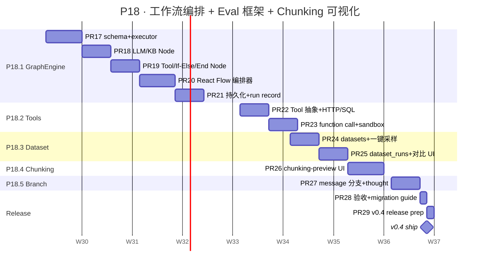

# P18 详细 Sub-Plan · 深度补齐 → v0.4

**周期**：2026-07-21 → 2026-09-12（8 周）
**目标版本**：v0.4
**总 slots**：32 (8 周 × 4 productive slots/week)
**主计划**：[docs/plans/2026-05-23-chameleon-master-plan.md](./2026-05-23-chameleon-master-plan.md)
**前置**：v0.3 已 ship（P17 全 ✓），channels / abilities / observations / scores 已落地

---

## 0. P18 全景



---

## 1. 进度跟踪表

| ID | Feature | 目标周 | PR 数 | 状态 | 备注 |
|---|---|---|---|---|---|
| P18.1 | GraphEngine MVP | W9-W11 | 5 | ⏳ pending | 营销主线，最大杠杆 |
| P18.2 | Tool calling 系统 | W12 | 2 | ⏳ pending | OpenAI function call 对齐 |
| P18.3 | Dataset + DatasetRun | W13 | 2 | ⏳ pending | LangFuse 风 Eval 链 |
| P18.4 | Chunking 可视化编辑器 | W14 | 1 | ⏳ pending | W7 TokenChunker 价值兑现 |
| P18.5 | 对话分支 + Agent thought | W15 | 1 | ⏳ pending | LobeChat 风 branch tree |
| P18.6 | ✅ 已完成（P17.F1） | — | — | ✅ | JSON Schema 引擎 P17 已 ship |
| 🚢 | v0.4 release | W16 | 2 | ⏳ pending | docs + tag |

**总 PR 数**：13 个；按红线 < 800 LOC/PR 控制。

---

## 2. 红线（沿用 P17，新增 P18 特定）

### 沿用红线（违反必须打回）

- ⛔ 不修改已发布 alembic migration —— forward-only
- ⛔ 不延迟发版 —— W16 周末 70% 也 ship，剩余移 P19
- ⛔ 不绕过 `Result[T]` 响应封装
- ⛔ 不绕过 `sse_response` SSE 协议
- ⛔ service 不返 ORM Model；API 不调 Mapper

### P18 新增红线

- ⛔ **GraphEngine Node 之间不共享可变状态** —— 节点只能通过 edges 显式传递 data；全局 `NodeContext` 只读
- ⛔ **Tool 不能直接持有 db session** —— 走依赖注入 + service 层；防止 tool 写 raw SQL 绕过权限
- ⛔ **Code Sandbox 永不在主进程执行用户代码** —— 子进程 / 容器隔离 + 超时 + 资源限制
- ⛔ **Dataset 不存原始 PII** —— 采样时强制脱敏字段；call_log 一键采样默认去掉 user_input 完整文本（只留 hash + token 数）
- ⛔ **不允许 graph 内嵌 graph 递归调用** —— 防爆栈；要复用一个流程，rerun by graph_id

### PR 验收 checklist（同 P17）

- [ ] `yarn tsc --noEmit` clean
- [ ] 后端 `pytest` 全绿
- [ ] Chrome MCP 跑过 e2e 截图（GraphEngine PR 必须录 gif）
- [ ] LOC < 800
- [ ] CHANGELOG `Unreleased` section 加一行

---

## 3. W9-W11 · P18.1 GraphEngine MVP（5 PRs）

### 3.1 目标

Dify-style 可视化编排：拖 5 类 node + 连线 → 后端 GraphExecutor 跑出来结果 → 前端实时显示状态。
对外宣传："Chameleon Workflow MVP shipped"。

### 3.2 数据模型

**新表**：

```sql
CREATE TABLE graphs (
    id BIGINT PRIMARY KEY,
    graph_key VARCHAR(64) UNIQUE NOT NULL,
    name VARCHAR(128) NOT NULL,
    description TEXT,
    schema_version INT NOT NULL DEFAULT 1,
    spec JSONB NOT NULL,             -- 节点/边的完整声明（图结构）
    enabled BOOLEAN NOT NULL DEFAULT TRUE,
    created_at TIMESTAMPTZ NOT NULL DEFAULT NOW(),
    updated_at TIMESTAMPTZ NOT NULL DEFAULT NOW(),
    deleted_at TIMESTAMPTZ
);

CREATE TABLE graph_runs (
    id BIGINT PRIMARY KEY,
    graph_id BIGINT NOT NULL REFERENCES graphs(id),
    request_id VARCHAR(64) NOT NULL UNIQUE,  -- 与 call_log.request_id 串联
    status VARCHAR(16) NOT NULL,             -- pending/running/success/failed/cancelled
    input JSONB NOT NULL,
    output JSONB,
    error JSONB,
    started_at TIMESTAMPTZ,
    finished_at TIMESTAMPTZ,
    duration_ms INT,
    node_count INT
);

CREATE TABLE graph_node_runs (
    id BIGINT PRIMARY KEY,
    graph_run_id BIGINT NOT NULL REFERENCES graph_runs(id),
    node_id VARCHAR(64) NOT NULL,            -- 来自 spec.nodes[].id
    node_type VARCHAR(32) NOT NULL,
    status VARCHAR(16) NOT NULL,
    input JSONB,
    output JSONB,
    error JSONB,
    request_id VARCHAR(64),                  -- 写入 call_logs.parent_id 实现 trace 串联
    started_at TIMESTAMPTZ,
    finished_at TIMESTAMPTZ,
    duration_ms INT
);
```

### 3.3 PR 拆分

#### **PR #17**：`feat(graph): schema + node base + executor skeleton`

LOC ~600

- `backend/chameleon-core/src/chameleon/core/graph/` 新包
  - `types.py` —— `NodeSpec` / `EdgeSpec` / `GraphSpec` Pydantic
  - `node_base.py` —— `Node[NodeDataT]` 泛型基类；`async def execute(ctx, input) -> output`
  - `executor.py` —— 拓扑排序 + DAG 检测 + 队列驱动；逐节点 await execute()
  - `context.py` —— `NodeContext`（只读 trace_id / app_id / depth 等）
- alembic `p18_w9_graphs`：建 3 张表
- model：`Graph`, `GraphRun`, `GraphNodeRun`
- 占位 node：`NoopNode`，跑通 executor

测试：
- 单元 12 个：拓扑 / 环检测 / 单节点 / 链式 3 节点 / 分叉合并 / 异常传播

#### **PR #18**：`feat(graph): LLM Node + KB Node`

LOC ~500

- `nodes/llm.py` —— `LLMNode`：调 router 选 model；接 prompt template；支持 messages 注入
- `nodes/kb.py` —— `KBNode`：retrieval 调用现有 search service；返 top_k chunks
- 这俩 node 都接 `chameleon.system.api_key.record_call` 写 child call_log

测试：
- 集成 6 个：LLM mock + KB seed → 跑 graph "user query → KB.search → LLM.compose"

#### **PR #19**：`feat(graph): Tool / If-Else / End Node + 错误传播`

LOC ~500

- `nodes/tool.py` —— 调 P18.2 的 Tool（先占位 stub）
- `nodes/if_else.py` —— 表达式求值（jsonlogic 风格白名单 op）
- `nodes/end.py` —— 终态聚合
- executor 增强：分支选择、并发 fanout 收集、错误冒泡

测试：
- 单元 8 个：分支 true/false / if 后并发 2 节点 / 错误从子节点冒泡 / End 聚合

#### **PR #20**：`feat(graph): React Flow 前端编排器`

LOC ~700（前端为主）

- `frontend/src/system/graphs/` 新模块
  - `pages/graph-editor-page.tsx` —— React Flow canvas + 左侧 node palette + 右侧 inspector
  - `components/nodes/{llm,kb,tool,ifelse,end}-node.tsx` —— 5 个自定义 node 渲染
  - `components/inspector.tsx` —— 用 P17.F1.3 的 `JSONSchemaForm` 渲染 node config
  - `services/graph.ts` —— CRUD API
  - 路由：`/graphs`, `/graphs/:id/edit`, `/graphs/:id/runs`
- 后端 admin：`/v1/admin/graphs` 6 个端点（list / detail / create / update / delete / test-run）

测试：
- Chrome MCP gif：拖 3 节点连线 → 保存 → 跑一遍 → 看每节点状态

#### **PR #21**：`feat(graph): 持久化 + run record + trace 串联`

LOC ~400

- executor 每开节点：插 `graph_node_runs` + 写 `call_logs`（parent_id 串到 trace tree）
- run 完成：聚合 duration / status；前端 `/graphs/:id/runs` 列表 + 详情 drawer
- 与 P17.C1 的 trace tree drawer 复用（一个 graph_run 就是一个 trace）

测试：
- E2E 4 个：跑 graph → call_logs 有对应行 → trace tree drawer 看到嵌套结构

### 3.4 W9-W11 日历

| 周 | 日 | 任务 | slot |
|---|---|---|---|
| W9 | Mon-Tue | PR #17 types + node_base + executor | 1.5 |
| W9 | Wed-Thu | PR #17 migration + tests + 合并 | 1 |
| W9 | Fri | PR #18 LLM/KB Node | 0.5 |
| W10 | Mon | PR #18 收尾 + 合并 | 0.5 |
| W10 | Tue-Wed | PR #19 Tool/IfElse/End + executor 增强 | 1.5 |
| W10 | Thu | PR #19 合并；PR #20 React Flow 初稿 | 1 |
| W10 | Fri | PR #20 inspector + nodes 自定义 | 1 |
| W11 | Mon | PR #20 后端 admin API + 合并 | 1 |
| W11 | Tue-Wed | PR #21 run record + trace 串联 | 1.5 |
| W11 | Thu | PR #21 合并；buffer | 0.5 |
| W11 | Fri | GraphEngine 整体验收（录 gif）| - |

### 3.5 验收（GraphEngine ship 必须 ✓）

- [ ] 5 类 node 都能在 React Flow 拖 + 配 + 跑通
- [ ] 一条 graph 跑完，trace tree drawer 能看到嵌套 observation
- [ ] graph_runs 列表能筛 status / time
- [ ] 跑失败的 node 在 React Flow 上红色 + tooltip 错误
- [ ] Chrome MCP gif 60s 展示完整流程

---

## 4. W12 · P18.2 Tool calling 系统（2 PRs）

### 4.1 目标

让 LLMNode / 外部直调都能用工具。对齐 OpenAI function calling；为 MCP 兼容预留接口。

### 4.2 PR 拆分

#### **PR #22**：`feat(tools): Tool 抽象 + 内置 HTTP/SQL`

LOC ~500

- `backend/chameleon-core/src/chameleon/core/tools/` 新包
  - `base.py` —— `Tool` abstract：`name`, `description`, `parameters_schema`（JSON Schema）, `async run(args, ctx)`
  - `builtins/http.py` —— `HTTPTool`：支持 GET/POST + headers + timeout；自动加 X-Chameleon-Tool 标头
  - `builtins/sql.py` —— `SQLTool`：白名单 db_url + 只读模式；超时 30s
  - `registry.py` —— 类似 provider registry，启动时扫
- alembic `p18_w12_tools`：建 `tools` 表（name / kind / config / enabled）
- admin API `/v1/admin/tools`

测试：单元 8 + E2E 3。

#### **PR #23**：`feat(tools): function calling + Code Sandbox`

LOC ~500

- LLMNode 支持 `tools=[...]`，转 OpenAI function calling 协议
- `builtins/code_sandbox.py` —— 用 `subprocess` + `seccomp` / Docker run（按环境降级）；用户代码 30s 超时 / 128MB 内存
- 调用 sandbox 时强制 require_permission("tools:execute")

测试：单元 6（含安全测：尝试越权读 /etc/passwd → 失败）+ E2E 2。

---

## 5. W13 · P18.3 Dataset + DatasetRun（2 PRs）

### 5.1 目标

把 W7 的 scores 串成完整 Eval 链路：call_log 采样 → dataset → 重跑新 prompt/model → 对比 score。

### 5.2 PR 拆分

#### **PR #24**：`feat(eval): datasets + 一键采样`

LOC ~500

- alembic `p18_w13_datasets`：
  ```sql
  CREATE TABLE datasets (
      id BIGINT PRIMARY KEY, name, description, item_count, created_at
  );
  CREATE TABLE dataset_items (
      id BIGINT PRIMARY KEY, dataset_id BIGINT FK,
      source_call_log_id VARCHAR(64),    -- 源 call_log.request_id
      input_payload JSONB,                -- 已脱敏的 input
      expected_output JSONB,              -- 人工标注的预期
      meta JSONB
  );
  ```
- admin API：
  - `POST /v1/admin/datasets/:id/sample-from-logs` —— 按 filter（agent_key / time / success）批量采样
  - 采样时强制脱敏（红线：去掉 user_input 完整文本，留 hash + token count + 长度）
  - `GET /v1/admin/datasets/:id/items` 列表
  - `POST /v1/admin/datasets/:id/items/:item_id/update` 人工标注

测试：E2E 5。

#### **PR #25**：`feat(eval): dataset_runs + 对比 UI`

LOC ~600

- alembic `p18_w13_dataset_runs`：
  ```sql
  CREATE TABLE dataset_runs (
      id BIGINT PRIMARY KEY, dataset_id BIGINT FK,
      name, agent_key, model_override, prompt_override,
      status, started_at, finished_at,
      summary JSONB  -- {item_count, success_rate, mean_latency, score_aggregates}
  );
  CREATE TABLE dataset_run_items (
      id BIGINT PRIMARY KEY, dataset_run_id BIGINT FK, dataset_item_id BIGINT FK,
      actual_output JSONB, scores JSONB, error JSONB
  );
  ```
- 后台跑 dataset_run：每 item → invoke → 写 score（LLM judge or RAGAS）
- 前端 `/datasets/:id/runs`：列表 + 对比表格（两 run 横向 diff，行高亮 score 差）

测试：E2E 4（含 mock LLM judge）。

---

## 6. W14 · P18.4 分块策略可视化编辑器（1 PR）

### **PR #26**：`feat(rag): chunking-preview 三栏 + chunking_strategy 版本化`

LOC ~700

- 路由：`/kbs/:id/chunking-preview`
- 左栏：原文 textarea（粘贴 / 上传一个临时 doc）
- 中栏：chunks 列表（按当前 strategy 切；rich card 显 token / char count / overlap 高亮）
- 右栏：strategy 表单（复用 P17.D1 的 5-mode picker）+ 实时预览开关
- 后端：`POST /v1/admin/kbs/:id/chunking-preview` —— body 含 text + strategy → 返 chunks 数组（不落库）
- `chunking_strategy_versions` 表：每次保存策略生成一版，document 记录使用的版本号；切版本可对比 retrieval 命中率

测试：E2E 3 + 单元覆盖 strategy 边界。

---

## 7. W15 · P18.5 对话分支 + Agent thought 链（1 PR）

### **PR #27**：`feat(chat): messages.parent_message_id + branch UI + agent step events`

LOC ~700

- alembic `p18_w15_message_branch`：
  ```sql
  ALTER TABLE messages ADD COLUMN parent_message_id BIGINT;
  CREATE INDEX ix_messages_parent ON messages(parent_message_id);
  ```
- regenerate / edit-and-resend 创建新分支（不覆盖老 assistant message）
- 前端 conversation drawer：用 tree 视图渲染消息链；当前分支高亮，其他分支灰显可切换
- Agent thought events：LLMNode / Agent invoke 内的中间步骤（思考 / 工具调用 / 中间结论）通过 SSE `meta` 事件透出 → 前端在消息下方折叠显示

测试：E2E 5（创建分支 / 切换分支 / 折叠 thought）。

---

## 8. W16 · 收尾 + v0.4 release（2 PRs）

### **PR #28**：`chore(release): v0.4 联通验收 + migration guide`

LOC ~200

- `docs/release/v0.4-migration.md`：5 个新表迁移顺序 / GraphEngine 开关 / Tool 沙箱要求
- 整合 e2e gif（按主题分 5 段：Graph / Tools / Eval / Chunking / Branch）

### **PR #29**：`chore(release): v0.4 ship`

LOC ~100

- 4 backend 包 + 2 frontend 包：0.3.0 → 0.4.0
- CHANGELOG 加 v0.4 section
- git tag `v0.4.0`

---

## 9. 跨周共用约束

### 9.1 GraphEngine 与 trace tree 串联

每个 `GraphNode.execute()` 必须：
1. 取 `ctx.trace_id`（来自 `current_observation_id()`）作为 parent
2. 进入时 `async with observe(observation_type='agent', parent_id=parent)` 开新 child
3. 退出时 `record_call(...)` 落 call_log
4. 节点 `request_id` 同步写到 `graph_node_runs.request_id`

这保证：跑 graph → trace tree drawer 能看到 5 节点的嵌套结构，每节点能独立打分。

### 9.2 Tool 与 P17 abilities 复用

Tool 也走 `requires_permission`：admin 配置时声明 `permission_code`（如 `tools:execute:sql`），LLMNode 调用前 enforce。
Tool 调用产生 call_log（observation_type='tool'）— 与 P17.C1 嵌套树天然兼容。

### 9.3 Dataset 与 scores 复用

dataset_run 跑完每 item 后，写一条 `scores`（source='eval'）；前端在 trace tree 直接看到 score badge —— 不重复造 UI。

### 9.4 不引入新依赖（除非必须）

按 P17 规约：一个 PR 最多引入一个三方库。
预期新增：`react-flow` (PR #20)、`tiktoken` 已有、`docker` 可选（PR #23 优先 subprocess+seccomp）。

---

## 10. 风险全表

| 风险 | 何时出现 | 概率 | 应对 |
|---|---|---|---|
| GraphEngine 拓扑算法 corner case 多 | W9-W10 | 中 | PR #17 单测覆盖率 ≥ 95%；分叉/合并/环都跑用例 |
| React Flow 学习曲线超 1 周 | W10-W11 | 中 | 上线前 Spike 半天；备选 reactflow MIT 还是 dagre 已成熟 |
| Tool sandbox 安全漏洞 | W12 | 高 | PR #23 默认禁用 SQLTool / CodeSandbox；admin 显式开关 + 强权限点 |
| Dataset 采样泄露 PII | W13 | 高 | 红线已立；CI 加自动测：检查 dataset_items 不含 raw user_input 长 > 50 |
| Eval LLM judge 成本失控 | W13 | 中 | dataset_run 跑前显示 estimated tokens × price；超 $5 二次确认 |
| GraphEngine 与现有 agent 路径不能同时跑 | W11 | 低 | feature flag `graph.enabled`；老 agent 仍走 P17 路径 |

---

## 11. 退出标准（v0.4 ship 必须全 ✓）

- [ ] GraphEngine 跑通 demo workflow（user → KB → LLM → End）
- [ ] React Flow 编辑器能拖能连能保存能 rerun
- [ ] graph_runs 与 call_logs 完全打通；trace tree drawer 能看到嵌套
- [ ] 至少 2 个内置 Tool（HTTP + SQL）可用且经过权限校验
- [ ] LLMNode 支持 function calling
- [ ] datasets 能从 call_log 一键采样（脱敏）
- [ ] dataset_runs 能对比两个 run 的 score
- [ ] chunking-preview 三栏 UI 实时显示切块结果
- [ ] message 分支 UI：regenerate 不覆盖老 assistant
- [ ] CHANGELOG v0.4 + migration guide 完整
- [ ] git tag `v0.4.0`

---

## 12. P19 启动准备（W16 周五做）

W16 ship 后立即对标：

- LangFuse Eval 自动化（JobConfiguration + EvalTemplate）
- LobeChat 插件市场骨架
- One-API Group / Organization 多租户
- LobeChat 多模态（图 / 文件 / 语音）
- FastGPT 知识库 Collection 类型扩展

P19 详细 sub-plan 在 v0.4 ship 后 1 周内产出。

---

## 13. Quick Reference · 13 个 PR 总览

| # | 周 | 主题 | 分支 | LOC |
|---|---|---|---|---|
| 17 | W9 | graph schema + executor | `p18/graph-core` | ~600 |
| 18 | W9-W10 | LLM/KB Node | `p18/graph-llm-kb` | ~500 |
| 19 | W10 | Tool/IfElse/End Node | `p18/graph-control` | ~500 |
| 20 | W10-W11 | React Flow 编排器 | `p18/graph-editor` | ~700 |
| 21 | W11 | run record + trace 串联 | `p18/graph-run` | ~400 |
| 22 | W12 | Tool 抽象 + HTTP/SQL | `p18/tools-builtin` | ~500 |
| 23 | W12 | function call + sandbox | `p18/tools-sandbox` | ~500 |
| 24 | W13 | datasets + 采样 | `p18/datasets` | ~500 |
| 25 | W13 | dataset_runs + 对比 | `p18/dataset-runs` | ~600 |
| 26 | W14 | chunking-preview | `p18/chunking-ui` | ~700 |
| 27 | W15 | message branch | `p18/message-branch` | ~700 |
| 28 | W16 | 收尾 + migration | `p18/release-prep` | ~200 |
| 29 | W16 | 🚢 v0.4 ship | `release/v0.4` | ~100 |

**总 LOC**：~6500（13 PR × ~500 平均）

每 PR 严格 < 800 LOC，超量必须拆。
