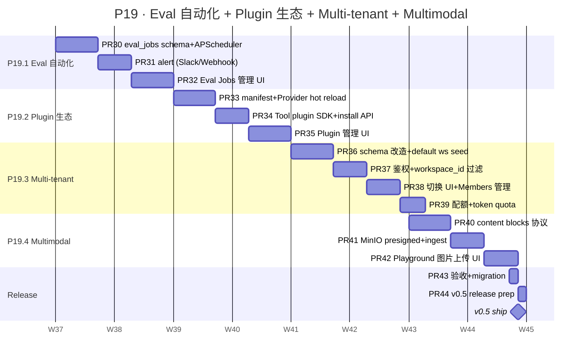

# P19 详细 Sub-Plan · 自动化 + 生态 + 多租户 → v0.5

**周期**：2026-09-13 → 2026-11-07（8 周）
**目标版本**：v0.5
**总 slots**：32（8 周 × 4 productive slots/week）
**主计划**：[docs/plans/2026-05-23-chameleon-master-plan.md](./2026-05-23-chameleon-master-plan.md)
**前置**：v0.4 已 ship（P18 全 ✓），GraphEngine / Tools / Eval Pipeline / Chunking Preview / Message Branch 已落地

---

## 0. P19 全景



---

## 1. 进度跟踪表

| ID | Feature | 目标周 | PR 数 | 状态 | 备注 |
|---|---|---|---|---|---|
| P19.1 | Eval 自动化（job+alert） | W17-W18 | 3 | ⏳ pending | 承接 P18 eval pipeline，最低 ROI 但最稳收益 |
| P19.2 | Plugin Hot Loader | W19-W20 | 3 | ⏳ pending | 孵化外部生态，长期复利 |
| P19.3 | Multi-tenant Group | W21-W22 | 4 | ⏳ pending | 企业版地基，伤筋动骨改 schema |
| P19.4 | Multimodal | W23-W24 | 3 | ⏳ pending | 跟上 GPT-4V/Claude Vision 协议 |
| 🚢 | v0.5 release | W24 | 2 | ⏳ pending | docs + tag + GitHub Release |

**总 PR 数**：15 个；红线 < 800 LOC/PR；总计约 8K-10K LOC。

---

## 2. 红线（沿用 P17/P18，新增 P19 特定）

### 沿用红线（违反必须打回）

- ⛔ 不修改已发布 alembic migration —— forward-only
- ⛔ 不延迟发版 —— W24 周末 70% 也 ship，剩余移 P20
- ⛔ 不绕过 `Result[T]` 响应封装
- ⛔ 不绕过 `sse_response` SSE 协议
- ⛔ service 不返 ORM Model；API 不调 Mapper
- ⛔ GraphEngine Node 不共享可变状态
- ⛔ Tool 不能直接持有 db session
- ⛔ Dataset 不存原始 PII

### P19 新增红线

- ⛔ **Plugin 加载必须 async + 超时** —— 不允许同步阻塞主事件循环；插件 init 超过 5s 视为失败 unload
- ⛔ **Plugin manifest 不允许包含可执行代码** —— 只声明 schema 和 entrypoint 路径，禁止 `eval()` / `exec()` 内联
- ⛔ **Multi-tenant 改 schema 必须 backward-compat** —— `workspace_id` 全部 NULLABLE，老数据自动归 `default` workspace
- ⛔ **Multimodal content blocks 不塞 base64 巨型 string** —— 走 MinIO presigned URL，请求体只传 `image_url`
- ⛔ **Eval Job 告警必须 rate-limit + dedup** —— 同一规则 1h 内最多发 1 次；防风暴
- ⛔ **Group seed 必须幂等** —— 老数据迁移脚本只能 idempotent，禁止数据破坏性 backfill
- ⛔ **配额检查走单点中间件** —— 不允许在每个 service 里散写额度判断逻辑

### PR 验收 checklist（同 P17/P18）

- [ ] `yarn tsc --noEmit` clean
- [ ] 后端 `pytest` 全绿
- [ ] Chrome MCP 跑过 e2e 截图（UI PR 必录）
- [ ] LOC < 800
- [ ] CHANGELOG `Unreleased` section 加一行
- [ ] 涉及 schema 改动的 PR 必须配 rollback SQL

---

## 3. W17-W18 · P19.1 Eval 自动化（3 PRs）

### 3.1 目标

让 dataset_run 可以被周期触发 + regression 自动告警，承接 P18 eval pipeline，做"每日基线回归"测试。
对外宣传："Eval CI for AI agents"。

### 3.2 数据模型

**新表**：

```sql
CREATE TABLE eval_jobs (
    id BIGINT PRIMARY KEY,
    job_key VARCHAR(64) UNIQUE NOT NULL,
    name VARCHAR(128) NOT NULL,
    description TEXT,
    dataset_id BIGINT NOT NULL REFERENCES datasets(id),
    target_kind VARCHAR(16) NOT NULL,    -- graph / agent
    target_key VARCHAR(64) NOT NULL,
    judge VARCHAR(32) NOT NULL,           -- exact_match / contains / llm_judge
    cron_expr VARCHAR(64) NOT NULL,       -- '0 2 * * *' = 每天凌晨 2 点
    alert_config JSONB,                   -- {kind:slack|webhook, target, regression_threshold:0.1}
    enabled BOOLEAN NOT NULL DEFAULT TRUE,
    last_run_at TIMESTAMPTZ,
    last_score DECIMAL(5,4),
    created_at TIMESTAMPTZ NOT NULL DEFAULT NOW(),
    updated_at TIMESTAMPTZ NOT NULL DEFAULT NOW()
);

CREATE TABLE eval_job_runs (
    id BIGINT PRIMARY KEY,
    job_id BIGINT NOT NULL REFERENCES eval_jobs(id),
    dataset_run_id BIGINT NOT NULL REFERENCES dataset_runs(id),
    triggered_by VARCHAR(16) NOT NULL,   -- cron / manual / api
    mean_score DECIMAL(5,4),
    delta_score DECIMAL(5,4),            -- 与上次的差值
    alert_sent BOOLEAN NOT NULL DEFAULT FALSE,
    alert_target VARCHAR(256),
    created_at TIMESTAMPTZ NOT NULL DEFAULT NOW()
);

CREATE INDEX ix_eval_job_runs_job ON eval_job_runs(job_id, created_at DESC);
```

### 3.3 PR 拆分

#### PR #30 — eval_jobs schema + APScheduler trigger
- 后端：
  - `backend/migrations/versions/p19_w17_eval_jobs.py`
  - `chameleon-core/src/chameleon/core/models/eval_job.py`
  - `chameleon-system/src/chameleon/system/eval_jobs/` (api / service / schemas)
  - `chameleon-system/src/chameleon/system/eval_jobs/scheduler.py` ← APScheduler 注册 cron 任务
  - app 启动时 `_register_eval_jobs()` 把 enabled=true 的 job 注册到 scheduler
- 测试：
  - `test_e2e_eval_jobs_crud.py`（CRUD + enable/disable）
  - `test_e2e_eval_jobs_trigger.py`（手动 trigger 写 eval_job_run + dataset_run）

#### PR #31 — Slack / Webhook 通知 + regression 规则
- 后端：
  - `chameleon-system/src/chameleon/system/eval_jobs/notifiers/slack.py`
  - `chameleon-system/src/chameleon/system/eval_jobs/notifiers/webhook.py`
  - 注册式：`NOTIFIER_REGISTRY: dict[str, NotifierClass]`
  - `regression_threshold` 触发：当 `delta_score < -threshold` 发 alert
  - **rate-limit**：Redis `INCR + EXPIRE` 限 1h/job/规则
- 测试：
  - `test_eval_notifiers.py`（mock slack / mock webhook）
  - `test_eval_regression_threshold.py`

#### PR #32 — Eval Jobs 管理 UI（React Flow 风占位简化）
- 前端：
  - `frontend/src/system/eval_jobs/pages/eval-jobs-page.tsx`（列表 + 创建）
  - `frontend/src/system/eval_jobs/components/eval-job-form-modal.tsx`（cron 表达式编辑器 + alert 配置）
  - `frontend/src/system/eval_jobs/pages/eval-job-detail-page.tsx`（trend chart：最近 30 次 run mean_score）
  - 路由 `/eval-jobs` 加入 sidebar 「评测自动化」分组
- 用 [cron-parser](https://www.npmjs.com/package/cron-parser)（npm 上 ~150KB）解析 cron 给可读时间
- Chrome MCP 验收：建 job → 跑一次 → trend chart 出曲线 + alert 配置面板

---

## 4. W19-W20 · P19.2 Plugin Hot Loader（3 PRs）

### 4.1 目标

让 Provider 和 Tool 都能动态加载/卸载/重载，**不重启主进程**。
为 Plugin Marketplace（P20+）打底。

### 4.2 设计要点

**Plugin Manifest**（`manifest.toml` 放插件 root）：

```toml
[plugin]
name = "openrouter-provider"
version = "1.0.0"
type = "provider"  # provider | tool | embedding
entrypoint = "openrouter_provider.provider:OpenRouterProvider"
chameleon_version = ">=0.5.0"

[plugin.config_schema]
api_key = { type = "string", required = true, sensitive = true }
base_url = { type = "string", default = "https://openrouter.ai/api/v1" }

[plugin.permissions]
network = true
filesystem = false
```

**加载流程**：

```
PluginRegistry.install(path)
  → 读 manifest.toml
  → schema 校验 + chameleon_version 兼容检查
  → importlib.import_module(entrypoint)
  → registry[type][name] = (cls, manifest)
  → 写 DB plugin_instances
  → 触发 lifespan reload
```

**Hot Reload**（不重启）：
- `importlib.reload()` + `gc.collect()` 卸老类
- 用 `weakref.WeakValueDictionary` 持插件实例，方便释放
- 卸载时**先排干在跑的请求**（30s drain）→ 再 reload

### 4.3 数据模型

```sql
CREATE TABLE plugin_instances (
    id BIGINT PRIMARY KEY,
    plugin_key VARCHAR(64) UNIQUE NOT NULL,
    name VARCHAR(128) NOT NULL,
    type VARCHAR(16) NOT NULL,        -- provider / tool / embedding
    version VARCHAR(32) NOT NULL,
    source VARCHAR(32) NOT NULL,      -- builtin / local / git / pypi
    source_url VARCHAR(512),
    manifest JSONB NOT NULL,
    config JSONB NOT NULL,            -- 用户填的 config（敏感字段加密）
    enabled BOOLEAN NOT NULL DEFAULT TRUE,
    installed_at TIMESTAMPTZ NOT NULL DEFAULT NOW(),
    updated_at TIMESTAMPTZ NOT NULL DEFAULT NOW()
);
```

### 4.4 PR 拆分

#### PR #33 — Plugin manifest 协议 + Provider hot reload
- 后端：
  - `chameleon-core/src/chameleon/core/plugins/manifest.py`（Pydantic 模型 + 校验）
  - `chameleon-core/src/chameleon/core/plugins/registry.py`（PluginRegistry + hot reload）
  - 改造 `providers/__init__.py`：从 PluginRegistry 拉 provider，不再硬编码 import
  - 默认 builtin（local / dify / fastgpt）自动注册为 plugin
  - `migrations/versions/p19_w19_plugins.py`
- 测试：
  - `test_plugin_manifest.py`
  - `test_plugin_reload.py`（mock 一个 fake provider，install → reload → 调用）

#### PR #34 — Tool plugin SDK + install API
- 后端：
  - `chameleon-core/src/chameleon/core/plugins/sdk.py`（暴露 `@plugin_provider` / `@plugin_tool` 装饰器给外部开发者）
  - `chameleon-system/src/chameleon/system/plugins/api.py`：
    - `POST /v1/admin/plugins/install` —— 上传 `.tar.gz` 或填 git URL
    - `POST /v1/admin/plugins/{id}/enable|disable`
    - `POST /v1/admin/plugins/{id}/reload`
    - `POST /v1/admin/plugins/{id}/uninstall`
  - sandbox：**禁止** plugin 直接 `import chameleon.core.models.*`，只允许通过 SDK 暴露的 service interface
- 测试：
  - `test_e2e_plugin_install.py`（上传 fake 插件 tar.gz）
  - `test_plugin_sandbox.py`（验证插件不能 import 内部 model）

#### PR #35 — Plugin 管理 UI
- 前端：
  - `frontend/src/system/plugins/pages/plugins-page.tsx`（已安装列表 + 启用切换）
  - `frontend/src/system/plugins/components/plugin-install-modal.tsx`（上传 / git URL / 浏览市场占位）
  - `frontend/src/system/plugins/components/plugin-config-form.tsx`（基于 manifest config_schema 渲染 JsonSchemaForm，复用 P17 引擎）
  - sidebar 加「插件」分组
- Chrome MCP 验收：上传 demo plugin → enable → 看到 provider 列表多一个 → disable 后消失

---

## 5. W21-W22 · P19.3 Multi-tenant Group（4 PRs）

### 5.1 目标

User → Team → Workspace 三层；老数据自动归 `default` workspace。
为企业版 SaaS 打底；让单实例支持多团队/多客户隔离。

### 5.2 数据模型

**新表**：

```sql
CREATE TABLE workspaces (
    id BIGINT PRIMARY KEY,
    workspace_key VARCHAR(64) UNIQUE NOT NULL,
    name VARCHAR(128) NOT NULL,
    plan VARCHAR(16) NOT NULL DEFAULT 'free',  -- free / pro / enterprise
    config JSONB DEFAULT '{}'::jsonb,
    created_at TIMESTAMPTZ NOT NULL DEFAULT NOW(),
    deleted_at TIMESTAMPTZ
);

CREATE TABLE teams (
    id BIGINT PRIMARY KEY,
    workspace_id BIGINT NOT NULL REFERENCES workspaces(id),
    name VARCHAR(128) NOT NULL,
    created_at TIMESTAMPTZ NOT NULL DEFAULT NOW()
);

CREATE TABLE memberships (
    id BIGINT PRIMARY KEY,
    user_id BIGINT NOT NULL REFERENCES users(id),
    workspace_id BIGINT NOT NULL REFERENCES workspaces(id),
    team_id BIGINT REFERENCES teams(id),
    role VARCHAR(16) NOT NULL,    -- owner / admin / member / viewer
    created_at TIMESTAMPTZ NOT NULL DEFAULT NOW(),
    UNIQUE(user_id, workspace_id, team_id)
);

CREATE TABLE workspace_quotas (
    workspace_id BIGINT PRIMARY KEY REFERENCES workspaces(id),
    token_quota_monthly BIGINT,        -- NULL = unlimited
    token_used_current_month BIGINT NOT NULL DEFAULT 0,
    request_quota_daily INT,
    request_used_today INT NOT NULL DEFAULT 0,
    reset_at TIMESTAMPTZ NOT NULL
);
```

**所有业务表**（agents / apps / kbs / graphs / datasets / tools 等）加列：

```sql
ALTER TABLE agents ADD COLUMN workspace_id BIGINT REFERENCES workspaces(id);
CREATE INDEX ix_agents_workspace ON agents(workspace_id);
-- ... 重复 8 张表
```

### 5.3 默认 workspace seed

```sql
INSERT INTO workspaces (id, workspace_key, name, plan)
VALUES (1, 'default', '默认工作区', 'enterprise');

-- 所有 NULL workspace_id 业务行回填为 1
UPDATE agents SET workspace_id = 1 WHERE workspace_id IS NULL;
-- ...
```

### 5.4 PR 拆分

#### PR #36 — schema 改造 + default workspace seed
- 后端：
  - `migrations/versions/p19_w21_workspaces.py` —— 建 workspaces / teams / memberships / quotas + 业务表加 workspace_id（NULLABLE，默认 1）
  - `chameleon-core/src/chameleon/core/models/workspace.py`
  - `chameleon-core/src/chameleon/core/models/team.py`
  - `chameleon-core/src/chameleon/core/models/membership.py`
  - **不动**业务 service 逻辑（这一步只加列 + seed）
- 测试：
  - `test_workspaces_seed.py`（验证老数据被归到 default）

#### PR #37 — API 鉴权携带 workspace_id + 业务过滤
- 后端：
  - `CurrentApp` 扩展 `workspace_id` 字段（从 JWT / api_key 关联拿）
  - 所有 list / get / update 业务 service 自动加 `WHERE workspace_id = current.workspace_id`
  - admin scope 可看全 workspace；普通用户严格隔离
  - 创建资源时强制写 `workspace_id = current.workspace_id`
- 测试：
  - `test_workspace_isolation.py`（A workspace 看不到 B 的 agent / kb / graph）

#### PR #38 — Workspace 切换 UI + Members 管理
- 前端：
  - 顶部 header 加 workspace 切换 dropdown
  - `/workspaces/:id/members` 页面（邀请 / 改 role / 移除）
  - 切换 workspace 触发 `queryClient.clear()` 全量 refetch
  - 创建新 workspace 流程
- Chrome MCP 验收：建 2 个 workspace → 各创一个 agent → 切换看到不同列表

#### PR #39 — 配额 / token quota 限流
- 后端：
  - `chameleon-core/src/chameleon/core/middleware/quota.py` —— 单点配额检查中间件
  - 在 v1 API 调用前：check token quota + request quota
  - 调用完后 increment counters（async write，不阻塞响应）
  - 月度 reset cron
- 前端：
  - workspace settings 页加 usage gauge（quota / used）
- 测试：
  - `test_quota_enforcement.py`（超额 → 429 + Result.fail）

---

## 6. W23-W24 · P19.4 Multimodal（3 PRs）

### 6.1 目标

ProviderMessage 支持 content blocks 协议（OpenAI / Anthropic 主流格式），Playground 支持上传图片对话。
让 Chameleon 跟上 GPT-4V / Claude Vision / Gemini 多模态时代。

### 6.2 设计

**Content Blocks 协议**（兼容 OpenAI/Anthropic）：

```python
class TextBlock(BaseModel):
    type: Literal["text"]
    text: str

class ImageUrlBlock(BaseModel):
    type: Literal["image_url"]
    image_url: ImageUrl  # { url: str, detail: "auto"|"low"|"high" }

class AudioUrlBlock(BaseModel):
    type: Literal["audio_url"]
    audio_url: AudioUrl

ContentBlock = TextBlock | ImageUrlBlock | AudioUrlBlock

class ProviderMessage(BaseModel):
    role: str
    content: str | list[ContentBlock]   # 老用法 / 新用法兼容
```

**上传走 MinIO presigned**：
1. 前端 `POST /v1/files/presigned-upload` → 拿 presigned PUT URL
2. 前端直接 PUT 到 MinIO
3. 调 chat API 时 `image_url = minio_internal_url` 给后端
4. 后端透传给 provider（或下载传 base64，看 provider 协议）

### 6.3 PR 拆分

#### PR #40 — ProviderMessage content blocks 协议
- 后端：
  - `providers/base/src/chameleon/providers/base/types.py`：扩展 ContentBlock
  - `providers/local/...`：echo native agent 支持 multimodal echo（图片 URL 显示）
  - `chameleon-core/src/chameleon/core/api/sse_events.py`：新增 `image_chunk` event 类型（未来流式生成图）
  - DB `messages.content` 改 JSON 类型兼容 list block（NULLABLE old 列保留）
- 测试：
  - `test_multimodal_message.py`（text + image block 往返）

#### PR #41 — MinIO presigned upload + multimodal ingest
- 后端：
  - `chameleon-api/src/chameleon/api/files/api.py`：
    - `POST /v1/files/presigned-upload` —— body: `{ filename, content_type, size }` → 返 `{ upload_url, object_url, expires_in }`
    - `POST /v1/files/{object_id}/finalize`（可选元数据）
  - 限制 size <= 20MB；mime 白名单（image/png|jpeg|webp，audio/mp3|wav）
  - 改造 `knowledge/ingest.py`：支持 image PDF / OCR 占位
- 测试：
  - `test_e2e_presigned_upload.py`

#### PR #42 — Playground 图片上传 UI
- 前端：
  - `frontend/src/system/playground/components/file-attach-button.tsx`（点 + 图标弹文件选择）
  - `frontend/src/system/playground/components/message-bubble.tsx`：渲染 ImageUrlBlock
  - 拖拽上传 + 粘贴板上传（v2）
  - widget embed 也带（v2）
- Chrome MCP 验收：上传一张图片 → echo agent 回显图片 URL → 看到 thumbnail

---

## 7. Release（2 PRs）

#### PR #43 — verify + Chrome MCP 全量截图
- 跑全套 e2e（pytest + Chrome MCP）
- 截 15+ 张关键功能截图（Eval Jobs / Plugin / Workspace / 多模态）
- `docs/release/v0.5-screenshots/` 归档

#### PR #44 — v0.5 release prep
- CHANGELOG.md 加 v0.5 section
- `docs/release/v0.5-migration.md`（5 个新 migration 上车顺序）
- 6 个 pyproject.toml + 2 个 package.json 版本号 → 0.5.0
- 本地 tag v0.5.0 + push origin v0.5.0
- GitHub Release draft：复制 CHANGELOG v0.5 段

---

## 8. 时间表（绝对日期）

| 周 | 日期范围 | 工作内容 | 产出 |
|---|---|---|---|
| W17 | 2026-09-13 → 09-19 | PR #30 (eval_jobs schema + scheduler) | 后端 + 测试 |
| W18 | 2026-09-20 → 09-26 | PR #31 + #32 (alert + UI) | E2E + Chrome MCP 截图 |
| W19 | 2026-09-27 → 10-03 | PR #33 (manifest + provider hot reload) | builtin → plugin 改造 |
| W20 | 2026-10-04 → 10-10 | PR #34 + #35 (SDK + UI) | 上传 demo plugin 跑通 |
| W21 | 2026-10-11 → 10-17 | PR #36 + #37 (schema + 鉴权) | 老数据归 default ws |
| W22 | 2026-10-18 → 10-24 | PR #38 + #39 (UI + 配额) | 多 workspace 切换 demo |
| W23 | 2026-10-25 → 10-31 | PR #40 + #41 (协议 + 上传) | image_url 往返 |
| W24 | 2026-11-01 → 11-07 | PR #42 + #43 + #44 | v0.5 ship 🚢 |

---

## 9. 风险与缓解

| 风险 | 概率 | 影响 | 缓解 |
|---|---|---|---|
| Multi-tenant 改 schema 漏字段，老 API 跑 NULL workspace_id 报错 | 中 | 高 | NULLABLE + default workspace seed + 所有 service select 加 fallback `IS NULL OR = 1` |
| Plugin hot reload 内存泄漏 | 中 | 中 | weakref + 定期 gc.collect() 监控 + 强制 unload 测试 |
| Eval Job 告警风暴打爆 Slack | 中 | 低 | Redis rate-limit + dedup + 静默期 |
| 多模态文件存储成本爆炸 | 低 | 中 | 上传 size 限制 + 7d 自动清理未引用文件 |
| APScheduler 跟主应用绑死，重启丢任务 | 中 | 中 | DB-backed jobstore + lifespan startup 重新 register |
| Plugin 装坏破坏主应用 | 高 | 高 | install 走 try/except + load 失败 disable + 强制 schema 校验 |
| Multi-tenant 切换 UI 没清缓存导致跨 ws 数据泄漏 | 中 | 高 | 切换强制 `queryClient.clear()` + workspace_id 嵌入所有 queryKey |

---

## 10. 不在本阶段（明确 punt 到 P20+）

- ❌ **Code Sandbox 真实现**（gVisor / Firecracker / containerd 隔离太重，单独立项 P20）
- ❌ **KB Collection types**（FAQ / Wiki / API 专用 chunker，P18 通用 chunker 足够）
- ❌ **IDE/CLI 完整发布**（VSCode 扩展 + CLI binary 自包含分发）
- ❌ **Plugin Marketplace 远端注册中心**（P19 只做本地 install，远端市场 P20）
- ❌ **WebRTC 实时语音对话**（多模态先做 image，audio 异步即可）
- ❌ **Agent 协同**（A2A 协议 / multi-agent debate 留 P21）

---

## 11. 与 master plan / OSS 对标

| 主题 | OSS 对标 | Chameleon P19 落点 |
|---|---|---|
| Eval 自动化 | LangFuse Datasets + Cron Jobs / Promptfoo | Eval Jobs + Slack alert |
| Plugin Hot Loader | Dify Plugin v0.2 / Coze 插件 | manifest.toml + hot reload + SDK |
| Multi-tenant | One-API Group / Bytewax tenancy | Workspace + Team + Quota 三层 |
| Multimodal | OpenAI vision / Anthropic vision | content blocks + presigned MinIO |

---

## 12. 验收 demo 脚本（W24 验收用）

1. **Eval Job**：建一个 dataset → 配 daily cron + Slack alert → 强制 trigger → 看到 trend chart + alert dispatched
2. **Plugin**：从 `examples/plugins/echo-provider/` 打包 tar.gz → 上传 → enable → /v1/chat 看到 echo provider 接管
3. **Multi-tenant**：建第二个 workspace "demo-corp" → 邀请用户 → 切换 → 看到完全隔离的 agent / kb 列表 + 单独配额面板
4. **Multimodal**：playground 上传一张图 → echo agent 回显 → image thumbnail 显示在 message bubble

每个 demo 录 30s gif 进 `docs/release/v0.5-screenshots/`。
