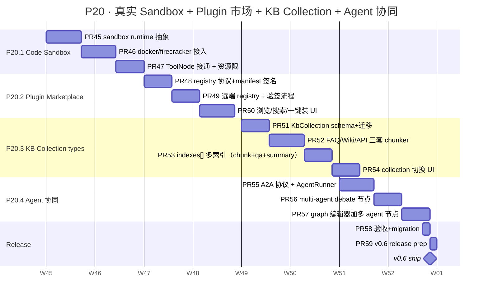

# P20 详细 Sub-Plan · 沙箱 + 市场 + 集合类型 + Agent 协同 → v0.6

**周期**：2026-11-08 → 2027-01-02（8 周）
**目标版本**：v0.6
**总 slots**：32（8 周 × 4 productive slots/week）
**主计划**：[docs/plans/2026-05-23-chameleon-master-plan.md](./2026-05-23-chameleon-master-plan.md)
**前置**：v0.5 已 ship（P19 全 ✓），Eval cron / Plugin hot reload / Workspace + Quota / Multimodal Vision 全部落地

---

## 0. P20 全景



---

## 1. 进度跟踪表

| ID | Feature | 目标周 | PR 数 | 状态 | 备注 |
|---|---|---|---|---|---|
| P20.1 | Code Sandbox 真实现 | W25-W26 | 3 | ⏳ pending | 替换 P18 SQLTool/Code 占位 |
| P20.2 | Plugin Marketplace 远端 | W27-W28 | 3 | ⏳ pending | manifest 签名 + 浏览搜索 + 一键装 |
| P20.3 | KB Collection types + 多索引 | W29-W30 | 4 | ⏳ pending | FAQ/Wiki/API 三套 chunker + qa/summary 多索引 |
| P20.4 | Agent 协同（A2A + debate） | W31-W32 | 3 | ⏳ pending | 多 agent 编排进 graph |
| 🚢 | v0.6 release | W32 | 2 | ⏳ pending | docs + tag + main FF |

**总 PR 数**：15 个；红线 < 800 LOC/PR；预计 ~10K-12K LOC。

---

## 2. 红线（沿用 P17/P18/P19，新增 P20 特定）

### 沿用红线（违反必须打回）

- ⛔ 不修改已发布 alembic migration —— forward-only
- ⛔ 不延迟发版 —— W32 周末 70% 也 ship，剩余移 P21
- ⛔ 不绕过 `Result[T]` 响应封装
- ⛔ service 不返 ORM Model；API 不调 Mapper
- ⛔ Plugin 加载必须 async + 5s 超时
- ⛔ workspace_id 全 NULLABLE + default ws backfill
- ⛔ Multimodal 走 URL，不内嵌 base64

### P20 新增红线

- ⛔ **Sandbox 永不在主进程跑用户代码** —— 必须子进程 / docker / Firecracker 隔离 + 超时 + CPU/内存上限；主进程仅做 IPC 编排
- ⛔ **Sandbox 输出强制 capped** —— stdout/stderr 各 < 1MB；超出截断 + warn；防 OOM 攻击
- ⛔ **Plugin manifest 远程拉取必须验签** —— Ed25519 签名 + 公钥 pinning；陌生签名拒绝安装
- ⛔ **registry 协议禁止上传脚本/二进制** —— 只接受 manifest URL + git tag pin；plugin 包还是 pip install 走 venv
- ⛔ **KbCollection 类型一旦写入不可改** —— `collection_type` 决定 chunker 与索引拓扑；改类型 = 新建 kb 重新 ingest
- ⛔ **Agent 协同 debate 强制有限轮数 + 软超时** —— 默认 max_rounds=5；防 agents 无限互打;每轮独立 budget
- ⛔ **跨 agent 调用必须传 trace_id** —— A2A 调用全链 observation 串好，不可断链

### PR 验收 checklist（同 P17-P19）

- [ ] `yarn tsc --noEmit` clean
- [ ] 后端 `pytest` 全绿（含本 PR 新增测试）
- [ ] Chrome MCP 跑过 e2e 截图（UI PR 必录）
- [ ] LOC < 800
- [ ] CHANGELOG `Unreleased` section 加一行
- [ ] 涉及 schema 改动的 PR 必须配 rollback SQL

---

## 3. W25-W26 · P20.1 Code Sandbox 真实现（3 PRs）

### 3.1 目标

P18 ToolNode 里 `code` 类型占位是"主进程 exec()"（绝对禁止上生产）。本 sub-phase
替换为 **真实隔离**：默认 docker container（用户友好），可选 Firecracker microVM
（高安全场景）。提供 CPU/内存/网络/文件系统四维资源限制 + 严格超时。

对外宣传："Chameleon 工具节点支持安全 Code Sandbox（Python / Node 双语言）"。

### 3.2 数据模型

无新表。`tool_instances.config` 复用：

```jsonc
{
  "tool_key": "code-runner",
  "config": {
    "runtime": "docker",           // docker | firecracker
    "image": "chameleon-sandbox:py3.12",
    "language": "python",          // python | node
    "timeout_sec": 30,
    "memory_mb": 256,
    "cpu_quota": 0.5,
    "network": "none",             // none | egress | full
    "max_stdout_bytes": 1048576
  }
}
```

### 3.3 PR 拆分

#### PR #45 — Sandbox Runtime 抽象 + 协议

- 后端：
  - `chameleon-core/src/chameleon/core/sandbox/__init__.py`
  - `chameleon-core/src/chameleon/core/sandbox/runtime.py` —— `SandboxRuntime` ABC + `SandboxResult` dataclass
  - `runtime/base.py`：execute(code, language, config, stdin) → SandboxResult
  - `runtime/mock.py`：测试用 in-memory runtime（直接走 subprocess，**不上生产**）
  - 红线检查：`assert config["runtime"] != "subprocess"` in production env
- 测试：
  - `test_sandbox_runtime.py` 验证协议 + mock 跑通

#### PR #46 — Docker / Firecracker runtime 接入

- 后端：
  - `runtime/docker.py`：docker-py SDK，每次起一次性 container，`auto_remove=True` + `mem_limit` + `cpu_period/cpu_quota` + `network_mode=none` + tmpfs `/tmp`
  - `runtime/firecracker.py`：通过 Firecracker socket 启 microVM（可选；docker 是默认 fallback）
  - 启动期 `lifespan` 检查 docker daemon 可达 + image pull；无 docker → 降级 mock 仅 dev
- 测试：
  - `test_sandbox_docker.py` 真实 docker（跳过 if !docker.available）

#### PR #47 — ToolNode 接通 + GraphExecutor 验收

- 后端：
  - `chameleon-core/src/chameleon/core/graph/nodes/tool.py`：`tool_kind="code"` 时调 `SandboxRuntime.execute()`
  - 内置 `CodeRunnerTool` 注册 to `_TOOL_REGISTRY`，sandbox 占位 stub 替换
  - admin tools list 显示 sandbox 配置面板
- 前端：
  - `system/tools` 详情页加 sandbox 配置子卡片（runtime / image / 资源 4 项）
- 测试：
  - `test_e2e_code_sandbox.py`：跑 `print("hello")` + 触发 timeout + 触发 OOM；超大 stdout 截断

---

## 4. W27-W28 · P20.2 Plugin Marketplace 远端（3 PRs）

### 4.1 目标

P19 PR #34 仅本地安装。本 sub-phase 引入 **远端 registry** 协议：admin 浏览 / 搜索 /
一键装；manifest 强制 Ed25519 签名（防钓鱼包）。

### 4.2 协议设计

远端 registry 暴露：

```
GET https://registry.chameleon.dev/index.json
→ {
  "version": 1,
  "plugins": [
    {
      "name": "openrouter-provider",
      "latest": "1.2.0",
      "type": "provider",
      "description": "OpenRouter API 接入",
      "manifest_url": "https://registry.chameleon.dev/openrouter-provider/1.2.0/manifest.toml",
      "signature_url": "https://registry.chameleon.dev/openrouter-provider/1.2.0/manifest.toml.sig",
      "publisher_pubkey": "ed25519:....",
      "tags": ["llm", "provider"],
      "downloads": 1234,
      "updated_at": "2026-11-20T00:00:00Z"
    }
  ]
}
```

manifest 签名校验：
1. fetch `manifest_url` → bytes
2. fetch `signature_url` → ed25519 sig
3. fetch publisher 公钥（pinned in registry index）
4. `nacl.signing.VerifyKey(pubkey).verify(manifest_bytes, sig)`
5. 通过 → 走 PluginRegistry.install()

### 4.3 数据模型

```sql
CREATE TABLE plugin_registries (
    id BIGINT PRIMARY KEY,
    registry_url VARCHAR(256) NOT NULL UNIQUE,
    name VARCHAR(128) NOT NULL,
    pubkey_pinning JSONB,    -- {publisher_name: ed25519 pubkey}
    enabled BOOLEAN DEFAULT TRUE,
    last_synced_at TIMESTAMPTZ,
    created_at TIMESTAMPTZ DEFAULT NOW()
);
```

### 4.4 PR 拆分

#### PR #48 — Registry 协议 + manifest 签名

- 后端：
  - `chameleon-core/src/chameleon/core/plugins/signing.py` —— Ed25519 验签
  - `chameleon-core/src/chameleon/core/plugins/registry_client.py` —— fetch index / verify
  - `chameleon-core/src/chameleon/core/models/plugin_registry.py` —— PluginRegistry ORM（重名注意：与 PluginRegistry singleton 区分，改名 PluginRegistryEntry）
  - `migrations/p20_w27_plugin_registries.py`
- 依赖：`pynacl>=1.5`
- 测试：
  - `test_plugin_signing.py`：合法签名通过 / 篡改拒绝 / 错 pubkey 拒绝

#### PR #49 — 远端 registry sync + install 接入

- 后端：
  - `chameleon-system/src/chameleon/system/marketplace/` 模块
    - `service.py`: sync_registry / search / install_from_remote
    - `api.py`: `/v1/admin/marketplace/registries` CRUD + `/sync` + `/search?q=...` + `/install`
  - install_from_remote 走完整链路：fetch manifest → verify sig → 写 plugin_instances → 调 PluginRegistry.install()
- 测试：
  - `test_e2e_marketplace_install.py`：mock registry 返合法 + 非法签名 manifest

#### PR #50 — 浏览 / 搜索 / 一键装 UI

- 前端：
  - `system/marketplace/pages/marketplace-page.tsx` —— grid 卡片（plugin name / desc / tags / 下载数 / install 按钮）
  - 搜索 + tag filter；每卡片有 "查看 manifest" toggle 显原始 toml
  - install 流程：弹 confirm → POST → toast → 跳 `/plugins` 查看
  - sidebar 加 "插件市场" 入口
- Chrome MCP 验收：注册 registry → sync → 搜 "openrouter" → install → /plugins 看到

---

## 5. W29-W30 · P20.3 KB Collection types + 多索引（4 PRs）

### 5.1 目标

P18 KB 只有一种 "通用文档" 模式。但实际场景里：
- **FAQ** ：QA 对结构化数据；chunk 应保留 Q + A 完整对，不可中切
- **Wiki** ：长文页面；按章节切，保留 heading 路径
- **API** ：openapi.yaml 这种结构化；按 endpoint 切，元数据带 method/path

每种 collection_type 各自一套 chunker；并支持 **多索引拓扑**（chunk-level + qa-level + summary-level）共存。

### 5.2 数据模型

```sql
-- 新表
CREATE TABLE kb_collections (
    id BIGINT PRIMARY KEY,
    kb_id BIGINT NOT NULL REFERENCES knowledge_bases(id) ON DELETE CASCADE,
    collection_type VARCHAR(16) NOT NULL,  -- generic | faq | wiki | api
    indexes JSONB NOT NULL,                 -- [{name:'chunk',dim:1536}, {name:'qa',dim:1536}, ...]
    config JSONB,                           -- 类型相关参数
    created_at TIMESTAMPTZ DEFAULT NOW()
);

-- chunks 加列
ALTER TABLE chunks ADD COLUMN collection_id BIGINT REFERENCES kb_collections(id);
ALTER TABLE chunks ADD COLUMN index_name VARCHAR(32) DEFAULT 'chunk';  -- 标识属于哪个索引
ALTER TABLE chunks ADD COLUMN qa_question TEXT;     -- FAQ 专用
ALTER TABLE chunks ADD COLUMN api_endpoint VARCHAR(256);  -- API 专用
CREATE INDEX ix_chunks_collection ON chunks(collection_id, index_name);
```

### 5.3 PR 拆分

#### PR #51 — KbCollection schema + 迁移

- 后端：
  - `chameleon-core/src/chameleon/core/models/kb_collection.py`
  - `migrations/p20_w29_kb_collections.py`：建表 + chunks 加列
  - **不动**老 KB 创建链路；新建 KB 时自动创建 `collection_type='generic'` 默认 collection
- 测试：schema 兼容；老 KB 升级后仍能 retrieve

#### PR #52 — FAQ / Wiki / API 三套 chunker

- 后端：
  - `chameleon-api/src/chameleon/api/knowledge/chunkers/faq.py`：解析 Q/A markdown（## Q: ... \n ## A: ...）→ 每对一 chunk + 填 qa_question 列
  - `chunkers/wiki.py`：按 `#`/`##` heading 切；保留 heading path 路径作 metadata
  - `chunkers/api.py`：解析 OpenAPI YAML/JSON；每个 endpoint 一 chunk + 填 api_endpoint 列
  - chunker dispatch: `get_chunker(collection_type, config)`
- 测试：三种类型的样本数据各跑通；元数据正确填入

#### PR #53 — chunks.indexes[] 多索引 + ingest pipeline

- 后端：
  - 改 ingest pipeline：一份原文 → 跑 chunker → 同时生成多个 index_name 的 chunks（如 FAQ 同时生成 'chunk' + 'qa' 两个索引版本）
  - retrieve 入参增加 `index_name` 可选过滤
  - admin 接口可启停 collection 的某个 index（如 wiki kb 关掉 summary index 节省空间）
- 测试：多索引存 + retrieve 命中正确索引

#### PR #54 — KB 详情页 collection 切换 UI

- 前端：
  - `/kbs/:id` 详情页加 "Collection" tab
  - 列 collections 表 + 当前激活类型 +「重新 ingest」按钮（warning：会清空老 chunks）
  - retrieve 测试 tab 加 `index_name` 切换 dropdown，对比同 query 多索引召回结果
- Chrome MCP 验收：建 FAQ kb → 上传 QA 文件 → 验证 chunks 命中 qa_question 字段

---

## 6. W31-W32 · P20.4 Agent 协同（A2A + debate）（3 PRs）

### 6.1 目标

让多个 agent 在一次 invoke 中协作：辩论（generator + critic）/ 流水线（researcher → writer → editor）/ 投票。
对外宣传："Chameleon 支持 multi-agent debate"。

### 6.2 设计要点

**A2A（Agent-to-Agent）协议**：

```python
async def call_agent(
    self_agent_key: str,
    target_agent_key: str,
    *,
    input: str | list[ContentBlock],
    trace_id: str,           # 红线：必须传，串 observation
    budget_remaining: int,   # 剩余 token 预算（防互相调用爆）
) -> InvokeResult
```

底层走现有 `agent_router.dispatch()` + 强制带 `observation_type='agent'` + `parent_id=current`，确保 trace tree 串成。

**Multi-agent debate 节点**：

```yaml
node:
  type: agent_debate
  config:
    agents: ["proposer", "critic", "judge"]
    max_rounds: 5
    early_stop_on: "consensus"  # consensus | max_rounds
    timeout_total_sec: 120
```

执行：循环 max_rounds，每轮 proposer 提议 → critic 反驳 → 状态机推进；最后 judge 出裁决。每轮所有 agent 输入历史拼起来；带 trace。

### 6.3 PR 拆分

#### PR #55 — A2A 协议 + AgentRunner

- 后端：
  - `chameleon-core/src/chameleon/core/agent/a2a.py` —— `AgentRunner` 类 + `call_agent` helper
  - 强制 trace_id 传递；budget_remaining 检查（不足 → BusinessError）
  - 历史链路：source_agent_key + target_agent_key 写到 call_log.spans
- 测试：echo agent 调 echo agent，验证 trace tree 嵌套

#### PR #56 — agent_debate 节点 + 状态机

- 后端：
  - `chameleon-core/src/chameleon/core/graph/nodes/agent_debate.py`
  - 状态机：proposer → critic → ...×max_rounds → judge
  - 提前停止：consensus 判定（critic 表态 "agree" → break）
  - 整体 timeout / per-round budget；超时返当前最佳结果
- 测试：3 agent 5 轮跑通；consensus 提前停；超时 graceful

#### PR #57 — graph 编辑器加 agent_debate 节点

- 前端：
  - `system/graphs/components/nodes/` 加 `AgentDebateNode` 类型
  - inspector 显示 agents 选择 + max_rounds + early_stop 选项
  - debate 节点跑完后 detail 展开各 round 的 thought + tool_calls
- Chrome MCP 验收：拖一个 debate 节点 + 3 个 agent 配齐 + Test Run 跑出多轮历史

---

## 7. Release（2 PRs）

#### PR #58 — verify + Chrome MCP 截图归档

- 跑全套 e2e（pytest + Chrome MCP）
- 截 15+ 张关键功能截图（sandbox 失败 / marketplace 安装 / KB FAQ 命中 / agent debate 多轮）
- `docs/release/v0.6-screenshots/` 归档

#### PR #59 — v0.6 release prep

- CHANGELOG.md 加 v0.6 section
- `docs/release/v0.6-migration.md`（3 个新 migration + sandbox docker 镜像准备 + plugin marketplace registry 配置步骤）
- 6 个 pyproject.toml + 2 个 package.json 版本号 → 0.6.0
- 本地 tag v0.6.0 + push origin v0.6.0
- main 分支 fast-forward 到 v0.6.0
- GitHub Release draft：复制 CHANGELOG v0.6 段

---

## 8. 时间表（绝对日期）

| 周 | 日期范围 | 工作内容 | 产出 |
|---|---|---|---|
| W25 | 2026-11-08 → 11-14 | PR #45 (runtime 抽象) | mock + 测试 |
| W26 | 2026-11-15 → 11-21 | PR #46 + #47 (docker + ToolNode 接通) | E2E + Chrome MCP |
| W27 | 2026-11-22 → 11-28 | PR #48 (registry 协议 + 签名) | 单元 + 集成 |
| W28 | 2026-11-29 → 12-05 | PR #49 + #50 (远端 + UI) | 浏览/装 demo |
| W29 | 2026-12-06 → 12-12 | PR #51 + #52 (collection schema + 3 chunker) | FAQ/Wiki/API 跑通 |
| W30 | 2026-12-13 → 12-19 | PR #53 + #54 (多索引 + UI) | 切换演示 |
| W31 | 2026-12-20 → 12-26 | PR #55 + #56 (A2A + debate 状态机) | echo agent 互调 |
| W32 | 2026-12-27 → 2027-01-02 | PR #57 + #58 + #59 | v0.6 ship 🚢 |

---

## 9. 风险与缓解

| 风险 | 概率 | 影响 | 缓解 |
|---|---|---|---|
| Docker 不可用环境（CI / 受限服务器） | 高 | 中 | runtime 抽象 + mock 降级；prod 显式拒绝 mock |
| Sandbox 镜像构建慢（cold-start） | 中 | 中 | image pre-pull + 容器池（warm pool 5-10 个） |
| Firecracker 在 macOS 不能跑 | 高 | 低 | 文档说明 dev 用 docker；Firecracker 仅 prod Linux |
| Plugin 签名公钥分发 / 撤销 | 中 | 高 | pubkey pinning 写 registry index；公钥撤销走 registry 黑名单 |
| FAQ/Wiki/API chunker 误判格式 | 中 | 中 | 在 admin 预览 chunks 后再 ingest；解析失败回退 generic chunker |
| Multi-agent 互调爆栈 / 死循环 | 高 | 高 | budget_remaining + max_rounds 双闸门；A2A depth >= 3 直接拒绝 |
| KbCollection schema 变更影响老 KB | 高 | 高 | collection_id NULLABLE + 自动 seed 老 KB 为 generic 默认 collection |

---

## 10. 不在本阶段（明确 punt 到 P21+）

- ❌ **WebRTC 实时语音对话**（音频流式处理 + browser TTS，单独立项）
- ❌ **IDE 完整发布**（VSCode 扩展独立 codebase + 发版流程）
- ❌ **CLI binary 自包含分发**（pyinstaller / PyOxy 还要适配 multi-arch）
- ❌ **Sandbox 网络全开模式**（network='full' 风险太高，暂只 'none' / 'egress'）
- ❌ **Plugin Marketplace 商业模式**（付费 / 私域 registry，留 SaaS 阶段）
- ❌ **跨 workspace agent 协同**（A2A 当前限 workspace 内；跨租户协同需配额联动）

---

## 11. 与 master plan / OSS 对标

| 主题 | OSS 对标 | Chameleon P20 落点 |
|---|---|---|
| Code Sandbox | Pyodide / WASM / E2B / Modal | docker + Firecracker 双 runtime + 资源 4 维限制 |
| Plugin Marketplace | Dify Marketplace / Coze 插件商店 | Ed25519 签名 + pinning + 一键装 |
| KB Collection | LangChain DocumentLoaders / Haystack | 三套 chunker + 多索引 + 类型不可改红线 |
| Agent 协同 | AutoGen / CrewAI / LangGraph multi-agent | A2A 协议 + budget + debate 状态机 + trace 串联 |

---

## 12. 验收 demo 脚本（W32 验收用）

1. **Code Sandbox**：tools 配 code-runner image=`chameleon-sandbox:py3.12` timeout=5s → 跑 `print('hello')` 成功 → 跑死循环触发 timeout → 跑大量 stdout 触发截断 → Trace tree 看 tool span。
2. **Plugin Marketplace**：admin → marketplace → 搜 "openrouter" → 装 → /plugins 看到 → enable → /v1/chat 用新 provider 真实调通。
3. **KB Collection**：建 FAQ kb → 上传 `qa-sample.md`（10 个 QA 对）→ Collections tab 看到 chunks 包含 qa_question 字段 → /kbs/:id/test 检索 "如何重置密码" → 命中正确 QA。
4. **Multi-agent debate**：graphs 编辑器拖 agent_debate 节点 + 3 个 agent → Test Run → 看到 5 轮 thought 历史 + judge 最终输出 → Trace tree 嵌套 15 个 generation span。

每个 demo 录 30-60s gif 进 `docs/release/v0.6-screenshots/`。
