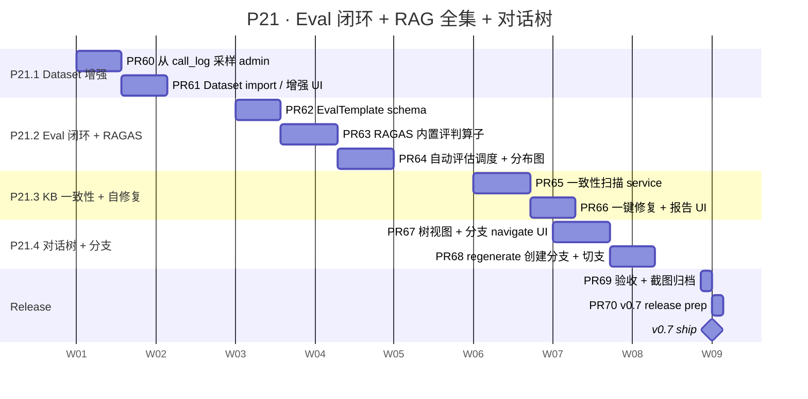

# P21 详细 Sub-Plan · Eval 完整闭环 + RAG 全集 + 对话树 → v0.7

**周期**：2027-01-03 → 2027-02-28（8 周）
**目标版本**：v0.7
**总 slots**：32（8 周 × 4 productive slots/week）
**主计划**：[docs/plans/2026-05-23-chameleon-master-plan.md](./2026-05-23-chameleon-master-plan.md)
**前置**：v0.6 已 ship（P20 全 ✓），Sandbox / Marketplace / KB Collection / Agent debate 全部落地

---

## 0. P21 全景



---

## 1. 进度跟踪表

| ID | Feature | 目标周 | PR 数 | 状态 | 备注 |
|---|---|---|---|---|---|
| P21.1 | Dataset 从 call_log 采样 + 手工 import | W33-34 | 2 | ⏳ pending | schema 已 ship（P18）；这次补 UI + 采样 service |
| P21.2 | EvalTemplate + RAGAS + 自动评估 | W35-37 | 3 | ⏳ pending | RAGAS 评判算子 + 模板系统 + cron |
| P21.3 | KB 一致性检查 + 自修复 | W37-38 | 2 | ⏳ pending | 扫孤立 chunk / 缺向量 / dim 不一致 |
| P21.4 | 对话树前端 + regenerate 分支 | W38-39 | 2 | ⏳ pending | parent_message_id 已 ship（P18）；补 UI + regenerate |
| 🚢 | v0.7 release | W40 | 2 | ⏳ pending | docs + tag + main FF |

**总 PR 数**：11；红线 < 800 LOC/PR；预计 ~8K-10K LOC。

---

## 2. 红线（沿用 P17-P20，新增 P21 特定）

### 沿用红线（违反必须打回）

- ⛔ 不修改已发布 alembic migration —— forward-only
- ⛔ 不延迟发版 —— W40 周末 70% 也 ship，剩余移 P22
- ⛔ 不绕过 `Result[T]` 响应封装
- ⛔ service 不返 ORM Model；API 不调 Mapper
- ⛔ workspace_id 全 NULLABLE + default ws backfill
- ⛔ Sandbox / Marketplace / KB Collection / A2A 红线全继承

### P21 新增红线

- ⛔ **Dataset 采样必须脱敏** —— 从 call_log 拉的 sample 落到 dataset 前过 PII 检测 hook；不脱敏的字段（密码 / 邮箱 / 手机号 hash 后落）
- ⛔ **RAGAS 评判算子内置只读** —— builtin judges 不允许用户改 weight / metric definition；要 customize 走 EvalTemplate.config 字段，不动算子代码
- ⛔ **KB 一致性自修复不在线删数据** —— 修复 service 只标 `quarantined=True` + 报告；admin UI 显式确认才物理删
- ⛔ **对话树 regenerate 不破坏老 branch** —— regenerate 产生新 message，老分支保留；UI 显式切支
- ⛔ **EvalTemplate 改动有版本** —— template.version 自增；老 EvalJob 引用历史版本 freeze，新 job 用最新

### PR 验收 checklist（同 P17-P20）

- [ ] `yarn tsc --noEmit` clean
- [ ] 后端 `pytest` 全绿（含本 PR 新增测试）
- [ ] Chrome MCP 跑过 e2e DOM 验证（UI PR 必录）
- [ ] LOC < 800
- [ ] CHANGELOG `Unreleased` section 加一行
- [ ] 涉及 schema 改动的 PR 必须配 rollback SQL

---

## 3. W33-34 · P21.1 Dataset 采样增强（2 PRs）

### 3.1 目标

P18 已 ship Dataset / DatasetItem / DatasetRun schema 与基础 runner；本 sub-phase 补 **从 call_logs 一键采样到 Dataset** + **手工 import CSV/JSONL** 的 admin UI。

### 3.2 数据模型

无新表。复用 `datasets` / `dataset_items`。新增 service 路径：

```python
async def sample_from_call_logs(
    dataset_id: int,
    *,
    agent_key: str | None = None,
    start_time: datetime,
    end_time: datetime,
    sample_size: int,
    success_only: bool = True,
    pii_strategy: Literal["mask", "drop", "keep"] = "mask",
) -> list[DatasetItem]:
    ...
```

### 3.3 PR 拆分

#### PR #60 — 从 call_log 采样 admin API + service

- 后端：
  - `chameleon-system/src/chameleon/system/datasets/sampling.py` — `sample_from_call_logs()`
  - PII 脱敏 hook：`mask_email` / `mask_phone` / `mask_id_card`（正则 + 替换占位符）
  - 入参 schema：时间窗 / agent_key / 采样规模 / 是否仅成功 / 脱敏策略
  - 端点：`POST /v1/admin/datasets/{id}/sample-from-logs`
- 测试：
  - `test_e2e_dataset_sampling.py`：插 mock call_logs → 采样 → 验证落 dataset_items / PII 已脱敏

#### PR #61 — Dataset 增强 UI + import CSV/JSONL

- 前端：
  - `/datasets/:id` 详情页加 "从日志采样" 按钮 → modal 选时间窗 / agent / size
  - "手工 import" 按钮 → CSV/JSONL 上传 + 字段映射预览（前端解析 + 校验）
  - sample 完跳 dataset_items 表 + 标 source='call_log' / 'manual_import'
- 后端：
  - `POST /v1/admin/datasets/{id}/items/bulk-import` 接 dataset_items 批量入参
- Chrome MCP 验收：采样 → 入库 → items 列表显示 source 来源

---

## 4. W35-37 · P21.2 EvalTemplate + RAGAS + 自动评估（3 PRs）

### 4.1 目标

P19 ship 了 EvalJob + APScheduler 触发；本 sub-phase 引入：
1. **EvalTemplate**：评判模板复用（同一套 metric weights 可绑多 job）
2. **RAGAS 内置算子**：faithfulness / answer_relevance / context_precision / context_recall（开源 ragas 库的子集，本地实现避免 ragas 重依赖）
3. **自动评估调度**：dataset_run 跑完自动跑 eval_template 算分

### 4.2 数据模型

```sql
CREATE TABLE eval_templates (
    id BIGINT PRIMARY KEY,
    name VARCHAR(64) NOT NULL,
    description TEXT,
    metrics JSONB NOT NULL,  -- [{name:'faithfulness', algorithm:'ragas_faith', weight:0.4}, ...]
    judge_provider VARCHAR(32),  -- 用哪个 LLM 当 judge（默认 gpt-4o-mini）
    version INTEGER DEFAULT 1,
    workspace_id BIGINT NULL,
    created_at TIMESTAMPTZ DEFAULT NOW(),
    UNIQUE (workspace_id, name, version)
);

-- eval_jobs 表加列
ALTER TABLE eval_jobs ADD COLUMN template_id BIGINT NULL REFERENCES eval_templates(id);
ALTER TABLE eval_jobs ADD COLUMN template_version_frozen INTEGER NULL;

-- dataset_run_items 加列
ALTER TABLE dataset_run_items ADD COLUMN eval_scores JSONB NULL;
```

### 4.3 PR 拆分

#### PR #62 — EvalTemplate schema + 模板 CRUD

- 后端：
  - `chameleon-core/src/chameleon/core/models/eval_template.py`
  - `migrations/p21_w35_eval_templates.py`
  - `chameleon-system/src/chameleon/system/eval_templates/` 模块：service + api
  - 红线：模板改动 → `version += 1`，老 job 引用 `template_version_frozen` 不变
- 测试：模板 CRUD / 版本递增 / job freeze 语义

#### PR #63 — RAGAS 内置算子（本地实现）

- 后端：
  - `chameleon-core/src/chameleon/core/eval/algorithms/` 子包
    - `ragas_faithfulness.py` —— 切句 + LLM judge 检查每句是否被 context 支持
    - `ragas_answer_relevance.py` —— 反向生成 query + 比对 cosine
    - `ragas_context_precision.py` —— 检索精度（命中 / 检索数）
    - `ragas_context_recall.py` —— 检索召回（命中 / GT chunks）
  - 注册到 `eval.algorithms.REGISTRY`；EvalTemplate.metrics[].algorithm 引用
- 测试：每个算子单测（mock LLM judge）+ 端到端用 EvalTemplate 跑出加权总分

#### PR #64 — 自动评估调度 + 评分分布图

- 后端：
  - `datasets/runner.py` 跑完 dataset_run 后，如 dataset 绑 EvalTemplate → 自动遍历 items 跑评分写入 `dataset_run_items.eval_scores`
  - 分布统计 endpoint：`GET /v1/admin/dataset-runs/{id}/score-distribution`
- 前端：
  - `/dataset-runs/:id` 加评分分布卡（直方图 SVG / Tailwind chart）
  - 失败 item 列表（per-metric 低于阈值标红）
- Chrome MCP 验收：跑一个 sample run → 看分布图 + 低分 item 标红

---

## 5. W37-38 · P21.3 KB 一致性 + 自修复（2 PRs）

### 5.1 目标

跑久了的 KB 会出问题：孤立 chunk（doc 删了 chunk 还在）、向量缺失（embedding 失败遗留）、dim 不一致（换模型后老 chunk 不能查）。本 sub-phase 提供 **扫描 + 报告 + 一键修复**。

### 5.2 数据模型

```sql
ALTER TABLE chunks ADD COLUMN quarantined BOOLEAN DEFAULT FALSE;
ALTER TABLE chunks ADD COLUMN quarantine_reason VARCHAR(64) NULL;

CREATE TABLE kb_consistency_reports (
    id BIGINT PRIMARY KEY,
    kb_id BIGINT NOT NULL REFERENCES knowledge_bases(id) ON DELETE CASCADE,
    started_at TIMESTAMPTZ DEFAULT NOW(),
    finished_at TIMESTAMPTZ NULL,
    issues JSONB,  -- [{type:'orphan_chunk', chunk_id:..., reason:...}, ...]
    fixed_count INTEGER DEFAULT 0,
    status VARCHAR(16) DEFAULT 'pending'
);
```

### 5.3 PR 拆分

#### PR #65 — 一致性扫描 service

- 后端：
  - `chameleon-system/src/chameleon/system/kbs/consistency.py`
    - `scan_orphan_chunks()` —— chunks 的 doc_id 在 documents 表不存在
    - `scan_missing_embeddings()` —— chunks.embedding IS NULL but kb.embedding_dim>0
    - `scan_dim_mismatch()` —— chunks.embedding 维度 ≠ kb.embedding_dim
  - 调度：一次性同步跑（小 KB）/ APScheduler 后台跑（大 KB）
  - 红线：扫描只标 `quarantined=True` + 落 report.issues，**不**物理删
- 测试：插模拟数据三种问题 → 跑扫描 → 验证 report

#### PR #66 — 一键修复 + 报告 UI

- 后端：
  - `repair_*` service 函数：删 orphan / 重 embed / drop dim 错的 chunk
  - 端点：`POST /v1/admin/kbs/{id}/consistency-reports/{rid}/repair`
- 前端：
  - `/kbs/:id` 加 "一致性" tab
  - 显示历史 report 列表 + 当前 quarantined chunks 数
  - "修复" 按钮 → 弹确认 modal（"将物理删除 N 个 quarantined chunks，不可恢复"）
- Chrome MCP 验收：制造 3 个孤立 chunk → 扫描 → 一键修复 → 确认 quarantined 为 0

---

## 6. W38-39 · P21.4 对话树前端 + regenerate（2 PRs）

### 6.1 目标

P18 已 ship `messages.parent_message_id` 字段；本 sub-phase 落 **前端树视图 + regenerate 触发分支**。

### 6.2 设计

regenerate 流程：
1. 用户点某条 assistant message 的 "重新生成"
2. service 找该 message 的 parent_user_message
3. 用同样的 user message 再 invoke 一次 → 新 assistant message 的 `parent_message_id` = 同 user message
4. 同一个 user message 产生多个 assistant 分支
5. UI 显示 "1/3" 切换器

### 6.3 PR 拆分

#### PR #67 — 树视图 + 切支 UI

- 前端：
  - `/playground/sessions/:id` 改造：
    - message 间根据 `parent_message_id` 构树
    - 同 parent 多 child 时显示分支切换器（`◀ 1 / 3 ▶`）
    - 切支后只显示选中分支的下游
  - 共享逻辑提到 `useMessageTree(messages)` hook
- 后端：
  - 无新表；`messages` 查询已有 parent_message_id；增 `GET /v1/sessions/:id/messages/tree?branch=...` 可选
- 测试：
  - useMessageTree 单测：扁平列表 → 树
  - Chrome MCP 验收 ◀▶ 切支正常

#### PR #68 — regenerate 触发分支 + edit 触发分支

- 前端：
  - 每条 assistant message hover 显示 "重新生成" 按钮
  - 每条 user message hover 显示 "编辑" 按钮（编辑后 = 新分支起点）
- 后端：
  - `POST /v1/sessions/:id/messages/:mid/regenerate` —— 拿 parent user msg + 重新 invoke + 写新 assistant child
  - `POST /v1/sessions/:id/messages/:mid/edit-and-resend` —— user msg 编辑后产生新 user child + auto-invoke + 写新 assistant child
- 测试：跑两次 regenerate → 同 parent 下 3 个 assistant 分支；切支正确
- Chrome MCP 验收：regenerate 出 3 个版本，UI 显示 1/3 切换

---

## 7. Release（2 PRs）

#### PR #69 — verify + 截图归档

- 跑全套 e2e（pytest + Chrome MCP）
- `docs/release/v0.7-screenshots/VERIFICATION.md`：Dataset 采样 / EvalTemplate 编辑 / RAGAS 分布图 / KB 一致性报告 / 对话树切支

#### PR #70 — v0.7 release prep

- CHANGELOG.md 加 v0.7 section
- `docs/release/v0.7-migration.md`（2 个新 migration + RAGAS 算子使用 + KB 一致性命令）
- 4 个 pyproject.toml + 1 个 package.json → 0.7.0
- 本地 tag v0.7.0 + push origin v0.7.0
- main 分支 fast-forward 到 v0.7.0
- GitHub Release draft

---

## 8. 时间表（绝对日期）

| 周 | 日期范围 | 工作内容 | 产出 |
|---|---|---|---|
| W33 | 2027-01-03 → 01-09 | PR #60 (call_log 采样) | service + 端点 |
| W34 | 2027-01-10 → 01-16 | PR #61 (import + UI) | admin UI 跑通 |
| W35 | 2027-01-17 → 01-23 | PR #62 (EvalTemplate) | CRUD + 版本递增 |
| W36 | 2027-01-24 → 01-30 | PR #63 (RAGAS 算子) | 4 个 metric 算子 |
| W37 | 2027-01-31 → 02-06 | PR #64 (自动评估 + 分布图) | 分布卡片 |
| W37 | 2027-02-07 → 02-13 | PR #65 (一致性扫描) | 三类扫描 |
| W38 | 2027-02-14 → 02-20 | PR #66 (修复 UI) | 一键修复跑通 |
| W38 | 同 | PR #67 (树视图) | 切支 UI |
| W39 | 2027-02-21 → 02-27 | PR #68 (regenerate) | 分支生成 |
| W40 | 2027-02-28 → 02-28 | PR #69 + #70 | v0.7 ship 🚢 |

---

## 9. 风险与缓解

| 风险 | 概率 | 影响 | 缓解 |
|---|---|---|---|
| RAGAS 4 个 metric 本地实现耗费过多算力 / token | 高 | 中 | 采样率限制（每 100 items 跑 10）；judge LLM 默认轻量模型 |
| PII 脱敏漏正则规则 | 中 | 高 | builtin 三类正则 + admin 可加 customize 正则；脱敏失败 fail-closed |
| KB 一致性扫描大表慢 | 中 | 中 | 后台 job 分批 + APScheduler 调度；扫期间不锁表 |
| 对话树前端复杂度 | 中 | 中 | useMessageTree hook 单测覆盖；树形组件用 Radix Collapsible |
| 跨多次 regenerate 后 session 历史顺序乱 | 高 | 高 | 后端永远按 parent_message_id 构树；前端只渲染选中分支线性化 |
| EvalTemplate 改动后老 job 行为变 | 高 | 高 | template.version 自增 + job freeze 历史 version；fk 引用 version_frozen 不变 |

---

## 10. 不在本阶段（明确 punt 到 P22+）

- ❌ **OTEL 摄入 + SDK 发布**（P22 主题）
- ❌ **A10 Cost dashboard 完整版**（依赖 OTEL 完善，P22）
- ❌ **B7 Agent thought chain 可视化**（依赖 trace tree v2，P22）
- ❌ **B8 Workflow 版本 / 发布机制**（draft/published，P22）
- ❌ **D8 6 步搜索融合**（需要 hybrid + rerank 全集成，P22）
- ❌ **D9 图片解析 VLM**（图片 caption 入 KB，P22 RAG 全集）
- ❌ **应用市场 / 移动端优化**（v1.0 阶段，P22）
- ❌ **跨多 model judge 投票评估**（投票算子，P22 + 复杂度太高）

---

## 11. 与 master plan / OSS 对标

| 主题 | OSS 对标 | Chameleon P21 落点 |
|---|---|---|
| Dataset + Eval | LangFuse Datasets / LangSmith | call_log 采样 + manual import + EvalTemplate 版本化 |
| RAGAS | RAGAS / Ragas-py | 本地 4 个 metric 算子内置（不引 ragas 包） |
| KB 一致性 | LlamaIndex Indexer Doctor / 通用没有 | 扫孤立 / 缺向量 / dim mismatch + quarantine 半软删 |
| 对话树 | Anthropic Claude UI / Poe / ChatGPT branches | parent_message_id 树 + UI 切支 + regenerate/edit |

---

## 12. 验收 demo 脚本（W40 验收用）

1. **Dataset 采样**：admin → `/datasets/:id` → "从日志采样" → 选时间窗 + agent + size=20 → 入库 → 见 20 条 items 标 source=call_log + PII 已脱敏 ✓
2. **EvalTemplate + RAGAS**：建 EvalTemplate "RAG 4 维"，metrics=4 个 RAGAS 算子 + 等权重 → 绑到 dataset_run → 跑出每 item 4 个分数 + 加权总分 + 分布卡片 ✓
3. **KB 一致性**：手工删除 documents 留下孤立 chunks → admin 跑扫描 → 见 report 列 N 条 issue → 一键修复 → chunks quarantined→deleted ✓
4. **对话树**：playground 跑一轮 → 点 assistant message "重新生成" 2 次 → 见 1/3 切换 → 编辑 user message → 新分支起点 → 切回老分支历史完整 ✓

每个 demo 录 30-60s gif 进 `docs/release/v0.7-screenshots/`。
