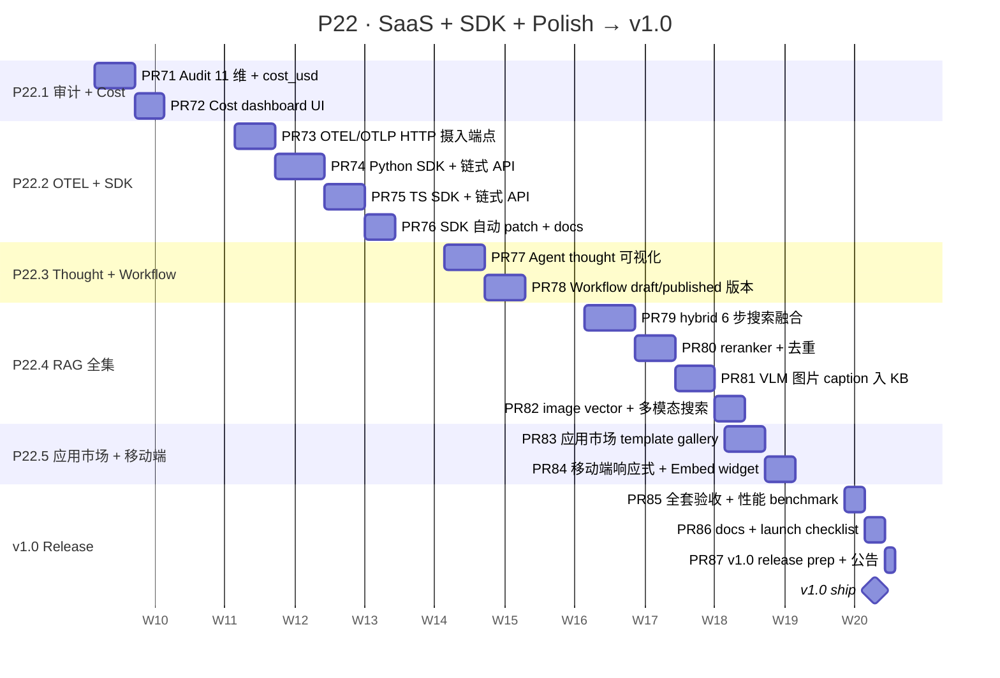

# P22 详细 Sub-Plan · SaaS + SDK + Polish → v1.0

**周期**：2027-03-01 → 2027-05-18（8 周）
**目标版本**：v1.0
**总 slots**：35（8 周 × 4-5 productive slots/week）
**主计划**：[docs/plans/2026-05-23-chameleon-master-plan.md](./2026-05-23-chameleon-master-plan.md)
**前置**：v0.7 已 ship（P21 全 ✓），Dataset PII / EvalTemplate + RAGAS / KB 一致性 / 对话树全部落地

---

## 0. P22 全景



---

## 1. 进度跟踪表

| ID | Feature | 目标周 | PR 数 | 状态 | 备注 |
|---|---|---|---|---|---|
| P22.1 | 审计 11 维 + Cost dashboard | W41 | 2 | ⏳ pending | audit_log 加 workspace/cost_usd 字段；dashboard 多维聚合 |
| P22.2 | OTEL 摄入 + Python/TS SDK | W42-43 | 4 | ⏳ pending | OTLP HTTP 端点；SDK 链式 API；auto-patch |
| P22.3 | Thought chain + Workflow 版本 | W44 | 2 | ⏳ pending | trace tree 可视化；workflow draft/published |
| P22.4 | RAG 6 步融合 + VLM 图片 | W45-46 | 4 | ⏳ pending | hybrid + rerank + dedupe；VLM caption + image vector |
| P22.5 | 应用市场 + 移动端 | W47 | 2 | ⏳ pending | template gallery；widget fullscreen |
| 🚢 | v1.0 release | W48 | 3 | ⏳ pending | benchmark + docs + launch |

**总 PR 数**：17；红线 < 800 LOC/PR；预计 ~13K-15K LOC。

---

## 2. 红线（沿用 P17-P21，新增 P22 特定）

### 沿用红线（违反必须打回）

- ⛔ 不修改已发布 alembic migration —— forward-only
- ⛔ 不延迟发版 —— W48 周末 70% 也 ship，剩 v1.1
- ⛔ 不绕过 `Result[T]` 响应封装
- ⛔ service 不返 ORM Model；API 不调 Mapper
- ⛔ 已 ship 红线全继承（PII / RAGAS / KB 一致性半软删 / 对话树不破坏老分支）

### P22 新增红线

- ⛔ **OTLP 端点必须按 trace_id 鉴权** —— 任何 SDK 来源的 trace 写入都要 app_id 校验；不允许匿名上报
- ⛔ **SDK API 兼容承诺** —— v1.0 后 public API 走 deprecation policy（保留 1 minor 版本）；v0.x 阶段可 break
- ⛔ **SDK 必须支持 async + sync 双形态** —— Python `chameleon.sync.Client` / `chameleon.async_.Client`；TS 默认 async
- ⛔ **Workflow published 后不可改** —— published 版本 freeze；改要新建 draft → publish 走版本递增（同 EvalTemplate）
- ⛔ **VLM caption 走 URL 引用** —— 不内嵌 base64；图片 vector 与 text vector 同 dim 防混维度
- ⛔ **应用市场 install 必须经审核** —— 公共 template 标 `verified=True` 才能默认推荐；用户自传 template 不在默认列表
- ⛔ **Cost 计算必须可重放** —— 用 model 价目表 + token 计数算；改价目表不溯源改老 call_log

### PR 验收 checklist（同 P17-P21）

- [ ] `yarn tsc --noEmit` clean
- [ ] 后端 `pytest` 全绿
- [ ] Chrome MCP 跑过 e2e DOM 验证（UI PR 必录）
- [ ] LOC < 800
- [ ] CHANGELOG `Unreleased` 加一行
- [ ] 涉及 schema 改动配 rollback SQL

---

## 3. W41 · P22.1 审计 11 维 + Cost dashboard（2 PRs）

### 3.1 数据模型

```sql
-- audit_logs 加 2 列（原 9 维 → 11 维）
ALTER TABLE audit_logs ADD COLUMN workspace_id BIGINT NULL REFERENCES workspaces(id);
ALTER TABLE audit_logs ADD COLUMN session_id VARCHAR(64) NULL;

-- call_logs 加成本字段
ALTER TABLE call_logs ADD COLUMN cost_usd NUMERIC(12, 6) NULL;

-- 新表：model 价目（用于 cost 计算可重放）
CREATE TABLE model_pricing (
    id BIGINT PRIMARY KEY,
    model_code VARCHAR(64) NOT NULL,
    effective_from TIMESTAMPTZ NOT NULL,
    prompt_price_per_1k NUMERIC(10, 6) NOT NULL,
    completion_price_per_1k NUMERIC(10, 6) NOT NULL,
    currency VARCHAR(8) DEFAULT 'USD',
    created_at TIMESTAMPTZ DEFAULT NOW(),
    UNIQUE (model_code, effective_from)
);
```

### 3.2 PR 拆分

#### PR #71 — Audit 11 维 + cost_usd 字段 + 价目表

- 后端：
  - `migrations/p22_w41_audit_cost.py`（audit_logs + call_logs + model_pricing 表）
  - `chameleon-core/src/chameleon/core/models/model_pricing.py`
  - `chameleon-system/src/chameleon/system/audit_logs/service.py`：record_audit 加 workspace_id / session_id
  - `chameleon-system/src/chameleon/system/api_key/service.py`：record_call 时按 price 表算 cost_usd 写入
  - 价目表 seed：内置 OpenAI / Anthropic / 百炼 等主流 model 价目（service 启动期 seed if empty）
- 测试：插 call_log → cost_usd 计算正确 / 价目改后老 log 不动 / audit 11 维 e2e

#### PR #72 — Cost dashboard UI + 多维聚合

- 后端：
  - `chameleon-system/src/chameleon/system/dashboard/cost.py`：按 user / model / channel / agent / workspace 聚合
  - 端点：`GET /v1/admin/dashboard/cost?dimension=model&since=...&until=...` 返时间序列 + 总额
- 前端：
  - `/dashboard/cost` 新页：top 卡片（24h/7d/30d 总额）+ 多维度切换饼图 + 时间序列折线
  - Chrome MCP 验收：跑几个 call → 看 dashboard 数字 + 曲线

---

## 4. W42-43 · P22.2 OTEL 摄入 + Python/TS SDK（4 PRs）

### 4.1 设计

OTLP HTTP endpoint（`/v1/otel/traces`）接 OpenTelemetry Protocol，把外部应用上报的 span 落到 chameleon `call_logs`（observation_type 同步映射）。

SDK 设计目标：
- `chameleon.Client(api_key=...)`：链式 API（trace / span / generation 装饰器 + context manager）
- 自动 patch（`chameleon.patch_all()`）：装 openai / anthropic / langchain 后调用都走 chameleon trace
- 与 `langfuse-sdk` 命名风格对齐（市场惯例），但 chameleon-native data model

### 4.2 PR 拆分

#### PR #73 — OTLP HTTP 摄入端点

- 后端：
  - `chameleon-api/src/chameleon/api/otel/`：路由 `/v1/otel/traces` + `/v1/otel/metrics`
  - Pydantic 解析 OTLP JSON / Protobuf（先实现 JSON，protobuf 推 v1.1）
  - 转换：每个 span → call_log 行；attribute.tag.* → meta；按 traceId + spanId → request_id / parent_id
  - 红线：任何写入必须 app_id 校验（X-OTLP-API-Key header）
- 测试：mock OTLP payload → 验证 call_log 写入正确

#### PR #74 — Python SDK + 链式 API

- 新仓 `chameleon-sdk/python/`（独立目录，将来 publish to PyPI）
  - `chameleon/client.py`：`Client(api_key, base_url, workspace_id?)`
  - `chameleon/sync.py` / `chameleon/async_.py`：sync / async 双客户端
  - `chameleon/decorators.py`：`@trace` / `@span` / `@generation`
  - `chameleon/context.py`：context manager `with client.span("name") as s: ...`
  - 内部通过 `/v1/otel/traces` 上报（与 OTEL 兼容）
- 测试：sync + async 双模式调用 mock backend；trace 嵌套正确

#### PR #75 — TS SDK + 链式 API

- 新仓 `chameleon-sdk/typescript/`
  - `src/client.ts`：`new ChameleonClient({apiKey, baseUrl})`
  - 装饰器 / `client.span()` / `client.generation()`
  - 默认 async；提供 `client.flush()` 显式 flush
  - 兼容 browser + node（fetch API）
- 测试：vitest 跑 mock backend；validate trace shape

#### PR #76 — SDK auto-patch + docs

- Python：`chameleon.patch_all()` monkey-patch openai / anthropic / langchain
- TS：`patchOpenAI(client)` / `patchAnthropic(client)` wrappers
- docs：`docs/sdk/python.md` + `docs/sdk/typescript.md` + quickstart 示例

---

## 5. W44 · P22.3 Thought chain + Workflow 版本（2 PRs）

### 5.1 PR 拆分

#### PR #77 — Agent thought chain 可视化

- 后端无新表（复用 call_logs + spans 数据）
  - 新 endpoint：`GET /v1/admin/traces/{request_id}/tree` 返树形结构（嵌套 children）
- 前端：
  - `/traces/:request_id` 新页：递归树视图 + 每节点展开 input/output/usage/latency
  - 复用 P21.4 `useMessageTree` 风格（不复用代码，但风格一致）
- Chrome MCP 验收：跑一个含工具 + KB 的 agent → 查看 trace tree

#### PR #78 — Workflow draft/published 版本

- 后端：
  - `graphs` 表加 `is_published` Bool + `published_version` Int + `published_at` Timestamp
  - 新 endpoint：`POST /v1/admin/graphs/{id}/publish`（freeze 当前 spec → published_version+=1；新 draft 起点）
  - executor 跑 graph 时支持 `version` 参数（默认 published；admin 可指定 draft）
- 前端：
  - graph 编辑器顶部加「已发布 v3 / 草稿编辑中」状态条
  - 「发布」按钮 + confirm 提示
- 红线：published 版本 spec 不可改；改要走新 draft → publish 流程

---

## 6. W45-46 · P22.4 RAG 全集（4 PRs）

### 6.1 PR 拆分

#### PR #79 — hybrid 6 步搜索融合

- 后端：
  - `chameleon-core/src/chameleon/core/retrieval/hybrid.py`：6 步管道
    1. 向量召回 top_k * 2
    2. BM25 召回 top_k * 2（PG 全文索引）
    3. 合并去重（chunk_id）
    4. RRF（Reciprocal Rank Fusion）打分
    5. metadata 过滤（kb_id / collection_type / 标签）
    6. 返 top_k
  - kbs.recall_mode 加 `hybrid` 选项（已有 vector / keyword）
- 测试：插混合 chunks → 跑 hybrid → 验证 RRF 排序正确

#### PR #80 — Reranker + 去重

- 后端：
  - `chameleon-core/src/chameleon/core/retrieval/reranker.py`：LLM-as-judge rerank
  - 默认接 bge-reranker-base（本地可跑）；可选 cohere reranker API
  - dedupe：按 content 相似度（cosine on embedding）合并近义 chunks
- 测试：rerank 后 top-k 命中率提升 + dedupe 减少重复

#### PR #81 — VLM 图片 caption 入 KB

- 后端：
  - documents 加 `kind` 字段（text / image / pdf）
  - 上传 image 文件 → 调 VLM（gpt-4o-mini-vision / qwen-vl-plus）生成 caption → caption 入 KB 作为可检索文本
  - 红线：image URL 引用，不内嵌 base64 入 chunk
- 测试：上传图片 → caption 写入 → retrieve 命中 caption

#### PR #82 — image vector + 多模态搜索

- 后端：
  - chunks 加 `kind` 字段（text / image）
  - image 也存 vector（用 CLIP / image-embedding-3）—— 与 text vector 同 dim 通过 projection 对齐
  - retrieve 入参 query 加 `image_url` 可选；跑混合检索（text vector + image vector）
- 测试：图文混合检索

---

## 7. W47 · P22.5 应用市场 + 移动端（2 PRs）

### 7.1 PR 拆分

#### PR #83 — 应用市场 template gallery

- 新表：
  - `app_templates`：name / description / category（assistant / agent / workflow / rag）/
    spec_json / cover_image / verified Bool / downloads / created_by
- 端点：
  - `GET /v1/admin/app-templates`（默认仅 `verified=True`）
  - `POST /v1/admin/app-templates/{id}/install`（一键克隆到当前 workspace）
- 前端：
  - `/marketplace/templates` 卡片网格（区别于已有 `/marketplace` plugin 市场）
  - 一键 install → 跳 graph 编辑器
- 红线：用户自传 template 默认 `verified=False`，不在首页推荐

#### PR #84 — 移动端响应式 + Embed widget

- 前端：
  - `core/components/layout/sidebar.tsx`：移动端折叠为汉堡按钮
  - playground / conversations 详情页：移动端单列布局
  - `embed-iframe` widget：移动端 fullscreen + 触屏优化
- Chrome MCP 验收：DevTools 切换 mobile viewport → 检查关键页面布局

---

## 8. W48 · v1.0 Release（3 PRs）

#### PR #85 — 全套验收 + 性能 benchmark

- 跑全套 pytest + Chrome MCP DOM 验证
- 性能 benchmark：
  - 单 invoke 延迟（mock provider）：P50 / P95 / P99
  - KB retrieve 延迟（1K / 10K / 100K chunks）
  - graph 执行延迟（5 节点 / 20 节点）
- 报告：`docs/release/v1.0-benchmark.md`

#### PR #86 — Docs + launch checklist

- README.md 重写（v1.0 风格 + 对标 Dify+LangFuse 表 + 一键 docker run 命令）
- `docs/quickstart.md`（5 分钟跑通 chat + RAG + agent）
- `docs/architecture.md`（模块图 + 数据流）
- `docs/sdk/`（Python / TS quickstart）

#### PR #87 — v1.0 release prep + 公告

- CHANGELOG.md 加 v1.0 section（精炼版 + roadmap to v1.x）
- `docs/release/v1.0-migration.md`
- 全 pyproject + package.json bump → 1.0.0
- 本地 tag v1.0.0 + push origin
- main fast-forward
- GitHub Release draft：精雕（HN / Reddit / 小红书 公告版本）

---

## 9. 时间表（绝对日期）

| 周 | 日期范围 | 工作内容 | 产出 |
|---|---|---|---|
| W41 | 2027-03-01 → 03-07 | PR #71 + #72 | Audit 11 维 + Cost dashboard |
| W42 | 2027-03-08 → 03-14 | PR #73 + #74 | OTLP + Python SDK |
| W43 | 2027-03-15 → 03-21 | PR #75 + #76 | TS SDK + auto-patch + docs |
| W44 | 2027-03-22 → 03-28 | PR #77 + #78 | Thought viz + Workflow 版本 |
| W45 | 2027-03-29 → 04-04 | PR #79 + #80 | hybrid + reranker |
| W46 | 2027-04-05 → 04-11 | PR #81 + #82 | VLM caption + image vector |
| W47 | 2027-04-12 → 04-18 | PR #83 + #84 | 应用市场 + 移动端 |
| W48 | 2027-04-19 → 04-25 | PR #85 + #86 + #87 | 验收 + docs + v1.0 ship 🚢 |

---

## 10. 风险与缓解

| 风险 | 概率 | 影响 | 缓解 |
|---|---|---|---|
| OTLP protobuf 解析复杂 | 高 | 中 | PR #73 只做 JSON；protobuf 推 v1.1 |
| Python / TS SDK 双开发量大 | 高 | 高 | 先 Python（PR #74）完整跑通；TS 简化为 minimum viable（PR #75） |
| VLM API 费用 / 配额 | 中 | 中 | caption 走 admin 配置（默认关）；用户开了才生效 |
| image vector projection 对齐 | 高 | 高 | 用同模型族（OpenAI image-embedding-3 出 1536d，对齐 text dim）；不同模型用 linear projection layer |
| 移动端布局回归桌面 | 中 | 中 | Tailwind 媒体查询；Chrome MCP DevTools viewport 切换验证 |
| v1.0 launch 时间窗 | 高 | 高 | W48 严守；如功能 70% 也 ship，剩 v1.0.1 patch |
| GitHub Release 公告语境 | 中 | 低 | 用户预审；多平台版本分开（HN 技术 / 小红书生活向） |

---

## 11. 不在本阶段（明确 punt 到 v1.x）

- ❌ **WebRTC 实时语音对话**（独立 codebase；v1.1）
- ❌ **VSCode 扩展**（独立 publish pipeline；v1.1）
- ❌ **CLI binary 自包含分发**（PyOxy / pyinstaller multi-arch；v1.1）
- ❌ **付费 marketplace 商业化**（SaaS 阶段 v2.x）
- ❌ **OTLP gRPC**（protobuf；推 v1.1）
- ❌ **Java / Go SDK**（Python + TS 覆盖 90% 用户；v1.x）
- ❌ **跨 workspace agent 协同**（A2A 当前限 ws 内；v1.x 联动配额）

---

## 12. 与 master plan / OSS 对标

| 主题 | OSS 对标 | Chameleon P22 落点 |
|---|---|---|
| Cost dashboard | LangFuse Usage / Helicone | 11 维 audit + 价目表 + 多维聚合 dashboard |
| SDK + OTEL | LangFuse SDK / Langtrace | Python+TS 双 SDK + OTLP HTTP + auto-patch |
| Thought viz | LangSmith trace tree / LangFuse | 复用 call_logs spans + 递归树视图 |
| Workflow 版本 | Dify draft/published | published freeze + version 递增 |
| 6 步搜索融合 | RagFlow / Haystack hybrid | vector + BM25 + RRF + filter + dedupe + rerank |
| VLM 入 KB | LlamaIndex multimodal / FastGPT 图片 | caption 入 text chunk + image vector 双轨 |
| 应用市场 | Dify Templates / Coze 商店 | template gallery + 一键克隆 + verified 审核 |

---

## 13. v1.0 launch demo 脚本（W48）

1. **5 分钟 quickstart**：`docker compose up` → 注册账号 → 选 RAG 模板一键克隆 → 上传文档 → 跑 chat 命中 KB
2. **Cost dashboard**：跑 50 条 chat → /dashboard/cost → 看按 model 切的总额 + 24h 折线
3. **Python SDK**：`pip install chameleon-sdk` → 在示例脚本里 `with chameleon.trace(): openai.ChatCompletion.create(...)` → 看 trace 落到 chameleon UI
4. **Thought viz**：跑 multi-agent debate → /traces/:rid 看 nested tree
5. **Hybrid search**：建 KB 切 hybrid 模式 → 跑 query 看 vector + BM25 + rerank 各步骤结果
6. **VLM + image**：上传一张图 → caption 入 KB → 用 query "图里有什么" 命中
7. **应用市场**：浏览 verified templates → 装「客服 agent」→ 跳编辑器
8. **移动端**：手机浏览器打开 widget → fullscreen 跑 chat
9. **OTLP**：跑一个 langchain 示例 + `chameleon.patch_all()` → trace 自动落 chameleon

每个 demo 录 30-60s gif 进 `docs/release/v1.0-screenshots/`。

---

## 14. v1.0 launch checklist

发版前 1 周（W47 末）跑：

- [ ] 全套 pytest + Chrome MCP 截图归档
- [ ] 性能 benchmark 数字达标（单 invoke P95 < 500ms in mock）
- [ ] README + quickstart + architecture 三件套就位
- [ ] Python + TS SDK 各发个 pre-release 到 test.pypi / npm beta
- [ ] docker compose 一键起验证（mac + linux）
- [ ] LICENSE / CONTRIBUTING / CODE_OF_CONDUCT 检查
- [ ] GitHub repo 描述 + topics + 主页 demo 链接
- [ ] HN / Reddit / 小红书 三平台公告草稿
- [ ] Demo gif 录制 + 上传 README

W48 周日 ship v1.0。🚢
