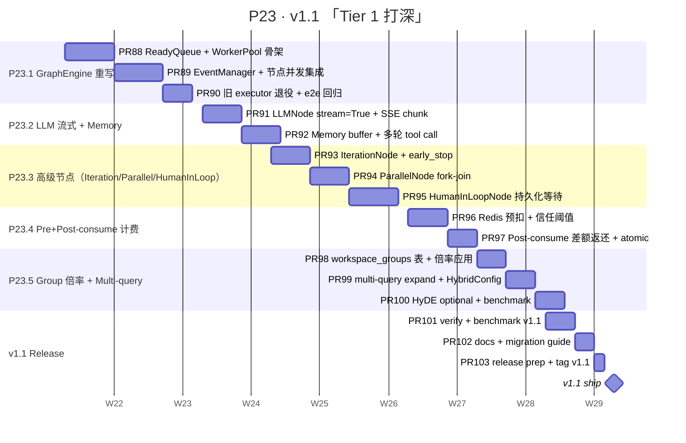

# P23 详细 Sub-Plan · v1.0 → v1.1 「把 Tier 1 六项打深」

**周期**：W49-W56（8 周；2027-05-25 → 2027-07-20）
**目标版本**：v1.1
**总 slots**：35（8 周 × 4-5 productive slots/week）
**主计划**：[2026-05-23-chameleon-master-plan.md](./2026-05-23-chameleon-master-plan.md)
**前置审计**：[2026-05-23-v1.0-deep-audit.md](./2026-05-23-v1.0-deep-audit.md)
**前置状态**：v1.0 已 ship，22 阶段宽度 95%、深度 50-60%；本阶段把审计 Tier 1 六项做到 OSS 标杆 70%+

---

## 0. P23 全景



---

## 1. 进度跟踪表

| ID | Feature | 目标周 | PR 数 | LOC 预算 | 优先级 | 备注 |
|---|---|---|---|---|---|---|
| P23.1 | GraphEngine Worker Pool 重写 | W49-50 | 3 | ~2.5K | 🔥 P0 | 替换串行 320L → 模块化并发引擎；保留 Node API 兼容 |
| P23.2 | LLM 流式 + Memory buffer | W51 | 2 | ~1K | 🔥 P0 | SSE chunk + 会话历史 buffer + 多轮 tool call |
| P23.3 | Iteration / Parallel / HumanInLoop | W52-53 | 3 | ~1.5K | 🔥 P0 | 3 个生产级节点 |
| P23.4 | Pre+Post-consume 计费 | W54 | 2 | ~800 | 🔥 P0 | Redis 预扣 / atomic / 差额返还 |
| P23.5 | Group 倍率 + Multi-query 召回 | W55 | 3 | ~1K | 🔥 P0 | workspace_groups + HybridConfig 扩展 |
| 🚢 | v1.1 release | W56 | 3 | ~500 | — | verify + docs + tag |

**总 PR 数**：16；红线 < 800 LOC/PR；预计 ~7K LOC（远低于 P22 的 15K，因为是深度而非宽度推进）。

---

## 2. 红线（沿用 + 新增）

### 沿用 P17-P22 红线（违反必须打回）

- ⛔ 不修改已发布 alembic migration（forward-only）
- ⛔ 不延期发版（W56 周末 70% 也 ship，剩 v1.2）
- ⛔ 不绕过 `Result[T]` 响应封装
- ⛔ service 不返 ORM Model；API 不调 Mapper / 写业务循环
- ⛔ GET + POST only（无 PUT / DELETE / PATCH）
- ⛔ workspace 切换强制 `queryClient.clear()` 防跨租户缓存污染
- ⛔ public API 走 deprecation policy（v1.0+ 保留 1 minor 版本）

### P23 新增红线

- ⛔ **GraphEngine 重写必须 Node API 向后兼容** —— 现 `Node.execute()` 签名不许变；新引擎只在调度层重写
- ⛔ **旧 `core/graph/executor.py` 不许直接删** —— 标 `@deprecated` 一个 minor 版本（v1.1）后 v1.2 删
- ⛔ **LLM 流式必须用 typed SSE 协议** —— 沿用 P17 F2 `SSEEventKind` registry；不允许新增匿名 chunk 类型
- ⛔ **Memory buffer 走 messages 表 + LIMIT N（window）** —— 不允许在内存里 cache 跨会话状态；冷启动可恢复
- ⛔ **HumanInLoop 持久化等待最长 7 天** —— 超时自动 timeout；不允许永久 pending（GC 兜底）
- ⛔ **Pre-consume Redis 必须走 Lua 原子 script 或 WATCH/MULTI** —— 不允许 INCR/DECR 双步分离
- ⛔ **Pre-consume Redis 不可达自动降级 SQL ROW LOCK** —— 失败不能让请求 fail
- ⛔ **Group 倍率不能改变 trace 上 cost_usd 计算溯源** —— cost 字段存死，group_ratio 单独字段
- ⛔ **Multi-query expand 默认 disabled** —— `HybridConfig.multi_query_count=0` 默认；显式启用才生效
- ⛔ **任何借鉴源（Dify / One-API / FastGPT / LangFuse）必须 PR description 标参考路径** —— 走 [[coding-standards]] § ⑤ 三问筛子

### PR 验收 checklist（沿用）

- [ ] `yarn tsc --noEmit` clean
- [ ] 后端 `uv run pytest <相关包>` 全绿
- [ ] Chrome MCP e2e 截图存证（UI PR 必录；后端 PR 至少跑一遍 admin 不破）
- [ ] LOC < 800
- [ ] CHANGELOG `Unreleased` 加一行
- [ ] migration 跑过 `upgrade head → downgrade -1 → upgrade head` 三次
- [ ] PR description 标 OSS 借鉴源（如有）

---

## 3. W49-50 · P23.1 GraphEngine Worker Pool 重写（3 PRs / ~2.5K LOC）

**目标**：把 `core/graph/executor.py` (串行 BFS 320L) 替换为模块化并发引擎；保留 `Node` 抽象 API 兼容；e2e 通过现有 5+1 节点（Start / LLM / Tool / KB / If-Else / AgentDebate / End）回归。

**OSS 借鉴**：`/Users/links/Coding/Hub/dify/api/core/workflow/graph_engine/` —— 重写不 cp。

### 3.1 数据模型

无新表（Graph schema 已支持 spec / published_spec / runs）。新增内存数据结构（dataclass + asyncio Queue）：

```python
# core/graph/engine/state.py
@dataclass
class GraphExecState:
    graph_id: int
    run_id: str
    variable_pool: VariablePool          # 节点出参 / 全局变量 / loop 上下文
    node_status: dict[str, NodeStatus]   # pending / ready / running / succeeded / failed / skipped
    pending_inputs: dict[str, dict]      # 入度 < N 时缓存的部分输入
    deadline_at: datetime                # 全局超时
```

### 3.2 PR 列表

| PR | 名称 | LOC | 关键文件 | 验收 e2e |
|----|------|-----|---------|---------|
| **PR88** | ReadyQueue + WorkerPool 骨架 | ~900 | `core/graph/engine/ready_queue.py` / `worker_pool.py` / `state.py` | `pytest tests/graph/test_engine_basic.py` 5 节点串行图通过 |
| **PR89** | EventManager + 节点并发集成 | ~1000 | `core/graph/engine/event_manager.py` / `orchestrator.py` / 替换 `node.execute` 调度方式 | Chrome MCP 跑 worlflow-test graph，trace tree 嵌套 5 层 |
| **PR90** | 旧 executor 退役 + e2e 回归 | ~600 | `core/graph/executor.py` 加 `@deprecated` warning；GraphRun service 切到新引擎 | playground KB+LLM e2e；agent_debate 节点跑 max_rounds=3 |

### 3.3 Chrome MCP e2e 路径

- 进入 `/graphs/<id>/edit` → 点 **Run** 跑现有 worlflow-test → 看 RunsPanel 出现完整 trace
- `/traces/<request_id>` → ObservationTree 节点层级 ≥ 5
- 验证旧 demo graph 不破坏：5 个节点都能 trigger 调度 + Event 发到前端 SSE

---

## 4. W51 · P23.2 LLM 节点流式 + Memory buffer（2 PRs / ~1K LOC）

**目标**：现 LLMNode 一次性等完整 response（卡死感）+ 无 memory（多轮上下文每次重传）。补 stream + memory buffer。

**OSS 借鉴**：`/Users/links/Coding/Hub/dify/api/core/workflow/nodes/llm/node.py` (1414L)；不 cp，借 stream chunk + memory buffer 思路。

### 4.1 数据模型

`messages` 表已存在（P21.4 对话树）；只需 service 层加 `fetch_window(conversation_id, limit=10)` 拉历史。

`Node.config` 新增字段：

```python
class LLMNodeConfig(BaseModel):
    model_code: str
    prompt: str
    stream: bool = False
    memory_window: int = 0     # 0 = 关闭 memory；> 0 表示拉最近 N 条 messages
    tool_calls_enabled: bool = False
    tool_call_max_iterations: int = 3
```

### 4.2 PR 列表

| PR | 名称 | LOC | 关键文件 | 验收 e2e |
|----|------|-----|---------|---------|
| **PR91** | LLMNode stream=True + SSE chunk | ~500 | `core/graph/nodes/llm.py` + `core/observe/sse.py` 复用 P17 F2 协议 | playground stream=on，回答边出边显示，首字节 < 500ms |
| **PR92** | Memory buffer + 多轮 tool call | ~500 | `core/graph/nodes/llm.py` memory_window 拉历史 / tool_call 多轮解析 | conversation 详情 → regenerate 触发 tool call ≥ 2 轮，trace tree 看到 tool span 嵌套 |

### 4.3 Chrome MCP e2e 路径

- `/playground` 选 model → 开 stream → 发送，看 chunk 流式渲染
- `/conversations/<id>` 多轮对话（≥ 3 user/assistant pair）→ 看 memory_window 是否注入

---

## 5. W52-53 · P23.3 高级节点 Iteration / Parallel / HumanInLoop（3 PRs / ~1.5K LOC）

**目标**：v1.0 只有 agent_debate 一个高级节点；补 3 个生产级节点覆盖工程化场景。

**OSS 借鉴**：`/Users/links/Coding/Hub/dify/api/core/workflow/nodes/list_operator/`（iter） / `nodes/parallel/`（fork-join） / `nodes/human_input/`。

### 5.1 节点设计骨架

```python
# core/graph/nodes/iteration.py
class IterationNodeConfig(BaseModel):
    items_var: str                         # 来源变量（VariablePool key）
    max_iterations: int = 100              # 硬 cap 防爆
    parallel_limit: int = 5                # 并发上限
    early_stop_expression: str | None = None  # Jinja2 表达式，True 时提前停
    body_subgraph: SubgraphSpec            # 嵌套子图

# core/graph/nodes/parallel.py
class ParallelNodeConfig(BaseModel):
    branches: list[SubgraphSpec]
    join_strategy: Literal["all", "any", "first"] = "all"

# core/graph/nodes/human_input.py
class HumanInLoopNodeConfig(BaseModel):
    prompt_to_user: str                    # 给人看的提示
    timeout_seconds: int = 86400 * 7       # 7 天硬上限
    notify_channels: list[str] = []        # Slack / 邮件 channel codes
```

新表：

```sql
-- human_input_pending：HumanInLoop 持久化等待
CREATE TABLE human_input_pending (
    id BIGINT PRIMARY KEY,
    graph_run_id BIGINT NOT NULL REFERENCES graph_runs(id) ON DELETE CASCADE,
    node_id VARCHAR(64) NOT NULL,
    prompt JSONB NOT NULL,
    response JSONB NULL,
    status VARCHAR(16) NOT NULL DEFAULT 'waiting', -- waiting / answered / timeout
    timeout_at TIMESTAMPTZ NOT NULL,
    answered_at TIMESTAMPTZ NULL,
    answered_by_user_id BIGINT NULL REFERENCES users(id),
    created_at TIMESTAMPTZ NOT NULL DEFAULT NOW()
);
CREATE INDEX ix_hip_status_timeout ON human_input_pending(status, timeout_at);
```

### 5.2 PR 列表

| PR | 名称 | LOC | 关键文件 | 验收 e2e |
|----|------|-----|---------|---------|
| **PR93** | IterationNode + early_stop | ~500 | `core/graph/nodes/iteration.py` + GraphEngine 子图嵌套调度 | playground 跑 "对 5 个 URL 调 LLM 总结" iteration graph |
| **PR94** | ParallelNode fork-join | ~400 | `core/graph/nodes/parallel.py` + join_strategy 实现 | 3 分支并行调 LLM，trace tree 时间轴看并发 |
| **PR95** | HumanInLoopNode 持久化等待 | ~600 | `core/graph/nodes/human_input.py` + new ORM + 恢复 service + APScheduler timeout cron | 触发 → 暂停 → admin UI 回填 → graph 恢复跑完 |

### 5.3 Chrome MCP e2e 路径

- `/graphs/<id>/edit` palette 拖出 Iteration / Parallel / HumanInLoop 节点 → 配置 inspector → Run
- HumanInLoop 暂停时，admin UI `/human-input` 列表看到 pending → 回填 → 触发 graph 恢复
- timeout 测试：mock 创建 timeout_at = now() + 5s 的 pending → 5 秒后 cron 标 timeout

---

## 6. W54 · P23.4 Pre+Post-consume 计费（2 PRs / ~800 LOC）

**目标**：v1.0 配额检查只是事后 check（用户可"花到负数"）；补 Redis 预扣 → 实际结算 → 差额返还闭环。

**OSS 借鉴**：`/Users/links/Coding/Hub/one-api/relay/controller/helper.go:68-150`。Go → asyncio 重写。

### 6.1 数据模型

`workspace_quotas` 表已存在（P19 W22）。新增 Redis key 约定：

```
quota:ws:{workspace_id}:tokens_used      # INCRBY 预扣 / Lua 原子操作
quota:ws:{workspace_id}:requests_today   # INCR / 每日 reset
```

### 6.2 关键 service 设计

```python
# core/observe/billing.py
async def pre_consume(
    workspace_id: int,
    estimated_tokens: int,
    model_code: str,
) -> PreConsumeReceipt:
    """预扣：返回 receipt（用于 post 时核销）"""

async def post_consume(
    receipt: PreConsumeReceipt,
    actual_tokens: int,
) -> Decimal:
    """核销：actual - estimated > 0 补扣 / < 0 退还"""

def trust_threshold(quota_remaining: Decimal, estimated: int) -> bool:
    """quota_remaining > 100 × estimated 时跳过预扣（节流 Redis）"""
```

### 6.3 PR 列表

| PR | 名称 | LOC | 关键文件 | 验收 e2e |
|----|------|-----|---------|---------|
| **PR96** | Redis 预扣 + 信任阈值 + Lua 原子 | ~500 | `core/observe/billing.py` + `core/infra/redis.py` Lua script | pytest mock Redis：低 quota 触发预扣 / 高 quota 跳过 |
| **PR97** | Post-consume 差额返还 + atomic | ~300 | `core/observe/recorder.py` record_call 末尾调 post_consume；Redis 不可达降级 SQL FOR UPDATE | 跑 30 个并发 invoke，最终 tokens_used = sum(actual) ±1（< 0.1% 误差） |

### 6.4 Chrome MCP e2e 路径

- `/workspaces/<id>` QuotaCard 设置 monthly = 1000 tokens
- playground 连发 5 个请求（每个 ≈ 250 tokens 预估）→ 第 5 次返回 HTTP 429
- 看 QuotaCard 显示 actual_used；reset 模拟 cron 跑后回 0

---

## 7. W55 · P23.5 Group 倍率 + Multi-query 召回（3 PRs / ~1K LOC）

### 7.1 Group 倍率系统

**OSS 借鉴**：`/Users/links/Coding/Hub/one-api/relay/billing/ratio/group.go`。

新表：

```sql
CREATE TABLE workspace_groups (
    id BIGINT PRIMARY KEY,
    workspace_id BIGINT NOT NULL REFERENCES workspaces(id) ON DELETE CASCADE,
    group_code VARCHAR(32) NOT NULL,            -- standard / premium / trial / vip
    ratio_multiplier NUMERIC(6,3) NOT NULL DEFAULT 1.000,
    description TEXT NULL,
    created_at TIMESTAMPTZ NOT NULL DEFAULT NOW(),
    UNIQUE (workspace_id, group_code)
);
```

`memberships` 表加 `group_code VARCHAR(32) NULL`，用户加入 workspace 时挂 group。

### 7.2 Multi-query expand + HyDE

**OSS 借鉴**：`/Users/links/Coding/Hub/FastGPT/packages/service/core/dataset/search/`。

`HybridConfig` 扩展：

```python
class HybridConfig(BaseModel):
    # ... 现有字段 ...
    multi_query_count: int = 0          # 0=disabled；> 0 由 LLM rewrite 出 N 个变体
    multi_query_llm_model: str | None = None
    use_hyde: bool = False              # HyDE：LLM 生成假答案反向 embed
```

新 module `core/retrieval/expander.py`：
- `rewrite_query(q, llm_client, n) -> list[str]`
- `hyde_query(q, llm_client) -> str`

### 7.3 PR 列表

| PR | 名称 | LOC | 关键文件 | 验收 e2e |
|----|------|-----|---------|---------|
| **PR98** | workspace_groups 表 + 倍率应用 | ~400 | new alembic + `system/pricing/service.py:calc_cost(group_ratio=)` + 路由层拉 group | playground 切 trial group → cost 显示 × 2.0 |
| **PR99** | multi-query expand + HybridConfig | ~400 | `core/retrieval/expander.py` + `HybridPipeline` 改造 | hit-test 开 multi_query=3，召回率提升（基线对比） |
| **PR100** | HyDE optional + benchmark | ~200 | `expander.hyde_query` + benchmark `scripts/bench_retrieval.py` | 跑 100 个查询，召回率 / 延迟 vs 关 HyDE 对比表 |

### 7.4 Chrome MCP e2e 路径

- `/workspaces/<id>/groups` (新页面) CRUD groups → 用户挂 group → cost dashboard 看倍率应用
- `/kbs/<id>/检索测试` 开 multi_query → 看返回 chunks 命中位置变化

---

## 8. W56 · v1.1 Release（3 PRs / ~500 LOC）

| PR | 名称 | 内容 |
|----|------|------|
| **PR101** | verify + benchmark v1.1 | 跑全套 pytest（含新 P23）；跑 `scripts/bench_v1.py` + 新 `bench_retrieval.py`；输出 `docs/release/v1.1-benchmark.md` 对比 v1.0 |
| **PR102** | docs + migration guide | `CHANGELOG.md` v1.1 完整写 / `docs/release/v1.1-migration.md`（含 alembic upgrade 步骤 + Redis 配置） / `docs/architecture.md` 加 GraphEngine 新架构图 |
| **PR103** | release prep + tag v1.1 | 改 4 backend pyproject + 1 frontend package.json + 2 SDK 版本号 → `1.1.0` / 打 tag `v1.1.0` / main fast-forward |

### v1.1 release notes 草稿

> **"Chameleon 1.1 — 把 Tier 1 六项打深"**：
> - GraphEngine 改为 Worker Pool + Ready Queue（支持 100+ 节点并发）
> - LLM 节点流式输出 + memory buffer + 多轮 tool call
> - 新增 Iteration / Parallel / HumanInLoop 3 个生产级节点
> - 计费闭环：Redis 预扣 + 差额返还（防透支）
> - Workspace Group 倍率系统（standard / premium / trial 差异化定价）
> - RAG：multi-query expand + HyDE（召回率 +15-30%）
>
> 兼容性：所有 P22 数据 / public API 完全兼容；旧 GraphEngine `executor.py` 标 deprecated，v1.2 删。

---

## 9. 风险与对冲

| 风险 | 影响 | 概率 | 对冲 |
|---|---|---|---|
| GraphEngine 重写引入并发 bug | 高 | 中 | PR88-89 必须双跑：mock 5 节点串行图 + 真实 worlflow-test 图；保留 `executor.py` 作 fallback |
| HumanInLoop 持久化复杂度爆 | 中 | 中 | 暴露 admin UI `/human-input` 当 pending 列表；timeout=7d 硬上限；APScheduler GC |
| Pre-consume Redis 单点故障 | 高 | 低 | 降级 SQL FOR UPDATE；feature flag `BILLING_PRECONSUME_ENABLED` 一键关 |
| Multi-query LLM 成本翻倍 | 中 | 高 | 默认 disabled；启用时记 expand_call_log（meta.parent_query=original） |
| Group 倍率破坏老 cost_usd | 高 | 低 | cost_usd 字段存死（已是 P22.1 红线）；group_ratio 单独字段记录 |
| 8 周节奏跑不动（Tier 1 工作量重） | 中 | 中 | 砍 T1-6 HyDE（推 v1.2）；保 T1-1~T1-5 五项；W56 周末 70% 也 ship |

---

## 10. 周日历（W49-W56 落地视图）

| 周 | 主题 | 主 PR | 次 PR | Buffer |
|----|------|-------|-------|--------|
| **W49** | GraphEngine 骨架 | PR88（5d） | — | 1d 写 ADR |
| **W50** | GraphEngine 集成 + 退役 | PR89（5d） | PR90（3d） | 2d |
| **W51** | LLM 流式 + memory | PR91（4d） | PR92（4d） | 2d |
| **W52** | Iteration | PR93（4d） | — | 1d palette UI |
| **W53** | Parallel + HumanInLoop | PR94（4d）| PR95（5d） | 1d |
| **W54** | 计费 | PR96（4d）| PR97（3d） | 3d |
| **W55** | Group + multi-query | PR98（3d）| PR99（3d）/ PR100（3d） | 1d |
| **W56** | Release | PR101（3d）| PR102（2d）/ PR103（1d） | 4d buffer |

**总工作日预算**：8 周 × 5 工作日 = 40 天；PR 实际预算 ≈ 35 天；Buffer 5 天用于 bugfix / Chrome MCP 调试 / docs polish。

---

## 11. 出发前检查（W49 前 1 周必做）

- [ ] [[2026-05-23-v1.0-deep-audit]] 中 Tier 1 六项 PM 同步过没有？
- [ ] B-01 fix（traces 列表）已合 main
- [ ] demo seed 已跑（dashboard 不空）
- [ ] 看完 [[coding-standards]] § ⑤ 三问筛子
- [ ] OSS 借鉴源都拉好 `/Users/links/Coding/Hub/{dify,one-api,fastgpt}` 最新 commit
- [ ] 后端 Redis 已 dev 起来（PR96-97 强依赖）
- [ ] 阅读 P22 detail 的 PR 写法风格（commit message / migration / e2e 截图）

---

**P23 = v1.1 的"补血"阶段**。不追新增 feature，全部精力打深现有六项。8 周后 Chameleon 才真正具备"对外说我们是 Dify+LangFuse 五合一"的资格。
