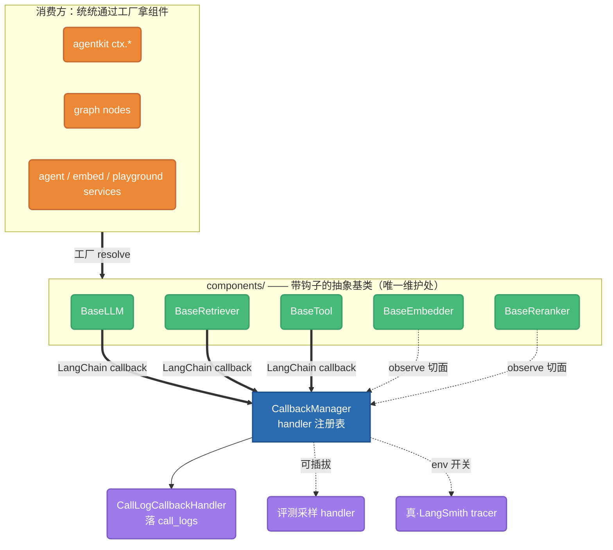

# 组件级回调切面：trace 收口到底层（LangChain 原生）

> 2026-05-29 · 把「自动埋点」从 LLM 一种组件推广到全部能力（Retriever / Tool /
> Embedding / Reranker）。复用 LangChain 的 `BaseCallbackHandler` + CallbackManager
> 总线，让任意调用方（应用 / API / 嵌入式 / Playground / 工作流 / agentkit SDK）只要
> 走组件基类，就自动产出干净的 trace 链路，零 caller 埋点代码。call_logs 写入器降级成
> 「众多 handler 之一」，与真·LangSmith tracer 平级 → 一个开关即可双写 / 互通。

本文是 [`2026-05-29-observability-langsmith-refactor.md`](./2026-05-29-observability-langsmith-refactor.md)
的延伸：那一轮把 call_logs 做成统一 trace 真相源、graph 节点接进 trace 树；这一轮解决
**「为什么只有 LLM 和 graph 节点是自动的，检索 / 工具 / 向量化在其它调用路径上完全没节点」**。

## 背景与痛点

retriever（KB 检索）节点目前**只有 Playground 手写了** `record_call`
（`system/playground/service.py:346`）。其余调用路径——正式 API、嵌入式、OpenAI 兼容、
知识库 admin、评测——做 RAG 时 **trace 里一个检索节点都没有**，看不到「检索发生了什么 /
召回了什么 / 耗时多久」。这是「谁调谁手写」反模式的必然结果：每加一个入口就要记得抄一遍，
迟早写漏、写得不一致。

更深的问题是**可观测性是「部分自动化的孤岛」**，不是一层统一切面：

| 组件 | 基类 | 生命周期钩子 | 自动 trace | 现状 |
|------|:---:|:---:|:---:|------|
| **LLM** | ✅ `BaseLLM`（继承 `langchain_openai.ChatOpenAI`） | ✅ `on_llm_end` | ✅ 全路径白嫖 | 满分 |
| **Tool** | ⚠️ `Tool` ABC | ❌ 无钩子 | ⚠️ 仅 graph 节点后处理补 | 半分 |
| **Retriever** | ❌ `search_kb` 裸函数 | ❌ | ❌ 只 Playground/graph 手写 | 0 |
| **Embedding** | ⚠️ Protocol | ❌ | ❌ 完全盲区 | 0 |
| **Reranker** | ⚠️ Protocol | ❌ | ❌ 完全盲区 | 0 |

- **Embedding / Reranker 是纯盲区**——RAG 里吃 token、吃 cost、决定召回质量的关键环节，
  trace 里一字没有。
- 现在的「自动」其实是**两套互不相干的实现**：LLM 走 LangChain callback（实时、事件驱动）；
  graph 节点走 `persist_node_spans` 后处理（批量、只在编排器内有效）。同一个 KB 检索，
  在工作流里有节点、在 API/嵌入式里啥都没有。
- `ObservationType` 枚举（`observe/context.py:38`）**早就定义了** TOOL / RETRIEVER /
  EMBEDDING / RERANKER 等 9 种，数据模型齐备——**只有 GENERATION 真的被自动写入**。

## 现状盘点（关键事实，带 file:line）

LLM 这条**已经是 LangChain 模式**，正是我们要复制的范式：

- `components/llms/base.py:21` — `BaseLLM` 直接继承 `langchain_openai.ChatOpenAI`，
  天然带 LangChain 的 callback 机制。
- `components/llms/factory.py:89` — `LLMFactory.create()` 启动期给每个实例注入
  `callbacks=[GenerationRecorder(...)]`，所有后续 `.ainvoke()/.astream()` 自动触发。
- `observe/llm_recorder.py:114` — `GenerationRecorder` 是 `AsyncCallbackHandler`，
  `on_chat_model_start/on_llm_end/on_llm_error` 落 generation 行。
- `observe/llm_recorder.py:242-243` — 落库时**归属字段从 `current_trace_context()` 读、
  parent_id = `current_observation_id() or tc.request_id`**——已经优先读我们的 ContextVar。
- `observe/context.py:68` — `TraceContext`（请求级归属：app_id / api_key_id / channel /
  agent_key / session_id / end_user_id / user_id / request_id）。
- `observe/context.py` — 双 ContextVar：`_CURRENT_TRACE`（请求级，不变）+ `_CURRENT_OBS_ID`
  （嵌套观测栈）；`observe(...)` 上下文管理器压/弹 OBS id，**但本身不落库**。

其余组件**没有跟上**：

- `components/knowledge.py:99` — `search_kb` 是裸函数，无基类无钩子。被 5 处调用：
  `graph/nodes/kb.py:109`（❌）、`base/base_agent.py:161`（❌）、
  `api/knowledge/service.py:326`（❌）、`providers/local/agentkit_runner.py:87`
  （✅ 唯一手动 `observe` 包裹）、测试。
- `system/session_files/service.py:413` — `search_session_files` 被
  `api/agent/service.py:315/791` 和 `api/embed/service.py:510/699` 调用，**全部无观测**。
- `tools/base.py:45` — `Tool` ABC 有 `run()` 但**无任何 callback hook**；
  function-calling 里的工具调用（`graph/nodes/llm_tools.py:117`）结构化记录只进内存，
  **不单独落 TOOL 行**。
- `embedding/base.py:8` — `EmbeddingClient` 是 Protocol，无钩子，embed 调用**零观测**。
- `retrieval/rerankers/base.py:20` — `Reranker` 是 Protocol，无钩子，rerank **零观测**。
- `observe/graph_spans.py:32-49` — graph 的 `persist_node_spans` 把 node_runs 后处理成
  span/retriever/tool 行（批量、仅 graph 内有效），与 LLM callback 是**两套并行系统**。

**分层约束（决定方案落点）**：`chameleon-core` ← `chameleon-system` ← `chameleon-api`，
单向依赖。`record_call` 在 `system/api_key/service.py:231`。所以 **core 不能直接调
record_call**——core 只能定义「基类 + handler 协议」，具体写库的 handler 在 system/api 层注册
（和 `GenerationRecorder` 由 system 层注入到 core 的 LLMFactory 是同一套路）。

## 选定方案：A — 复用 LangChain 回调总线

LangSmith「配一下全捕获」的本质是三件套：**每种能力都有抽象基类 → 基类在生命周期点
fan-out 事件给 CallbackManager → CallbackManager 分发给所有注册 handler**。LangSmith 的
tracer 不过是其中一个 handler。我们 LLM 这条已经在这条总线上（因为 `BaseLLM` 是 LangChain
原生类），**只需把其余 callback-native 的组件也接上同一条总线**。

核心收益（对比自研 CallbackManager）：
1. 全系统**一条 CallbackManager、一套 handler 注册**，LLM 不再是孤儿。
2. **真·LangSmith 白送**：组件 LangChain-native 后，注册 LangChain 官方 tracer（环境变量
   `LANGCHAIN_TRACING_V2`）即可把全链路推到真 LangSmith 渲染，与我们的 call_logs handler
   **并存**。这正是「配一下全捕获」。
3. 我们的 `CallLogCallbackHandler`（由 `GenerationRecorder` 泛化）也只是一个 handler，
   未来加「在线评测采样 / 导出自有 dashboard」只需多注册 handler，业务零改动。

### 目标架构



### 各组件改造

| 组件 | 是否 LangChain-callback-native | 改造 | 落点 |
|------|:---:|------|------|
| **LLM** | ✅ | 已就位，无需改 | `components/llms/` |
| **Retriever** | ✅（LangChain `BaseRetriever` 原生 fire `on_retriever_start/end`） | 把 hybrid pipeline 包成 `BaseRetriever` 子类；工厂注入 handler | `components/retrievers/`（新） |
| **Tool** | ✅（LangChain `BaseTool` 原生 fire `on_tool_start/end`） | `Tool` ABC 收敛为 LangChain `BaseTool`（或薄适配）；function-calling 与 graph 节点共用 | `tools/` |
| **Embedding** | ❌（LangChain `Embeddings` 基类不 fire callback） | 自建 `BaseEmbedder` ABC + 钩子，内部走 `observe()` 切面落同一 sink | `embedding/` |
| **Reranker** | ⚠️（可作 `BaseDocumentCompressor` 但 Hit≠Document，成本高） | 自建 `BaseReranker` ABC + 钩子，走 `observe()` 切面 | `retrieval/rerankers/` |

> Retriever / Tool 走 LangChain 原生回调（白送 LangSmith 互通）；Embedding / Reranker
> 因 LangChain 未原生埋点，走我们自己的 `observe()` 切面，但**最终都落到同一个 call_logs
> sink、同一棵 trace 树**，从溯源看是统一的。

### CallLog handler 设计

把现有 `GenerationRecorder` 泛化为 `CallLogCallbackHandler`（仍是 `AsyncCallbackHandler`），
实现多事件：

```
on_chat_model_start / on_llm_start / on_llm_end / on_llm_error      → GENERATION（沿用）
on_retriever_start / on_retriever_end / on_retriever_error          → RETRIEVER
on_tool_start / on_tool_end / on_tool_error                         → TOOL
```

Embedding / Reranker 经各自基类的 `observe()` 切面，调用同一个**内部 sink 协议**
（`ObservationSink.record(...)`，core 定义协议、system 层注册实现 = `record_call` 包一层），
落 EMBEDDING / RERANKER 行。

每条观测落库字段来源：
- **归属**（app/key/channel/session/end_user/user）：`current_trace_context()`（不变）。
- **payload**：retriever = `{query, top_k, mode, citations:[{source,ref,content,score,...}]}`；
  tool = `{tool_key, args}` / `{output}`；embedding = `{model, count, dims}`；
  rerank = `{model, in_count, out_count}`。
- **duration_ms**：start→end 自动计时（**顺手干掉 Playground 那段手算 0ms 的逻辑**）。

## 关键技术点（实现时重点拿捏）

**1. parent_id 用谁的树？** —— 决定：**统一用我们的 `current_observation_id()` ContextVar**
作为所有 handler 的唯一 parent 源（与 `GenerationRecorder` 今天的行为一致），**不切到
LangChain 的 run_id/parent_run_id 树**，避免「双真相源」。LangChain 回调只供给「事件 +
payload + 计时」；其 run 树仅供可选的真·LangSmith tracer 独立使用，不参与我们 call_logs 的
parent 计算。这样既得 LangChain 的事件总线，又保持单一 trace 树。

**2. 嵌套深度的第一刀。** 各组件在当前 OBS scope 下记为**兄弟**（root 或所属 graph 节点 span
之下），这已是相对今天「零行」的巨大改善。「embedding 嵌套到 retriever 之下」「function-calling
tool 嵌套到 generation 之下」属于二期打磨：让 `BaseRetriever`/LLM 节点在执行期主动 `observe()`
压一层 scope 即可，**第一刀不做**，避免和 callback 落库重复。

**3. 不破坏现有 generation。** `GenerationRecorder` 泛化时**保持 LLM 路径行为不变**
（同样的 parent 读取、同样的 token/cost 回收），只是新增 retriever/tool 事件分支。先加新分支、
再逐步迁移其它组件，全程灰度。

**4. graph 的两套合一（缓做）。** `persist_node_spans` 与组件级回调会对「graph 内 KB/Tool
节点」**潜在双写**。一期：组件级回调只在**非 graph 路径**生效（graph 节点继续走
persist_node_spans）；待回调切面稳定，再让 graph 节点也走回调、删 `persist_node_spans` 的
call_logs 部分（`graph_runs` 留作 resume 锚，与既有 langsmith 重构方向一致）。

## 目录结构（统一契约层）

`chameleon-core` 下收敛出清晰的「组件抽象 = 一处维护」：

```
core/
├── components/            # 所有能力的抽象基类（唯一维护处）
│   ├── llms/              # 已有：BaseLLM + factory（注入 handler）
│   ├── retrievers/        # 新：BaseRetriever（包 hybrid pipeline）+ factory
│   └── ...
├── tools/                 # Tool → 收敛为 LangChain BaseTool
├── embedding/             # EmbeddingClient Protocol → BaseEmbedder ABC + 钩子
├── retrieval/rerankers/   # Reranker Protocol → BaseReranker ABC + 钩子
└── observe/
    ├── context.py         # TraceContext + 双 ContextVar（不变）
    ├── callbacks.py        # 新：CallLogCallbackHandler（GenerationRecorder 泛化）+ handler 注册表
    ├── sink.py            # 新：ObservationSink 协议（core 只定义，system 注册 record_call 实现）
    └── llm_recorder.py    # 迁移/合并入 callbacks.py
```

消费方一律通过工厂 resolve 组件 → 处处自动埋点：
- agentkit SDK：`ctx.kb_search` / `ctx.tool` 内部拿 `BaseRetriever`/`BaseTool`，删手动 `observe`。
- graph nodes：`resolve_llm` 已走工厂；KB/Tool 节点改走 `BaseRetriever`/`BaseTool`。
- services（agent/embed/playground）：检索 / 工具一律走工厂组件，不再裸调函数 + 手写 record_call。

## LangSmith 互通

组件 LangChain-native 后，加一个配置开关（如 `settings.langsmith_enabled` + 标准
`LANGCHAIN_*` 环境变量），在 handler 注册处把 LangChain 官方 tracer 也注册进去：
全链路同时落本地 call_logs **和** 推到真 LangSmith。这是验证「抽象层是否真到位」的试金石——
若开了真 LangSmith 能看到完整 trace，说明切面合格。

## 分阶段

| 阶段 | 内容 | 关键文件 | 验收 |
|------|------|---------|------|
| **A1** | core 定义 `ObservationSink` 协议 + `set_observation_sink()`；`observe()` 升级为可落库切面（无 sink/无 TraceContext 时 no-op） | `observe/sink.py`、`observe/context.py` | 单测：observe 进出落一行、ContextVar 兜底安全 |
| **A2** | `GenerationRecorder` 泛化为 `CallLogCallbackHandler`，加 on_retriever/tool 事件；system 层注册 sink 实现（包 `record_call`） | `observe/callbacks.py`、system 启动处 | LLM 行为零回归 |
| **A3** | `BaseRetriever` 包 hybrid pipeline；retriever 工厂注入 handler；payload 带 mode/score/citations | `components/retrievers/`、`api/knowledge/hit_test.py` | API/嵌入式/Playground 检索自动出 retriever 节点 |
| **A4** | `Tool` 收敛为 `BaseTool`；function-calling 与 graph tool 共用；落 TOOL 行 | `tools/base.py`、`graph/nodes/llm_tools.py` | 工具调用全路径出 TOOL 节点 |
| **A5** | `BaseEmbedder` / `BaseReranker` + `observe()` 切面；落 EMBEDDING / RERANK 行 | `embedding/`、`retrieval/rerankers/` | 向量化 / 重排不再盲区 |
| **A6** | 删 Playground 手写 `record_call`；agentkit 删手动 `observe`；接 LangSmith 开关 | `system/playground/service.py`、`providers/local/agentkit_runner.py` | 全入口一致；开 LangSmith 能看全链路 |
| **A7（缓）** | graph 两套合一：节点走回调，删 `persist_node_spans` 的 call_logs 部分 | `observe/graph_spans.py`、`graph/engine/orchestrator.py` | graph 内外 trace 结构一致、无双写 |

A1–A3 即可解决「检索节点全路径覆盖」这一最痛点；A4–A6 补齐工具 / 向量 / 重排并白送 LangSmith；
A7 把历史两套埋点彻底合一（可独立排期）。

## 风险与回滚

- **动 `observe()` 核心 + 泛化 handler** 影响所有 trace 写入：A1/A2 先加旁路、不改 LLM 行为，
  全套件回归；每阶段独立可回滚。
- **双写重复计费**：retriever/tool 行不带 token/cost（成本只在 generation 上），不会污染
  rollup；graph 一期不接回调，避免与 persist_node_spans 重复。
- **LangChain `BaseRetriever`/`BaseTool` 的类形状约束**：hybrid pipeline 包一层即可，
  内部实现不动；若适配成本超预期，retriever 退化为 `observe()` 切面（同 embedding 路径）也能落同一棵树。
- **分层**：core 只定义协议/基类，绝不 import `record_call`；sink 实现在 system 层注册——
  破坏分层即立刻挪回。

## 验证方案

1. 单测：`observe()` 落库 + ContextVar 栈语义 + 无 scope 兜底。
2. 集成：对每条入口（API / 嵌入式 / Playground / OpenAI 兼容 / agentkit / graph）跑一次
   带 KB 的问答，断言 trace 树含 `retriever` 节点、带 query/citations/score/duration>0。
3. 浏览器 e2e：观测域 Trace 详情逐入口核实节点齐全、嵌套正确、payload 结构化。
4. LangSmith 开关打开，肉眼核实真 LangSmith 能渲染完整链路。

## 不做的事（边界）

- 不引入自研 CallbackManager（走 A 复用 LangChain）。
- 一期不做 embedding/reranker 嵌套到 retriever 之下（记为兄弟即可）。
- 一期不动 graph 的 persist_node_spans（A7 单独排期）。
- 不改 call_logs 表结构（字段已齐，`observe/context.py:38` 枚举已定义全类型）。
