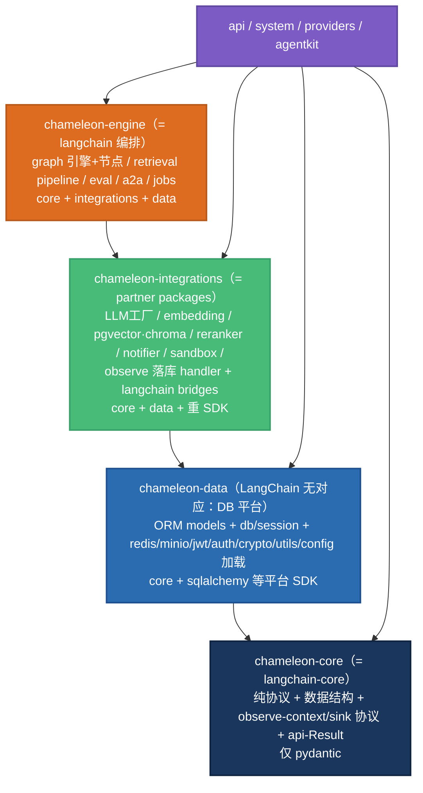

# chameleon-core 分层重构：拆出「纯抽象 core」

> ✅ **已完成（R0–R5，2026-05-30）**。分支 `refactor/core-layering`（未 push/未并，共 16 commit）。
> 4 包成型：**core**（纯协议，pydantic-only）/ **data**（ORM+infra）/ **integrations**（厂商实现+观测后端）/ **engine**（graph/retrieval/eval/a2a/jobs 编排）。
> import-linter **2 契约 GREEN**：① core 禁 sqlalchemy/langchain；② 严格分层 core←data←integrations←engine 单向。
> 5 条已知 IoC 便利 facade（base_agent 范式桥/KB、inventory 组件访问点）惰性 core→integrations，显式 ignore_imports 白名单+注释（可后续 DI 注入消除）。
> **遗留（可选）**：R3b 架构纯度（embedding/sandbox/schema/cache impl 仍在 core，不触发 linter，宜迁 integrations）；上层 product 包（app/api/system/providers）未纳入 layers 契约；无 CI（本地/pre-commit 跑 lint-imports）。
> 提交链：R0 e987fbc · R1 72c1741 · R2 88023cc · R3 02d6644/9287389/7748682/bf23a89/913aad5/b260be4 · R4 25131fd/bd58575/19f9c8c/73c0fe5/fb1b279 · R5 e94e6c8。

> 2026-05-29 · 把臃肿的 chameleon-core（~30% 抽象 + ~70% 实现/编排/持久化）按 LangChain
> 纪律重新分层为 4 包：**core（纯协议）/ data（持久化+平台）/ integrations（厂商实现+观测后端）/
> engine（编排）**。core 重新变成 pydantic-only 的协议薄壳，重 SDK（sqlalchemy / langchain-openai /
> pgvector / docker / redis / minio）全部下沉。与 [组件回调切面方案](./2026-05-29-component-callback-instrumentation.md)
> 同源——本重构为方案 A 提供干净的协议落点。

## 背景与现状诊断

`chameleon-core` 已沦为「大杂烩」：真·抽象只占 ~30%，其余是具体实现、编排引擎、ORM 持久化。
**铁证：core 内 8 个子包直接 `import sqlalchemy models`**（components / graph / retrieval /
vector / plugins / infra / observe / tools），而 LangChain 的 `langchain-core` 零 DB 依赖。

好消息：**包级依赖严格单向、无环** —— `core ← providers-base ← (api / system /
provider-local / agentkit)`（各 `pyproject.toml` 确认）。地基没歪，本次是「把 core 内部拆层」，
不是推翻重来。

成分盘点（来自并行代码调研）：

| 成分 | 代表模块 | 留 core? |
|------|---------|:---:|
| 抽象/协议 | `base/`(BaseAgent/AgentContext/Router) · `graph/{node_base,types,context,variables,results,registry}` · `*/base.py`(各 Protocol) · `tools/base` · `observe/context` · `api/{response,exceptions,sse}` · `config/base_settings` · `schema/` · `plugins/{sdk,manifest}` · `sandbox/runtime` | ✅ |
| 持久化 | `models/*`(25+ ORM) · `infra/db` | ❌→data |
| 平台基础设施 | `infra/{redis,object_store,jwt,auth,logger}` · `utils/*` · `config/{env,json,inventory,constants}` | ❌→data |
| 集成实现 | `components/llms/*`(langchain-openai) · `embedding/{openai_compat,image,factory}` · `vector/{pgvector,chroma,factory}` · `retrieval/rerankers/{clients,local,registry}` · `components/notifier/*` · `sandbox/docker` · `base/bridges/*`(langchain/langgraph 适配) | ❌→integrations |
| 观测后端 | `observe/{llm_recorder,graph_spans,aggregator}`(写 call_logs) | ❌→integrations |
| 编排 | `graph/engine/*` · `graph/nodes/*`(22 个) · `retrieval/{pipeline,hybrid,expander}` · `eval/algorithms/*` · `agent/a2a` · `jobs/` | ❌→engine |

## 目标分层（4 包 × LangChain 映射）



| 包 | 职责 | 依赖 | 重 SDK |
|----|------|------|--------|
| **chameleon-core** | 只说「形状」：协议 / 数据结构 / 跨切契约 | 无（仅 pydantic） | ❌ |
| **chameleon-data** | 管「存」：ORM + DB + 平台服务 | core | sqlalchemy / redis / minio / pyjwt / cryptography |
| **chameleon-integrations** | 填「厂商实现」：组件实现 + 观测后端 | core, data | langchain-openai / pgvector / chroma / docker / httpx |
| **chameleon-engine** | 做「编排」：graph / RAG / eval | core, integrations, data | langchain |

## 各包内容清单（搬迁对照）

**chameleon-core（留下，瘦身后 ~协议层）**
- `base/`(去掉 bridges) · `graph/{node_base,types,context,variables,results,registry}`
- 已是协议、原样留下：`embedding/base` · `vector/base` · `tools/base` · `retrieval/rerankers/base` ·
  `components/notifier/base` · `sandbox/runtime`
- `observe/context`（TraceContext + ContextVar）
- `api/{response,exceptions,sse,sse_events}` · `config/base_settings` · `config/system_settings_schema` ·
  `schema/`(纯数据结构部分) · `plugins/{sdk,manifest}` · `function/{chain,prompts}`(协议占位)

> **⚠️ 需在 core 新建的协议（今天还不存在独立协议文件，校验发现）**：
> - `core/protocols/llm.py`：`BaseLLM` 协议 —— 当前 `components/llms/base.py` 是**实现**（继承
>   `langchain_openai.ChatOpenAI`），不是协议；要「抽协议进 core + 实现改名 `OpenAICompatLLM` 进
>   integrations」，是 extract-then-move，不是简单搬迁。
> - `core/protocols/retriever.py`：`Retriever` 协议 —— 当前没有，检索是裸函数 `search_kb`；
>   KBNode 改为依赖此协议 + ctx 注入实现（掐断 kb.py:69 反向依赖）。
> - `core/observe/sink.py`：`ObservationSink` 协议（＝方案A A1）。
>
> **需拆分的混合文件（不是整体搬迁）**：
> - `agent/a2a.py`：协议/类型 → core；编排实现 → engine。
> - `config/inventory.py`：env/配置加载 → data；业务 service inventory → 改为注入（不进 core）。

**chameleon-data**
- `models/*`（全部 ORM）· `infra/{db,redis,object_store,jwt,auth,logger}`（**全部 infra 都进 data，
  core 不留任何 infra——这些是服务实现不是协议**）· `utils/*` ·
  `config/{env_settings,json_settings,constants}` + `inventory` 的配置加载部分

**chameleon-integrations**
- `components/llms/{base→OpenAICompatLLM, factory}` · `embedding/{openai_compat,image,factory}` ·
  `components/embeddings/*` · `vector/{pgvector,chroma,factory}` ·
  `retrieval/rerankers/{clients,local,registry}` · `components/{cache,notifier/slack,notifier/webhook,inventory,knowledge}` ·
  `sandbox/{docker,mock}` · `base/bridges/{langchain,langgraph}` · `plugins/{registry,registry_client,signing,builtins}` ·
  `observe/{llm_recorder,graph_spans,aggregator}` · `tools/builtins/*` · `tools/registry` · `schema/{registry,service}`

**chameleon-engine**
- `graph/engine/*` · `graph/nodes/*` · `retrieval/{pipeline,hybrid,expander,vlm_caption}` ·
  `eval/algorithms/*` · `agent/a2a`(编排部分) · `jobs/`（当前仅空 `__init__.py` 占位，有实现再迁）

## 依赖规则（铁律 + import-linter 护栏）

1. **只准向下依赖**：`core ← data ← integrations ← engine ← 上层`。出现上行 import = 立刻挪。
2. **core 禁 import**：`sqlalchemy` / `langchain*` / 任何厂商 SDK / 任何 `models`。
3. **协议在 core，实现在 integrations**：`BaseLLM` 协议留 core；继承 `ChatOpenAI` 的实现改名 `OpenAICompatLLM` 进 integrations。
4. **依赖倒置注入**：engine/integrations 通过「core 协议 + 上层注入实现」拿依赖，不 import 具体类。

用 `import-linter` 固化（`pyproject.toml`）：

```toml
[tool.importlinter]
root_packages = ["chameleon"]

[[tool.importlinter.contracts]]
name = "分层单向"
type = "layers"
layers = ["chameleon.engine", "chameleon.integrations", "chameleon.data", "chameleon.core"]

[[tool.importlinter.contracts]]
name = "core 保持纯净"
type = "forbidden"
source_modules = ["chameleon.core"]
forbidden_modules = ["sqlalchemy", "langchain", "langchain_openai", "chameleon.data"]
```

## 必须先掐断的耦合点（7 个异味 → 拆法）

| 异味（file:line） | 现状 | 拆法 |
|------|------|------|
| `retrieval/pipeline.py:35` import `Chunk/Document` | 检索拼 ORM 查询 | 返回纯 dataclass `Hit`，不外泄 ORM |
| `vector/pgvector.py:17` import `Chunk` | 向量库写 ORM | upsert 收纯 payload |
| `graph/nodes/kb.py:69` lazy import `inventory.search_kb` | 节点反向拉业务 service | 节点用 core `Retriever` 协议，impl 由 ctx 注入 |
| `components/llms/factory.py:26` import `LLMModel/Provider` | 工厂直连 DB 表 | 工厂收注入的 config 快照 |
| `observe/llm_recorder.py` 写 `call_logs` | 观测硬绑业务表 | core 定 `ObservationSink` 协议，落库 handler 在 integrations 注册（**＝方案A A1/A2**） |
| `plugins/registry.py:30` 操作 `PluginInstance` | 注册表绑 DB | registry 进 integrations，core 只留 sdk/manifest 协议；providers-base 改依赖协议 |
| `observe/aggregator.py:21` import `CallLog` | rollup 消费 ORM | CallLog rollup 归 integrations（消费方），core 不碰 |

## 与方案 A 的合并

方案 A 需要的 **`BaseLLM/BaseRetriever/BaseTool` 协议** 与 **`ObservationSink` 协议**，正是本重构里
core 该留下的核心抽象；方案 A 的 **CallLog handler** 正是 integrations 层。二者是同一块拼图：
建议 **先做本重构的 R0–R2（协议归位 + 掐断 observe 的 DB 耦合），方案 A 的 A1 顺势落在 core**。

## 分阶段（低风险先行）

| 阶段 | 动作 | 风险 |
|------|------|:---:|
| **R0** | 装 import-linter，标 core 禁 sqlalchemy/langchain，先让违规全暴露（暂 warn 不 fail） | 极低 |
| **R1** | 抽 **chameleon-data**（models+db+infra+utils+config 加载）：建包 + uv workspace 接线 + 全局改 import 路径 + alembic env 指向 | 中（机械、面广） |
| **R2** | 掐断**真正必须现在断**的耦合点 = observe 走 ObservationSink 协议（消 core→system 上行）。其余 4 个（retrieval/vector 返纯类型、factory 注入 config、KBNode 走协议）**搬到 integrations/engine 即合法，改为 R3/R4 顺手做**（非阻塞，避免无谓改行为风险） | 中（已完成） |
| **R3** | 抽 **chameleon-integrations**（组件实现 + 观测 handler + bridges） | 中 |
| **R4** | 抽 **chameleon-engine**（graph+retrieval+eval+jobs） | 中 |
| **R5** | core 自然瘦成协议层；重指各上层包依赖；import-linter 转 enforce（CI fail） | 低 |

每阶段验收：`uvx ruff check` + 全套件 pytest + 启动 7009 冒烟 + import-linter 通过。

## R0 基线结果（已执行 2026-05-29）

import-linter 2.11 + grimp 3.14 入 dev 组；契约写在根 `pyproject.toml` `[tool.importlinter]`
（`root_packages=["chameleon.core"]` + `include_external_packages`，forbidden：sqlalchemy / langchain /
langchain_core / langchain_openai / langgraph）。手动跑 `uv run lint-imports` → 契约 **BROKEN，50 条违规**
（这是预期的，正是作业清单；**未接 CI / pre-commit，不阻塞提交**）：

- **42 → sqlalchemy** = `models/*`（31，整体搬 **data**）+ 11 个非-model 越界：
  `infra/{db,auth}`·`utils/convert` → **data**；`components/{knowledge,llms/factory}`·`plugins/registry`·
  `vector/pgvector`·`tools/builtins/sql` → **integrations**；`graph/nodes/{kb,tool}`·`retrieval/pipeline` → **engine**。
- **8 → langchain 系**：`components/llms/base`(→integrations，抽协议)·`base/bridges/langchain_bridge`(→integrations)·
  `observe/llm_recorder`(→integrations，耦合点#5)·`retrieval/pipeline`(→engine)·
  `graph/nodes/{llm,llm_messages,llm_tools,classifier}`(→engine)。

这 50 条违规 = R1–R4 的逐文件搬迁/解耦清单；每搬完一批，违规数应单调下降；R5 归零后转 CI enforce。

## 风险与回滚

- **海量 import 重写**：`from chameleon.core.models import X` → `chameleon.data.models`，全仓 codemod（机械、可脚本化、可逐包 PR 回滚）。
- **alembic 迁移**：models 移包后 `migrations/env.py` 的 `target_metadata` 与历史脚本里的模型 import 路径要改；**不改已发布脚本的 changeset 逻辑，只改 import 路径**。
- **providers-base 依赖 plugins registry**：registry 下沉 integrations 后 providers-base 不能上行依赖——需把 plugin 查找改为「协议 + 注入」或让 registry 的协议留 core。R2 一并处理。
- **跨包循环**：每阶段 import-linter 守门，出现环立即停。
- **config/inventory 全局单例**：business logic 掺配置，R1 顺手拆「settings（data）vs service inventory（注入）」。

## 不做的事（边界）

- 不改 DB schema、不改任何业务逻辑（纯搬迁 + 解耦）。
- `api ← system` 的反向依赖（`playground`/`agent` 调 `system.api_key.service`）是**另一个独立 issue**，不在本次范围。
- 不拆 data 为 persistence+infra 两包（保持 4 包；如后续需要再细分）。

## 对抗校验结论（2026-05-29，双 critic 独立核对代码）

- ✅ **提议的 4 层无循环依赖**：integrations/engine 不会反向 import core 的协议消费方。
- ✅ **「留在 core」的模块实测 CLEAN**：`graph/{node_base,types,context,results,registry,variables}` ·
  `observe/context` · `base/base_agent` · `api/{response,exceptions,sse}` · `config/base_settings` ·
  `tools/base` · `plugins/{sdk,manifest}` · `sandbox/runtime` —— 全部零 `sqlalchemy/langchain/models` import。
- ✅ **7 个耦合点全部属实**，core→data 搬迁清单（models/infra/utils）核对无误。
- 🔧 精修（已并入上文）：① `components/llms/base.py` 是实现非协议（需 extract 协议 + 改名搬实现）；
  ② `agent/a2a.py`、`config/inventory.py` 是混合文件需拆分；③ 全部 `infra/` 进 data、core 不留 infra；
  ④ `jobs/` 当前空占位。

## 已锁定的决策

- 粒度：**4 包**（core / data / integrations / engine）。
- ORM **移出 core 进 chameleon-data**。
- 包命名为提案，最终名以实现时确认为准。
