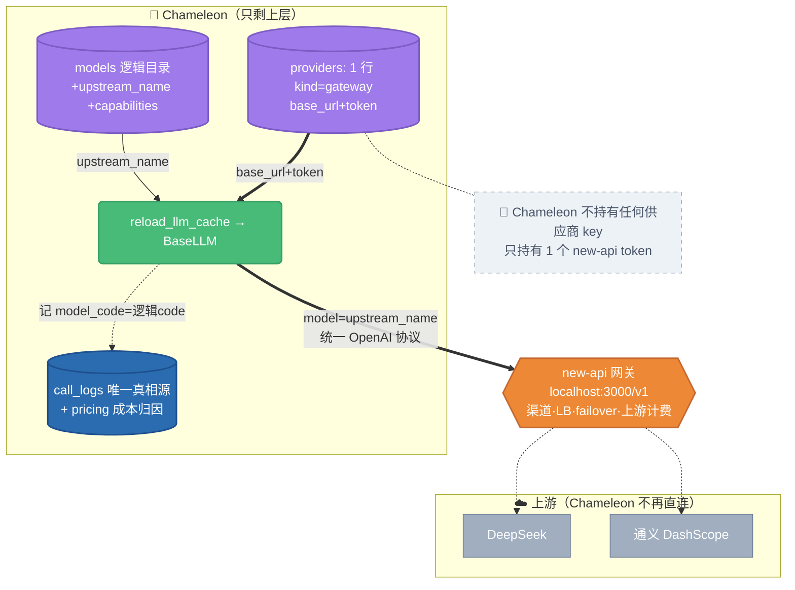

# Chameleon × new-api 网关收口重构

> 把 **new-api** 作为唯一上游网关（本地 `http://localhost:3000/v1`，一个 token 当 key）。
> 所有供应商 key / 负载均衡 / 多 key failover / 上游计费 搬进 new-api。
> Chameleon 只保留：逻辑模型目录 + 能力元数据 + 角色槽位 + 模型选择器 + key 作用域 + 观测/成本归因。

状态：进行中（分支 `refactor/newapi-gateway`）。
关联记忆：`gateway-newapi-local`、`concept-refactor`（Channels+Abilities 已砍）、`observability-langsmith`、`api-key-scope-model`。

---

## 0. 核心洞见（决定了改动量极小）

1. **调用层早已是单一 OpenAI 兼容客户端**：`BaseLLM(_BaseChatOpenAI)` 直接继承 `langchain_openai.ChatOpenAI`；`ChatDeepSeek/ChatQwen` 只是零行为差异 alias。没有任何 `import anthropic/cohere` 分支。→ 接 new-api **不需要写新客户端**。

2. **"网关"本质 = `providers` 表里一行普通 provider**：`base_url=http://localhost:3000/v1`、`api_key_encrypted=<new-api token>`。`reload_llm_cache` 的 query 本就 `join(Provider)` 按行取 `base_url + api_key`。→ 让模型指向这行 provider，工厂凭证逻辑**零改**。

3. **唯一必要的调用层代码改动是一行**：打给上游的模型名从 `model.code` 改成 `model.upstream_name or model.code`（逻辑名 ≠ 上游名）。cache key 与 `GenerationRecorder(model_code=)` 仍用逻辑 `code`（成本/观测靠它）。

4. **灰度天然成立**：老 provider（qwen/deepseek 直连）与 new-api 网关 provider 在同一张 `providers` 表里共存；模型 row 指向谁就走谁。删老路是 P3 的事，之前全程可逆。

5. **计费决定**（见对话）：new-api 只看得见"一个 token"，**做不了按 agent/session/end_user 的成本归因**。Chameleon 的 `pricing/calc_cost` + `call_logs` 是观测的成本维度，**保留不动**；new-api 只负责"上游真实账单 + token 额度封顶"。

---

## 1. 现状关键文件（已核实）

| 文件 | 现状 |
|---|---|
| `chameleon-integrations/.../llms/factory.py` | `reload_llm_cache` join Provider 取 `base_url/api_key`，建 `BaseLLM(model=model.code, …, callbacks=[GenerationRecorder(model_code=model.code)])`，cache key=`model.code` |
| `chameleon-integrations/.../llms/base.py` | `BaseLLM` = ChatOpenAI 子类，`api_base/api_key` 入参 |
| `chameleon-data/.../models/model_def.py` | `LLMModel`：provider_id FK / code / kind(chat,embedding) / dim / defaults / enabled；`uq(provider_id, code)` |
| `chameleon-data/.../models/provider.py` | `Provider`：code / kind(String32) / base_url / api_key_encrypted / extra_config / enabled |
| `chameleon-integrations/.../embedding/factory.py` | embedding 走 **model.json**（`inventory.llm_provider_credential`），**与 chat 的 DB 路径不同源** |
| `chameleon-core/.../config/inventory.py` | `embedding_dim()` 全局固定 **1536**；`llm_provider_credential` 读 model.json |
| `chameleon-system/.../providers/api.py` | provider CRUD；`kind` 正则 `^(llm\|embedding\|dify\|fastgpt\|coze)$`；增删改后 `reload_llm_cache()` |
| `chameleon-system/.../seed/models_seed.py` | 从 model.json 加密 seed providers+models+model_defaults |
| `backend/config/model.json` | providers(openai/deepseek/qwen，**含明文 company qwen key**) + models + cases(llm=qwen-plus, embedding=text-embedding-v2 dim1536) |
| `chameleon-system/.../pricing/service.py` | `calc_cost(model_code)` 查 `model_pricing`，与上游无关 |
| DB / 迁移 | **PostgreSQL**（迁移用 `op.add_column`，非 SQLite batch）；head=`p26_g01_run_item_judge_fields` |

---

## 2. 目标架构

---

## 3. 数据模型改动（PostgreSQL，`op.add_column`）

### `models` 加 3 列（迁移 `p27_a01_model_upstream_fields`）
- `upstream_name VARCHAR(128) NULL` — 逻辑模型 → new-api 暴露的模型名；NULL 时工厂回退用 `code`。
- `upstream_group VARCHAR(64) NULL` — 对应 new-api 的 group（NULL=默认组）；预留，P1 暂不强制使用。
- `capabilities JSON NULL` — `{vision, rerank, function_calling, context_window, max_output}`，驱动 UI 过滤 + 选择器；与计费无关。

`kind` 取值扩展加 `rerank`（值层面，无 DDL）。能力用 JSON 列而非独立表（与项目 `defaults`/`agents.config` 一致；不需按能力跨模型 SQL 聚合）。

### `providers`：不改结构，加 `kind='gateway'` 取值
- 约定一行 `code='new-api', kind='gateway', base_url='http://localhost:3000/v1', api_key_encrypted=encrypt(token)`。
- `providers/api.py` 的 `kind` 正则加 `gateway`（让 admin UI 能建网关 provider）。

### 不动
`api_keys` / `call_logs` / `model_pricing` / `model_defaults`（仅 P2 加 `rerank` 槽，靠 seed 数据无 DDL）。

---

## 4. 调用层改动

- **`factory.py`**：`model=model.code` → `model=model.upstream_name or model.code`（唯一硬改）。cache key、`GenerationRecorder(model_code=)` 仍用 `model.code`。
- **embedding（P2）**：`embedding/factory.py` 从读 model.json 凭证切到读 DB 网关 provider；逻辑 embedding 模型 `upstream_name='text-embedding-v3'`。
- **rerank（P2）**：`rerankers/registry.py` 加 `type='gateway'`，base_url 指 new-api、model=`gte-rerank`。
- **trace/成本切面**：零改动（`GenerationRecorder` 从 usage 取 token；`calc_cost` 按 model_code）。

---

## 5. 分阶段（每阶段可独立验证、可回退）

### P1 — 骨架（本切片，纯向后兼容）
schema 迁移（models 加 3 列）+ ORM + `factory.py` 一行收口 + `providers/api.py` 正则加 gateway。
**`upstream_name` 全 NULL → 行为与现状 100% 一致，不改变任何运行结果。**
验证：迁移可应用、模块可 import、现有模型仍按 code 加载。

### P0/接线 — 打通一次真实调用（数据操作，不提交密钥）
脚本/管理 API 写入：一行 `kind='gateway'` 的 new-api provider（token 从 `~/.agents/resources.json` / env 读，加密入库）+ 把 chat 模型 row 指向它并设 `upstream_name`。
验证：Playground 发 `deepseek-chat`/`qwen-plus` → 经 Chameleon → new-api → 上游跑通；`call_logs` 落一条 generation，token/cost 正确。

### P2 — embedding 切网关 ✅ / rerank 暂缓
- **embedding ✅**：LLM 工厂 reload 时把网关凭证暂存 `_GATEWAY_CRED`（`gateway_credential()` 同步暴露）；`embedding/factory.py` 在 `gateway.mode=newapi` 时改用网关凭证（否则 model.json 直连）。**用现有 `text-embedding-v2`（new-api 实测 dim=1536），同模型同维度，现有 KB 零影响**。已真跑验证。
- **embedding_dim 铁律**：现全局 1536。`text-embedding-v3`=**1024**，故本期**不**切 v3——v3 留给未来 per-KB 维度（KB 层任务，超出模型供应范围）：老 KB 维持 1536，只有新建 KB 才用 v3，dim 随 collection 走。
- **rerank 暂缓**：rerank 是**按 KB 配置**（KB.config 的 base_url/api_key/model），无全局默认；且 DashScope 个人账号对 `gte-rerank` 返回 403（账号未开通）。new-api 的 `/rerank` 路由可转发，但上游账号受限。结论：rerank 维持各 KB 直连配置；将来有可用 rerank 模型时，照 embedding 同样模式给 `rerankers/registry.py` 加 gateway 分支。

### P3 — 终化「打开网关」✅
- 发现 `chameleon.json`/`model.json` 均 **gitignored**（仅 `example/` 模板入库）→ company qwen key 从未进 git；config 是本地/部署级。
- dev 环境已**打开**：DB 永久建 `kind='gateway'` 的 `new-api` provider（加密 token）；本地 `chameleon.json` 设 `gateway.mode=newapi`；清空本地 `model.json` 冗余 api_key（newapi 模式不用）。
- **已真跑验证**（读真实配置）：chat（deepseek-chat）+ embedding（text-embedding-v2@1536）全部经 new-api，返回正常。
- 提交物：`chameleon.example.json` 增 `gateway` 块（模板默认 `direct`，部署按需 opt-in newapi）。**未删 direct 代码路径** —— `gateway.mode=direct` 一键回退直连，全程可逆。
- 网关 provider 含 token 密钥，属运行时数据，经 admin UI（P4 Providers 页）/ env 创建，不入库；`inventory.llm_provider_credential` 保留（direct 模式仍用）。

### P4 — 前端 + 角色槽位 + 部署模式开关
- Providers 页坍缩成"单网关卡 + 外部 agent 平台分区"；Models 页加 upstream_name/能力/角色槽位指派；新增 rerank 角色槽。
- **部署模式开关**（产品化"可插拔网关"）：因为 new-api 只是 `providers` 表一行，"直连 vs 网关"本就是按模型 `provider_id` 切的纯数据选择。加一个部署级配置 `gateway.mode = direct | newapi`（或"默认网关 provider"指针）把它显式化：
  - `direct`：模型用各自内置供应商行直连（回到原始配置；供应商需各自填 key）。
  - `newapi`：模型解析时统一改走 `kind='gateway'` 那行（一键全切，无需逐模型改 provider_id）。
  - 实现思路：在 `reload_llm_cache` 解析每个模型的"有效 provider"时，若 mode=newapi 且存在 enabled gateway provider，则凭证统一取 gateway、`model=upstream_name or code`；否则走模型自身 provider_id。这样开关是**运维一个配置 + reload**，模型表不用动。
  - 价值：不部署 new-api 的环境（或网关故障）一键回退直连；混用仍可按模型覆盖。

---

## 6. 风险

- **embedding_dim 1024 vs 1536**（最高危）：见 P2 铁律，老 KB 不切。
- **流式 usage 透传**：P0 必验 new-api 流式回包带 usage，否则 token/cost 丢（new-api 默认支持）。
- **多 head 迁移**：eval /loop 若也基于 g01 加迁移会产生多 head，合并时 `alembic merge`。
- **共享 DB**：7009/8000 两个后端在跑；迁移/数据写入需确认目标库，避免影响其他 worktree。
- **token 失效**：监控 `call_logs` 的 ProviderAuthError；轮换走 provider update + `reload_llm_cache`（已有）。
