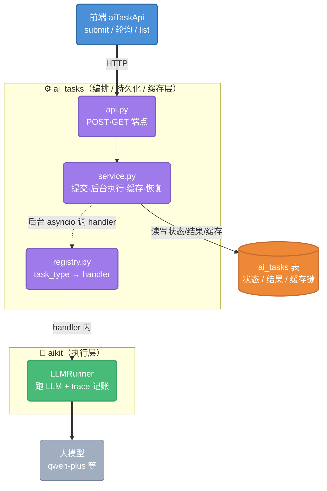
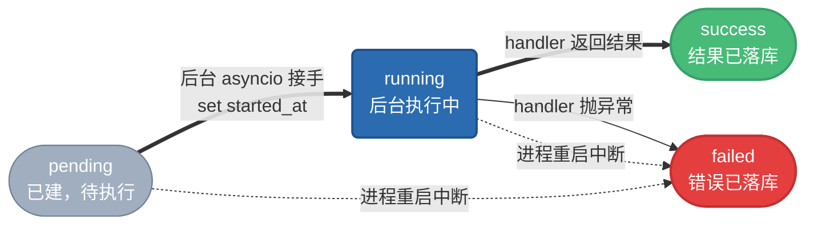
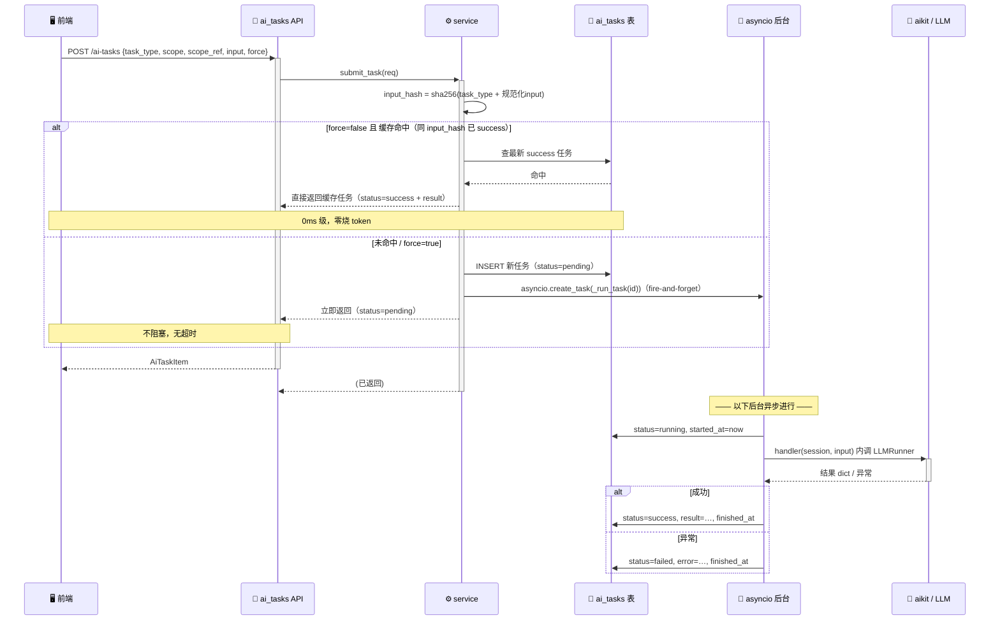
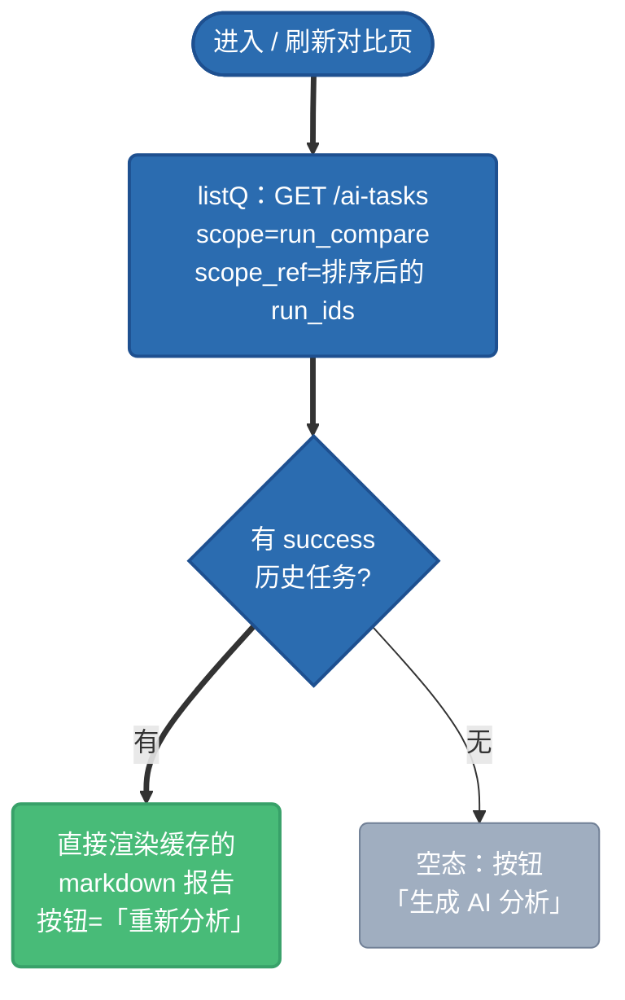
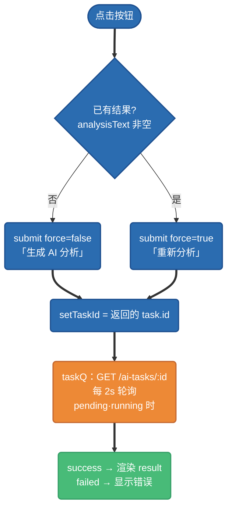

# 通用 AI 任务子系统（ai_tasks）—— 异步执行 / 状态跟踪 / 结果缓存

> **解决方案（可复用参考）**。何时翻它：要把一个**长耗时 AI 调用**变成「提交即返 + 后台跑 + 前端轮询 + 结果缓存 + 离开页面回来反显」时，照本子系统接一个 `task_type` handler 即可（接入步骤见 §7）。
> 适用：对比分析、Prompt 优化、AI 扩样、批量评测等任何"点一下要等几十秒"的 AI 功能。
> 状态：已落地，首个接入场景 = 运行对比的「AI 总结分析」（落地 2026-06-07）。

## 1. 背景：为什么要它

某些 AI 功能是**长耗时同步请求**——比如「运行对比 AI 分析」让 qwen-plus 从 30 题的逐题数据生成一份报告，要 **30~60s**。这带来三个问题：

1. **超时**：前端 HTTP 客户端默认 30s 超时，请求还没回就报错（实测 `timeout of 30000ms exceeded`）。加大超时只是权宜——长任务永远有上限风险，且请求期间页面一直挂着。
2. **离开就丢**：用户切走页面 / 刷新，正在跑的任务和已出的结果都没了，回来得重跑。
3. **重复烧 token**：同一组运行反复看分析，每次都重新调一次大模型，纯浪费。

`ai_tasks` 一张表 + 一套异步流程，一次解决这三件事：**异步**（提交即返、后台跑、前端轮询）、**可恢复**（结果落库，离开回来反显）、**缓存**（同输入直接复用，零烧 token）。

## 2. 整体架构与分层

`ai_tasks` 不自己跑 LLM，它是**编排 / 持久化 / 缓存层**，把真正的执行委托给 `chameleon-aikit`（执行层）。



**一句话分工**：aikit 负责「把 LLM 调出结果」；ai_tasks 负责「异步调度 + 存状态/结果 + 同输入缓存去重」。`task_type` 对齐 aikit registry 的 key（如 `eval.compare_analysis`）。

## 3. 数据模型：`ai_tasks` 表

| 列 | 含义 |
|---|---|
| `id` | 雪花主键 |
| `task_type` | 任务类型，对齐 aikit key，如 `eval.compare_analysis` |
| `scope` / `scope_ref` | **业务归属**：`scope`=业务域（如 `run_compare`），`scope_ref`=关联实体（如排序后的 run_ids 拼接）。用于「按归属列出历史任务」做反显 |
| `input_hash` | **缓存键** = `sha256(task_type + "\n" + 规范化JSON(input))` |
| `input` | 任务入参（如 `{"run_ids":[...]}`） |
| `status` | `pending` / `running` / `success` / `failed`（状态机） |
| `result` | 产出（如 `{"analysis":"# 报告…"}`），前端反显就读它 |
| `error` | 失败原因 |
| `model_code` / `total_tokens` / `cost_usd` / `request_id` | 用量与 trace 关联（可空；aikit 调用本身另记 call_log） |
| `created_by` / `created_at` / `started_at` / `finished_at` | 归属与时间戳 |

索引：`ix_ai_tasks_input_hash`（缓存命中查找）、`ix_ai_tasks_scope(scope, scope_ref)`（列历史）。

## 4. 任务状态机（后台在做什么）



- **正常**：`pending → running →（success | failed）`，`finished_at` 在终态写入。
- **进程重启兜底**：进程内 asyncio 后台任务随重启丢失，启动钩子 `recover_stale_tasks()` 把残留的 `running`/`pending` 统一标 `failed`（error=「进程重启，任务中断」），避免永久卡在中间态。

## 5. 三个核心流程

### 5.1 怎么提交 + 后台在做什么（含缓存判定）

`POST /v1/admin/ai-tasks`，service 先判缓存，未命中才建任务并**后台异步执行**（提交请求立即返回，不等结果）。



**缓存怎么判断**：`input_hash = sha256(task_type + "\n" + json.dumps(input, sort_keys=True))`。同 `task_type` + 同 `input`（字段顺序无关）→ 同 hash → 命中已 `success` 的任务直接复用。
**为什么缓存安全**：本场景 `input` 是 `run_ids`，而**评测 run 是不可变快照**（跑完不再变），所以「对同几个 run 的分析」结果永不过时，缓存 100% 安全。需要强制重算时传 `force=true` 跳过缓存。

### 5.2 刷新界面 / 重新进来：前端怎么显示

**核心**：结果在 DB，前端**开窗即按业务归属拉一次历史**（`list`），命中 `success` 就直接反显——不需要用户重新点。



- `scope_ref` 前后端用**同一算法**算：`[...runIds].map(String).sort().join(',')`，保证刷新后能查到同一条任务。
- 反显纯靠 `list` 查 DB，与「是否点过按钮」无关——这就是「离开页面回来结果仍在」。

### 5.3 再次点击「生成 / 重新分析」：什么逻辑

点击 = 提交一个任务并轮询。是否复用缓存由按钮当前语义决定：



- **没结果时点**（按钮「生成 AI 分析」）→ `force=false`：若已有同输入缓存，submit 秒返 success；否则建 pending，前端轮询到出结果。
- **已有结果时点**（按钮「重新分析」）→ `force=true`：跳过缓存、强制新建一个任务重算。
- 轮询用 TanStack Query 的 `refetchInterval`：`pending`/`running` 时每 2s 拉一次，终态自动停。

## 6. 前端展示态推导（一张表说清）

前端用三个 query/state 推导出当前该显示什么（`run-compare-stats.tsx`）：

| 变量 | 来源 |
|---|---|
| `listQ` | 开窗拉历史（缓存反显） |
| `taskId` + `taskQ` | 点过按钮后跟踪的当前任务（轮询） |
| `activeTask` | `taskQ.data ?? (taskId==null ? listQ 里的 success : null)` —— **点过用轮询的，没点过用缓存的** |
| `analysisText` | `activeTask.result.analysis` |
| `analyzing` | `submitMut.isPending` 或 `activeTask.status ∈ {pending, running}` |
| 按钮文案 | `analyzing` → 「分析中…」；有 `analysisText` → 「重新分析」；否则 → 「生成 AI 分析」 |

## 7. 接入一个新的 AI 任务类型

整个子系统是**通用**的，加一类新任务只需 2 步，零改 ai_tasks 域：

1. **写 handler 并注册**（在该业务域，如 `xxx/ai_handlers.py`）：
   ```python
   from chameleon.system.ai_tasks.registry import register_handler

   async def _handle_my_task(session, input: dict) -> dict:
       # 内部用 aikit LLMRunner 跑，返回结果 dict（落 ai_tasks.result）
       ...
       return {"foo": "bar"}

   register_handler("xxx.my_task", _handle_my_task)
   ```
   并在 app 启动钩子 import 该模块触发注册（见 `app/main.py` lifespan）。

2. **前端调** `aiTaskApi.submit({ task_type: "xxx.my_task", scope, scope_ref, input })` → 轮询 / 反显，逻辑同上，组件可复用。

`handler` 契约：`async (session, input: dict) -> result: dict`。

## 8. 接口一览

| 方法 | 端点 | 用途 |
|---|---|---|
| POST | `/v1/admin/ai-tasks` | 提交（命中缓存直接返已 success 任务） |
| GET | `/v1/admin/ai-tasks/{id}` | 轮询单个任务状态 + 结果 |
| GET | `/v1/admin/ai-tasks?scope=&scope_ref=&task_type=&limit=` | 按业务归属列历史（反显 / 缓存展示） |

## 9. 设计取舍与已知限制

- **后台执行用进程内 asyncio**（`asyncio.create_task` + 模块级 set 持引用防 GC）：本地 / 单实例最简、零额外依赖。代价是进程重启会中断在跑的任务 → 用 `recover_stale_tasks()` 标 failed 兜底。**多实例 / 生产**需换正式 job queue（apscheduler / celery），handler 与缓存逻辑可原样复用。
- **缓存安全前提**：input 对应的实体不可变（如评测 run 快照）。若 input 指向**可变**数据，需把可变内容纳入 `input`/`input_hash`，或对该 `task_type` 关闭缓存（始终 `force` 或加 TTL）。
- **大整数序列化坑（已修）**：`scope_ref` 是逗号拼接的雪花字符串，前端 `request.ts` 的 `preserveBigIntIds` 正则会误伤它破坏 JSON → 已在 `transformResponse` 加 plain `JSON.parse` 兜底（后端全局 `SafeIntJSONResponse`，大整数本是字符串，plain parse 必正确）。
- **用量统计**：当前 `ai_tasks.total_tokens` 未回填（aikit 调用自身记 call_log）；需要在任务粒度看成本时，可在 handler 内开 trace scope 并把 request_id / tokens 回写任务。

---

**相关**：执行层见 `docs/plans/2026-06-07-internal-llm-aikit.md`（chameleon-aikit）。本子系统迁移 `p27_x06_ai_tasks`，代码在 `chameleon-system/ai_tasks/`（api / service / registry / schemas）+ ORM `chameleon-data/models/ai_task.py` + 前端 `core/services/ai-task.ts`。
