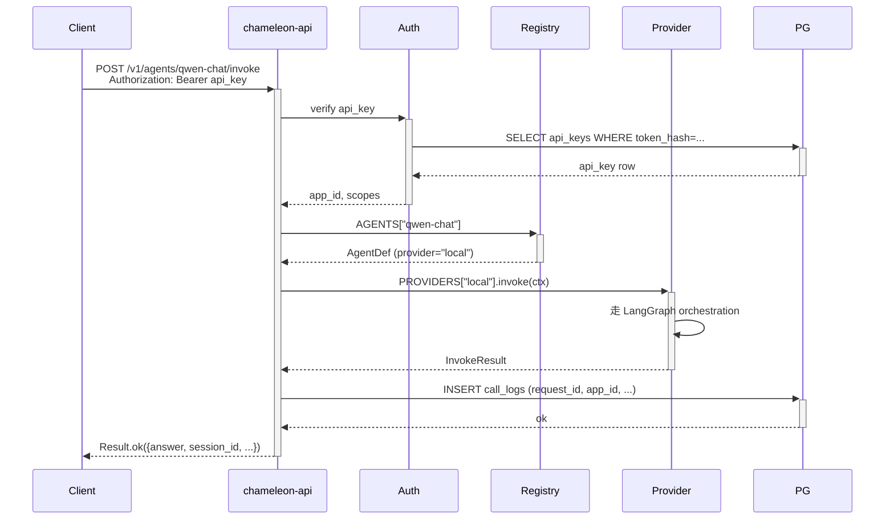

# 架构设计

## 总览

```mermaid
graph TB
    classDef edge fill:#4A90D9,stroke:#2E6BA6,stroke-width:2px,color:#fff
    classDef be fill:#48BB78,stroke:#38A169,stroke-width:2px,color:#fff
    classDef store fill:#ED8936,stroke:#C66A32,stroke-width:2px,color:#fff
    classDef provider fill:#9F7AEA,stroke:#7C5CC4,stroke-width:2px,color:#fff

    subgraph Edge["客户端"]
        UI([Admin Console]):::edge
        Widget([Embedded Widget]):::edge
        SDK([External SDK / curl]):::edge
    end

    subgraph App["chameleon-app（FastAPI）"]
        API(chameleon-api 业务):::be
        SYS(chameleon-system 管理):::be
        EMBED(chameleon-api/embed):::be
    end

    subgraph Core["chameleon-core 共享"]
        Auth(Auth / RBAC):::be
        DB[(SQLAlchemy 2.0)]:::store
        Redis[(Redis)]:::store
        Crypto(AES-GCM):::be
    end

    subgraph Providers["chameleon-providers"]
        Local(Local LangGraph):::provider
        Dify(Dify HTTP):::provider
        FastGPT(FastGPT HTTP):::provider
    end

    subgraph DataLayer["持久层"]
        PG[(PostgreSQL + pgvector)]:::store
    end

    UI ==>|/v1/admin/*| SYS
    Widget ==>|/v1/embed/*| EMBED
    SDK ==>|/v1/agents/{key}/invoke| API

    API --> Auth --> DB --> PG
    SYS --> Auth
    EMBED --> Redis

    API --> Local
    API --> Dify
    API --> FastGPT
    SYS --> Crypto --> PG
```

## 包结构（uv workspace）

```
chameleon-core         基础设施 + 共享 ORM 模型 + 工具
  ├ infra/             db / redis / jwt / logger
  ├ models/            21 张表的 ORM
  ├ utils/             crypto / passwords / snowflake
  ├ api/               response / exceptions / 全局错误码
  └ components/        LLM Factory / embedding factory

chameleon-providers/   Provider 抽象层
  ├ base/              Provider Protocol + Registry
  ├ local/             in-process LangGraph
  ├ dify/              Dify HTTP wrapper
  └ fastgpt/           FastGPT HTTP wrapper

chameleon-agents/      业务 agent 包（namespace 扫描自动注册）

chameleon-api/         对外 AI 业务 API
  ├ agent/             /v1/agents/{key}/invoke
  ├ knowledge/         /v1/knowledge/*
  ├ conversation/      /v1/conversations/*
  ├ task/              /v1/tasks/*
  └ embed/             /v1/embed/* （widget 公开）

chameleon-system/      管理 API
  ├ auth/              login / refresh / logout / change-password
  ├ users/ roles/ permissions/
  ├ apps/ api_keys/
  ├ providers/ models/ agents/
  ├ kbs/ embed_configs/
  ├ audit_logs/ call_logs/ dashboard/
  └ admin/ settings/   导入导出 seed

chameleon-app/         FastAPI 启动器（薄）
  ├ main.py            app 实例 + lifespan + 路由装配
  └ cli.py             chameleon init-admin / db upgrade
```

## 关键决策

### 1. DB-driven 配置

旧方案：所有配置在 JSON 文件，改完重启服务。
新方案：JSON 仅作首启 seed，运行时配置全在 DB（providers / models / agents 表）。

收益：
- admin UI 实时改 model api_key 不停服
- 多实例部署共享配置
- 配置审计走 audit_logs 表

### 2. JWT 双 Token

- `access_token`：15min，放 `Authorization: Bearer`
- `refresh_token`：7d，放 HTTP-only Cookie

前端 axios 拦截器收到 401 → 自动 POST `/v1/auth/refresh` → 拿新 access 重试一次。`refresh_token` 在 HTTP-only Cookie 里，JS 取不到，免 XSS。

### 3. RBAC 三表 + 通配符权限

```
users ──┬── user_roles ──┬── roles ──┬── role_permissions ──┬── permissions
        │   (多对多)      │           │     (多对多)          │
        └────────────────┘           └─────────────────────┘
```

权限 code 格式 `<resource>:<action>`，支持通配符 `*:*` / `users:*`。

### 4. Provider 凭证加密

`providers.api_key_encrypted` 字段存 AES-256-GCM 密文，密钥从 env `CHAMELEON_CRYPTO_KEY` 派生。读取时按需解密，明文绝不落盘日志、绝不返给前端。

### 5. Snowflake ID

64-bit：`1 sign + 41 timestamp + 10 instance + 12 seq`。多实例部署用 env `CHAMELEON_INSTANCE_ID` 区分（0~1023）。

### 6. Provider / Agent Registry

启动期 async load：
1. `build_provider_registry()` 扫 `chameleon.providers.*` namespace
2. `_scan_local_agent_modules()` 扫 `chameleon.agents.*` 把 BaseAgent 子类注册到 router
3. `build_agent_registry_from_db()` 从 DB `agents` 表读 enabled=True

业务热路径同步读 `PROVIDERS` / `AGENTS` dict（O(1)）。admin 改 agents 表后调 `reload_agent_registry()` 重 load。

### 7. 嵌入式 Widget

```
业务方网页 <script src=".../widget.js" data-embed-key="xxx">
  ↓
  IIFE bundle (13KB / gzip 4.8KB, vanilla TS, 不引 React)
  ↓
  shadow DOM 注入气泡 → 点开 panel
  ↓
  /v1/embed/{key}/config    拉 ui_config + welcome
  /v1/embed/{key}/session   颁 session_token（Redis TTL 1h）
  /v1/embed/{key}/invoke    调对应 agent
```

安全：
- Origin 白名单（`embed_configs.allowed_origins`）
- session_token 与 embed_key 强绑定
- 限流走 Redis 计数器
- 消息渲染走 `textContent`，不走 `innerHTML`

### 8. 前端 sage 分层

```
src/
├── core/                 共享基础设施（lib / components / stores / i18n / router）
├── system/<module>/      业务模块自包含
│   ├── pages/            页面组件
│   ├── services/         API 调用
│   ├── types/            TypeScript 类型
│   └── routes.ts         路由配置 (default export ModuleRouteConfig)
└── router/index.tsx      import.meta.glob 自动发现 system/**/routes.ts
```

新增业务模块 = 新建一个 `system/<name>/` 目录 + 写 routes.ts，无需改任何外部文件。

## 数据流：一次 Agent 调用



## 性能 / 容量预期

- backend 单实例：~ 200 RPS（非流式 / agent-internal latency 主导）
- pgvector HNSW：百万级 chunks 检索 < 50ms (m=16, ef_search=40)
- Redis：JWT 黑名单 + session_token + 限流，单实例足够支撑万级 QPS
- 多实例：用 nginx upstream 反代，无 session affinity（无状态后端）
