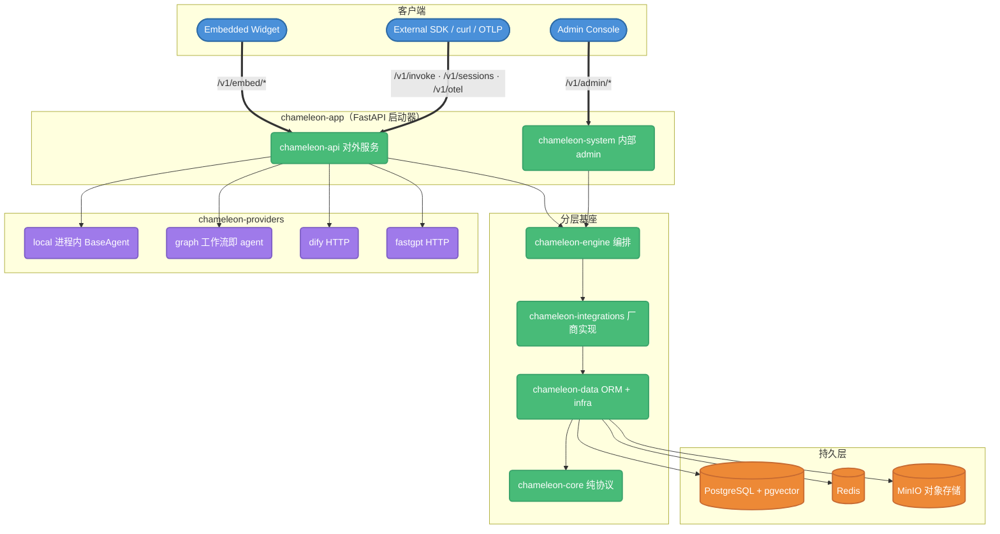
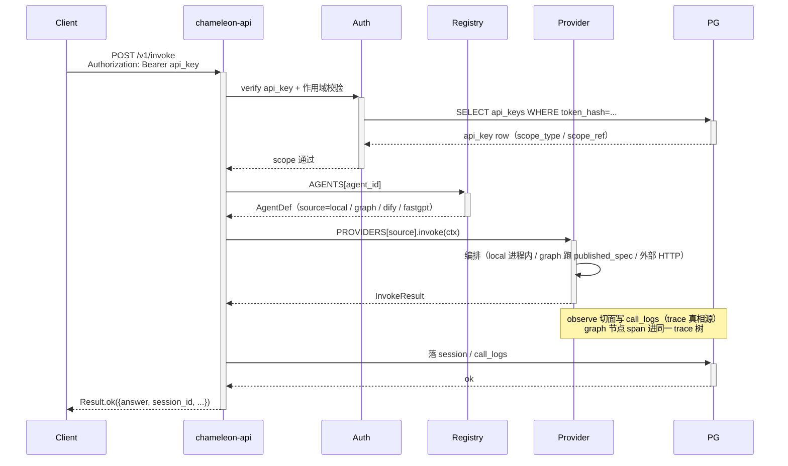

# 架构设计

## 总览

Chameleon 是开源 LLMOps 一站式平台：多源 AI 聚合 + 工作流编排 + RAG 知识库 + Trace/Eval 可观测 + 多 agent 协同 + 可嵌入 SDK。后端是 10 个 uv-workspace 包，按 `core ← data ← integrations ← engine ← (providers/api/system/app/agents/agentkit)` 严格单向分层（import-linter 强制护栏）。



## 包结构（uv workspace）

依赖方向严格单向：`core ← data ← integrations ← engine`，再往上 `providers / api / system / app / agents / agentkit` 都建立在 engine 之下的基座上。import-linter 用两条契约（forbidden + layers）锁死这个方向，反向 / 越层 import 直接 CI 红。

```
chameleon-core         纯协议 + 数据结构 + observe ContextVar/sink 协议
                       pydantic-only，禁 sqlalchemy / langchain（import-linter forbidden 契约兜底）

chameleon-data         ORM 模型（SQLAlchemy 2.0 async）+ infra + utils + 配置加载
  ├ models/            agents / api_keys / providers / models / kbs / sessions / graphs / eval / ...
  ├ infra/             db / redis / object_store(MinIO) / jwt / auth / crypto / logger
  └ utils/             snowflake / 通用工具

chameleon-integrations 厂商 / 外部实现
  ├ llms/              LLM 工厂 + embedding
  ├ vector/            pgvector / chroma + factory
  ├ rerankers/ (engine 侧) 与 reranker 桥接
  ├ bridges/           langchain 桥
  ├ observe/           observe 落库 handler（写 call_logs / graph span）
  └ plugins/ tools/    plugin registry + 内置工具

chameleon-engine       编排
  ├ graph/             工作流引擎 + nodes（LLM / KB / Tool / HTTP / Code 沙箱 / Template /
  │                    意图分类 / 聚合 / Answer / If-Else / Iteration / Parallel /
  │                    AgentDebate / HumanInput 等）
  ├ retrieval/         检索管线（hybrid + reranker）
  ├ eval/              评测算法
  ├ agent/ a2a/ jobs/  agent 编排 / 多 agent 协同 / 后台任务

chameleon-providers/   Provider 抽象层（base 协议 + 各实现各自 src/）
  ├ base/              Provider Protocol + Registry + types
  ├ local/             进程内 BaseAgent（含 agentkit_runner）
  ├ graph/             工作流即 agent（runtime 跑 published_spec，落 graph_runs）
  ├ dify/              Dify HTTP wrapper
  └ fastgpt/           FastGPT HTTP wrapper

chameleon-agents/      业务级本地 agent 包（含 examples/，namespace 扫描自动注册）

chameleon-agentkit/    进程内 agent SDK
                       @agent + ctx 隐式拿模型/KB/trace，多具名模型槽，
                       配置 Schema → 自动表单，entry-points 发现

chameleon-api/         对外 AI 服务 API
  ├ agent/             /v1/invoke · /v1/info
  ├ sessions/          /v1/sessions/*
  ├ knowledge/         /v1/kb/*（含 chunkers / parsers）
  ├ files/             /v1/files/*
  ├ task/              /v1/tasks/*
  ├ embed/             /v1/embed/*（widget 公开）
  ├ openai/            OpenAI 兼容端点
  └ otel/              /v1/otel（OTLP 摄入）

chameleon-system/      内部 admin 管理 API（/v1/admin/* + /v1/auth/*）
  ├ auth/              login / refresh / logout / change-password
  ├ users/ roles/ permissions/
  ├ api_key/ providers/ models/ pricing/ agents/
  ├ kbs/ datasets/ embed_configs/ session_files/ schemas/
  ├ graphs/ playground/ tools/ plugins/ marketplace/
  ├ eval_jobs/ eval_templates/ scores/ search/
  ├ audit_logs/ dashboard/ settings/
  └ app_templates/ admin/ seed/   导入导出 seed

chameleon-app/         FastAPI 启动器（薄）
  ├ main.py            app 实例 + lifespan + 中间件 + DI 注入 + 路由装配
  └ cli.py             chameleon init-admin / db upgrade
```

## 当前对外 API 面

公开（`/v1/*`）：

| 域 | 前缀 | 说明 |
| --- | --- | --- |
| Agent 调用 | `/v1/invoke` · `/v1/info` | 按 api_key 调对应 agent（local / graph / dify / fastgpt） |
| 会话 | `/v1/sessions/*` | ChatSession + end_user_id 身份层 |
| 知识库 | `/v1/kb/*` | 公开检索 / 文档接口 |
| 文件 | `/v1/files/*` | 上传 / presigned |
| 任务 | `/v1/tasks/*` | 异步任务 |
| OTLP | `/v1/otel` | OpenTelemetry trace 摄入 |
| 认证 | `/v1/auth/*` | login / refresh / logout |
| OpenAI 兼容 | `/v1/*` | OpenAI SDK 直接打 |
| 嵌入式 widget | `/v1/embed/{key}/*` | config / session / invoke / 文件 / feedback |

admin（`/v1/admin/*`）：`agents` · `api-keys` · `app-templates` · `kbs` · `graphs` · `models` · `providers` · `datasets` · `eval-jobs` · `eval-templates` · `plugins` · `marketplace` · `tools` · `schemas` · `scores` · `search` · `session-files` · `settings` · `users` · `roles` · `permissions` · `audit-logs` · `dashboard` · `playground` · `embed-configs`。

## 关键决策

### 1. DB-driven 配置

旧方案：所有配置在 JSON 文件，改完重启服务。
新方案：JSON 仅作首启 seed，运行时配置全在 DB（providers / models / agents 等表）。

收益：
- admin UI 实时改 model api_key 不停服
- 多实例部署共享配置
- 配置审计走 audit_logs 表

### 2. JWT 双 Token

- `access_token`：短时（默认 15min），放 `Authorization: Bearer`
- `refresh_token`：长时（默认 7d），放 HTTP-only Cookie

前端 axios 拦截器收到 401 → 自动 POST `/v1/auth/refresh` → 拿新 access 重试一次。`refresh_token` 在 HTTP-only Cookie 里，JS 取不到，免 XSS。

### 3. RBAC 三表 + 通配符权限（单租户）

平台已是**单租户**——没有 workspace / 多租户配额概念。访问控制只在用户—角色—权限三表上做：

```
users ──┬── user_roles ──┬── roles ──┬── role_permissions ──┬── permissions
        │   (多对多)      │           │     (多对多)          │
        └────────────────┘           └─────────────────────┘
```

权限 code 格式 `<resource>:<action>`，支持通配符 `*:*` / `users:*`。

### 4. Provider 凭证加密

`providers` 表存厂商凭证密文（AES-256-GCM），密钥从 env `CHAMELEON_CRYPTO_KEY` 派生。读取时按需解密，明文绝不落盘日志、绝不返给前端。

### 5. Snowflake ID

64-bit：`1 sign + 41 timestamp + 10 instance + 12 seq`。多实例部署用 env `CHAMELEON_INSTANCE_ID` 区分（0~1023）。前端处理这些 ID 时一律按 string 传，避免 JS number 精度截断。

### 6. API 密钥作用域（无 Apps 容器）

API 密钥不再归属任何「应用容器」，作用域直接锚到目标资源。`api_keys` 表用 `scope_type` + `scope_ref` 表达「这把 key 能访问什么」：

| scope_type | 含义 | 前缀 | scope_ref |
| --- | --- | --- | --- |
| `global` | 通吃所有服务 | `chm_` | NULL |
| `app` | 仅某工作流 / 智能体 | `app-` | agent / graph 标识 |
| `kb` | 仅某知识库 | `kbs-` | 知识库标识 |

作用域校验在 service 层统一兜（invoke 与 OpenAI 兼容端点共用），明文 key 仅生成时返一次。

### 7. Provider / Agent Registry

启动期 async load：
1. 扫 `chameleon.providers.*` 构建 provider registry（local / graph / dify / fastgpt）
2. 扫 `chameleon.agents.*` 把 BaseAgent 子类 / `@agent` 注册进 router
3. 从 DB `agents` 表读 enabled=True 装配 agent registry

`agents` 表用 `source` 区分来源：

- `local`：本地 BaseAgent 子类 / agentkit `@agent`，namespace 扫描入表
- `graph`：本平台可视化编排的工作流，`graph_id` 关联 graphs，运行时服务其 `published_spec`，把节点 span 发进 trace 树并落 `graph_runs`
- `dify` / `fastgpt`：外部平台应用，`provider_id` 关联 providers 表

业务热路径同步读 registry dict（O(1)）；admin 改 agents 表后 reload。

### 8. 嵌入式 Widget

```
业务方网页 <script src=".../widget.js" data-embed-key="xxx">
  ↓
  IIFE bundle（vanilla TS，不引 React）
  ↓
  shadow DOM 注入气泡 → 点开 panel
  ↓
  /v1/embed/{key}/config            拉 ui_config + welcome
  /v1/embed/{key}/session           颁 session_token（Redis TTL）
  /v1/embed/{key}/invoke[/stream]   调对应 agent（支持流式）
  /v1/embed/{key}/files/...         会话文件上传（ephemeral RAG）
```

安全：
- Origin 白名单（`embed_configs.allowed_origins`）
- session_token 与 embed_key 强绑定
- 限流走 Redis 计数器
- 消息渲染走 `textContent`，不走 `innerHTML`

### 9. 可观测（LangSmith 化）

`call_logs` 是**唯一 trace 真相源**。一次调用的 trace 树 = 嵌套 observation（span + generation）：

- LLM / embedding / reranker 调用切面自动埋点
- graph 节点执行发 span 进同一棵 trace 树
- 根行做 rollup，把子树的 model / token / cost 汇总上来

前端把可观测拆 **Trace · Session** 两 tab：Trace 看单次执行树，Session 看一条会话账本（ChatSession + end_user_id 身份层，支撑嵌入式 / 多用户）。

### 10. 前端模块自包含分层

```
src/
├── core/                 共享基础设施（lib / components / stores / i18n / router / layout）
├── system/<module>/      业务模块自包含
│   ├── pages/            页面组件
│   ├── services/         API 调用
│   ├── types/            TypeScript 类型
│   └── routes.ts         路由配置 (default export ModuleRouteConfig)
├── api-docs/             API 文档站
└── router/index.tsx      import.meta.glob 自动发现 system/**/routes.ts
```

新增业务模块 = 新建一个 `system/<name>/` 目录 + 写 routes.ts，无需改任何外部文件。导航按 **4 个域**组织（工作台 / 知识库 / 观测 / 设置），由 `core/components/layout/nav-config.ts` 描述域模型。

## 数据流：一次 Agent 调用



## 性能 / 容量预期

- backend 单实例：~ 200 RPS（非流式 / agent-internal latency 主导）
- pgvector HNSW：百万级 chunks 检索 < 50ms（m=16, ef_search=40）
- Redis：JWT 黑名单 + session_token + 限流，单实例足够支撑万级 QPS
- 多实例：用 nginx upstream 反代，无 session affinity（无状态后端）

## 工具链与默认端口

- 后端：uv（workspace）· ruff · pytest · import-linter（2 契约 GREEN）。默认端口 `7009`（`uvicorn ... --port 7009`）。
- 前端：yarn + vite · eslint · tsc（strict）。dev 端口 `6006`。
- SDK：Python（chameleon-sdk，httpx sync + async，`@trace` / `patch_openai` / `patch_all`）· TypeScript（`@chameleon/sdk`）。OTLP HTTP 上报到 `/v1/otel`。
- 部署：Docker + Compose，多阶段镜像，`docker/` 三区（images / containers / scripts）。
